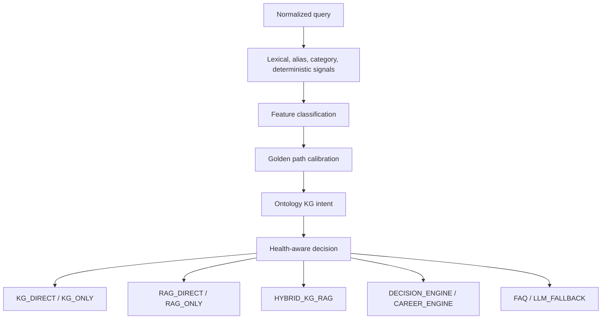

# Brain Router Audit

## Verdict

**PASS WITH RECOMMENDATIONS as implemented routing architecture. FAIL as fully proven production readiness under current benchmark evidence.**

BrainRouter is real, multi-signal, calibrated, and integrated. Current reports do not yet prove reliable route selection in live conditions.

## Evidence Of Implementation

| Capability | Evidence |
|---|---|
| Route constants | `backend/services/brainRouter.js:37-47` |
| Router class | `backend/services/brainRouter.js:312` |
| Signal dictionary and aliases | `backend/services/brainRouter.js:79-306` |
| Query feature classification | `backend/services/brainRouter.js:539-698` |
| Query analysis | `backend/services/brainRouter.js:845-961` |
| Final route selection | `backend/services/brainRouter.js:1059-1452` |
| Runtime integration | `backend/orchestrator.js:1132-1301` |

## Strengths

1. Separates route selection from answer generation.
2. Supports KG, RAG, Hybrid, Decision, Career, FAQ, and LLM fallback.
3. Uses dictionary signals, aliases, deterministic academic features, ontology intent, golden-path calibration, and subsystem health.
4. Exposes route reasons and metrics.
5. Enables deterministic direct answers when evidence is strong.

## Current Weaknesses

| Finding | Severity | Evidence | Impact |
|---|---|---|---|
| Route accuracy too low | High | `backend/testing/route_accuracy_report.json` reports 37.14% | Committee can challenge reliability. |
| Retrieval evidence weak | High | `backend/testing/retrieval_report.json` reports KG precision 0.00%, RAG recall 0.00%, hybrid full success 0.00% | Correct route may still lack evidence. |
| Golden path failure | High | `backend/testing/golden_path_benchmark_report.json` reports 10 passed and 1 failed | Named demo risk. |
| Route/source label contract risk | Medium | `backend/services/brainRouter.js:37-47`, `backend/services/responseFormatter.js:30-96` | Valid answers can be scored wrong. |
| Runtime defaults change behavior | Medium | `backend/config/runtimeMode.js:1-44` | Slides may not match live mode. |
| Policy wording straddles KG/RAG | Medium | `backend/services/brainRouter.js:845-961`, `backend/services/brainRouter.js:1059-1452` | Requires hybrid test coverage. |

## Router Decision Flow

## Production Readiness Gates

| Gate | Status |
|---|---|
| Route-label contract aligned | PARTIAL |
| KG_DIRECT accuracy proven | PARTIAL |
| RAG_DIRECT accuracy proven | FAIL |
| Hybrid accuracy proven | FAIL |
| Decision route proven | PARTIAL |
| No-answer behavior proven | NO EVIDENCE FOUND |
| Adversarial prompt-injection behavior proven | NO EVIDENCE FOUND |
| Golden demos stable | PARTIAL |

## Recommended Fixes

1. Normalize benchmark expected routes against runtime routes.
2. Normalize benchmark source labels against responseFormatter output.
3. Rerun route and retrieval benchmarks after live KG/RAG verification.
4. Add no-answer, typo, follow-up, multilingual, adversarial, and outage tests.
5. Use only live-passing WOW demo questions in slides.

## Final BrainRouter Defense Answer

BrainRouter is not a prompt trick. It is a dedicated routing subsystem with explicit routes, feature classification, confidence calibration, golden-path handling, and health-aware fallback. The limitation is validation: current benchmark evidence does not yet prove production-grade routing reliability.
