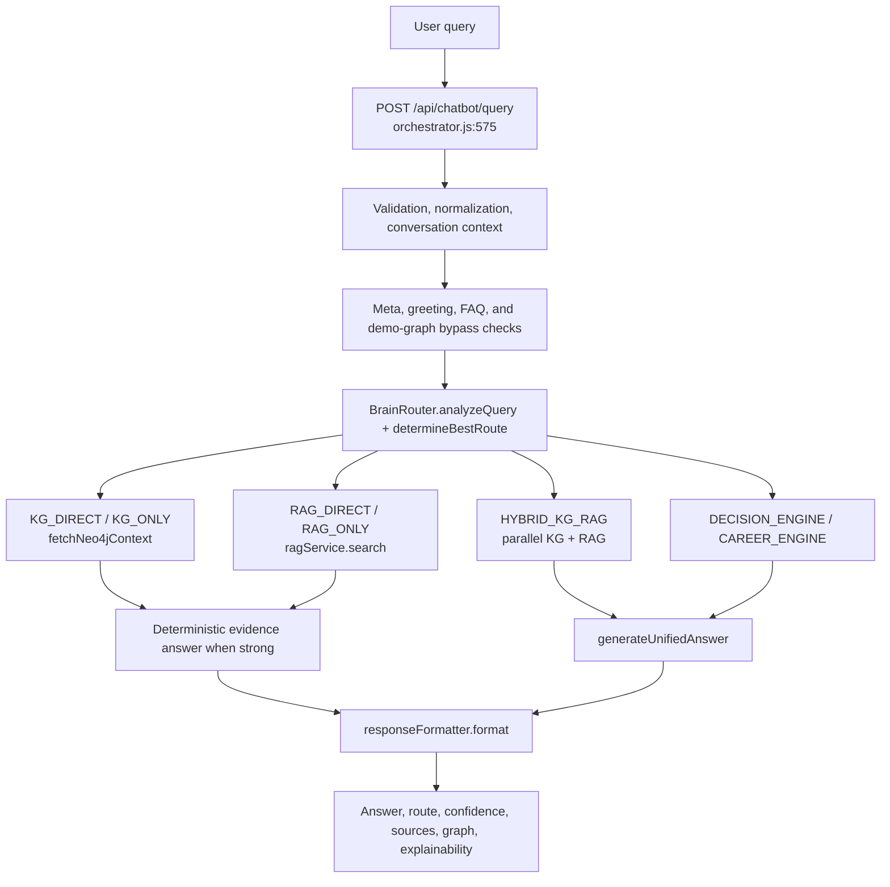

# Defense System Architecture

## Scope And Root Verification

Canonical project root used: `C:\AI_AGENT\aast-ai-agent-main`.

This package uses the corrected canonical workspace only. Noncanonical workspace copies are not used as source of truth. The generated files are defense reports and benchmark artifacts; source code was not modified.

## Executive Verdict

The system is a multi-route academic AI assistant with BrainRouter, Knowledge Graph retrieval, RAG retrieval, hybrid KG+RAG synthesis, decision advising, conversation memory, response formatting, and LLM failover controls. The architecture is defensible. Defense readiness is PARTIAL because current benchmark reports show low route accuracy, retrieval failures, and one golden-path failure.

## Component Map

| Layer | Evidence | Defense Role |
|---|---|---|
| API entry | `backend/orchestrator.js:575` | Main `POST /api/chatbot/query` request handler. |
| Brain Router | `backend/services/brainRouter.js:312`, `backend/services/brainRouter.js:845-961`, `backend/services/brainRouter.js:1059-1452` | Selects KG, RAG, Hybrid, Decision, Career, FAQ, or fallback routes. |
| KG retrieval | `backend/services/neo4jcontext.js:3191-3459`, `backend/services/neo4jcontext.js:1202-2228` | Intent detection, Cypher builders, exact fallback, semantic graph retrieval, deterministic KG answers. |
| RAG retrieval | `backend/services/ragService.js:558-718`, `backend/services/ragService.js:1182-1276` | Query expansion, simplified-query fallback, endpoint fallback, ranking, deduplication. |
| Hybrid execution | `backend/orchestrator.js:2591-2668` | Runs KG and RAG in parallel and merges evidence for synthesis. |
| Decision engine | `backend/services/decisionService.js:632-819`, `backend/services/decisionService.js:70-146`, `backend/services/decisionService.js:517-532` | Advising workflow, user memory, recommendation API, career roadmap fallback. |
| Unified synthesis | `backend/services/unifiedAnswerService.js:2145-2585`, `backend/services/unifiedAnswerService.js:1169-1200` | Evidence-only answer generation and deterministic fallback. |
| Response contract | `backend/services/responseFormatter.js:30-96` | Normalizes answer, route, sources, used facts, graph, citations, reasoning, and metadata. |
| Conversation memory | `backend/services/conversationService.js:36-216` | Stores turns, topic context, evidence memory, and follow-up state. |
| Circuit/failover | `backend/services/circuitStateManager.js:1-258`, `backend/config/runtimeMode.js:1-44` | Tracks LLM availability and runtime feature switches. |

## End-To-End Flow

## Route Catalog

`brainRouter.js` declares `KG_DIRECT`, `KG_ONLY`, `RAG_DIRECT`, `RAG_ONLY`, `HYBRID_KG_RAG`, `DECISION_ENGINE`, `CAREER_ENGINE`, `FAQ`, and `LLM_FALLBACK` at `backend/services/brainRouter.js:37-47`.

## Knowledge Graph Evidence

Graph evidence file: `backend/data/clean_graph.json`.

| Relationship | Count |
|---|---:|
| HAS_COURSE | 37 |
| TEACHES | 22 |
| ACTS_AS | 21 |
| WORKS_IN | 17 |
| HAS_ROLE | 17 |
| PART_OF_TRACK | 14 |
| LEADS_TO | 13 |
| CAREER_ALIGNMENT | 12 |
| HAS_FACILITY | 10 |
| BELONGS_TO | 10 |
| IS_SAME_ENTITY | 7 |
| CONTAINS_COMPONENT | 6 |
| RECOMMENDED_AFTER | 6 |
| MANAGES | 6 |
| SPECIALIZES_IN | 5 |
| HAS_SYLLABUS | 5 |
| HEAD_OF | 5 |
| HAS_PREREQUISITE | 4 |
| SUPPORTS_POLICY_QUERY | 3 |
| HAS_SPECIALIZATION | 3 |
| HAS_ADMIN | 3 |
| HAS_PARTNER_INSTITUTION | 2 |

Defense-safe KG topics include teaching assignments, course prerequisites, program-course membership, facilities and components, tracks/specializations, governance/unit roles, policy links, and career alignment.

## RAG Evidence

RAG evidence file: `backend/rag_system/cleaned_chunked_cai_production_v4.json`.

| Category | Chunk Count |
|---|---:|
| academic_policies | 36 |
| admissions_registration | 33 |
| admissions | 32 |
| postgraduate_programs | 18 |
| financial_policies | 14 |
| academic_programs | 12 |
| grading_policies | 11 |
| institutional | 9 |
| compliance | 7 |
| academic_rules | 6 |
| international_relations | 3 |
| infrastructure | 3 |

Strong RAG topics include admission requirements, transfer rules, scholarship eligibility, GPA, credit hours, semester load, tuition and fees, MSc rules, compliance, infrastructure, and academic programs.

## Hybrid Rationale

Hybrid routing is the core thesis story: structured graph facts answer "what is connected to what", while RAG passages answer "what conditions and policies apply". The orchestrator hybrid block uses `Promise.allSettled` and can tolerate partial source failure, but current retrieval benchmarks do not yet prove robust hybrid success.

## Hallucination And Explainability Controls

`unifiedAnswerService.js` instructs generation to use only verified context and includes deterministic fallback paths. `responseFormatter.js` exposes route, confidence, sources, used facts, missing information, graph, citations, reasoning, request ID, and metadata.

## Benchmark Snapshot

| Report | Current Evidence |
|---|---|
| Route accuracy | `backend/testing/route_accuracy_report.json`: 37.14% |
| Retrieval KG precision | `backend/testing/retrieval_report.json`: 0.00% |
| Retrieval RAG recall | `backend/testing/retrieval_report.json`: 0.00% |
| Retrieval hybrid full success | `backend/testing/retrieval_report.json`: 0.00% |
| Golden path | `backend/testing/golden_path_benchmark_report.json`: passed=10, failed=1 |

## Architecture Defense Position

The architecture is explainable and technically meaningful. The safe defense claim is source-aware routing before generation, not final benchmark success. The current validation state must be reported as PARTIAL until route, retrieval, and golden-path reports are repaired and rerun.
