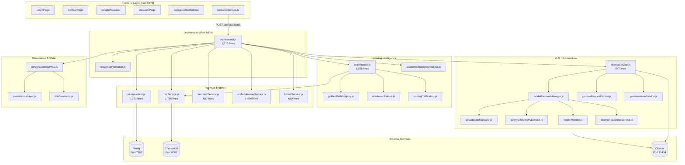
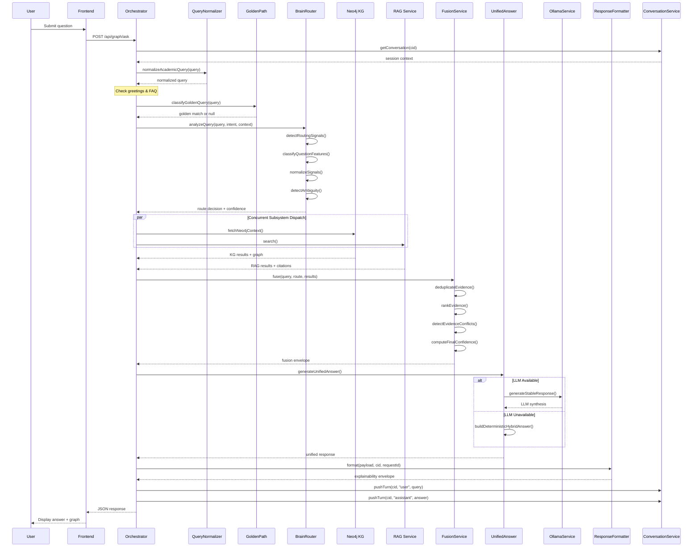
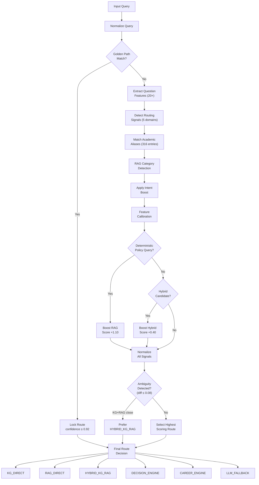
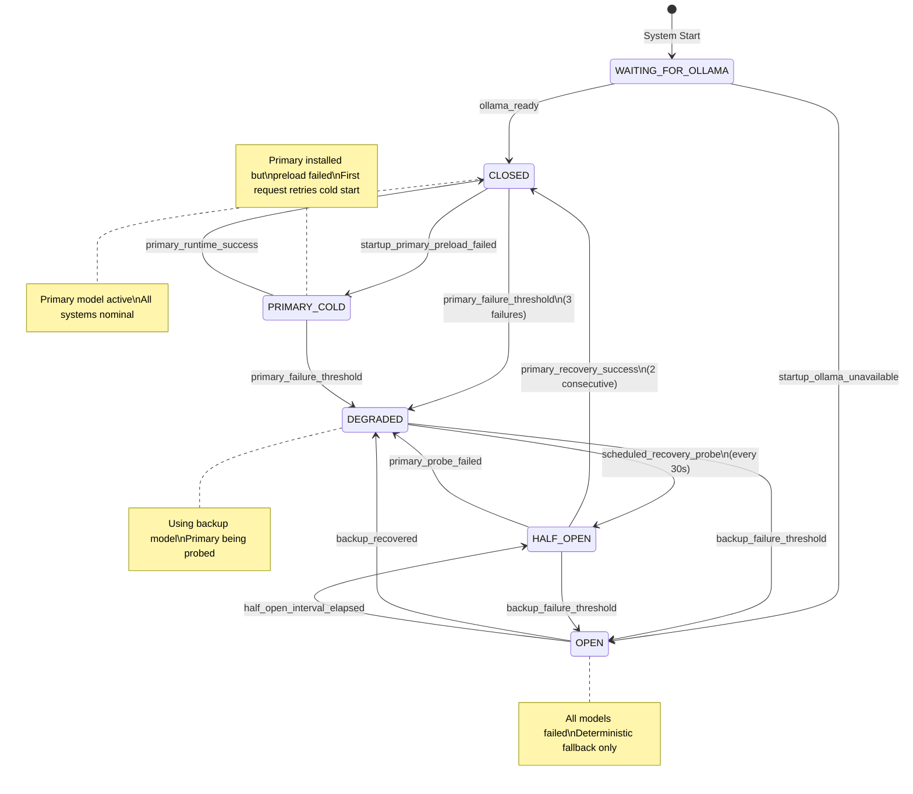
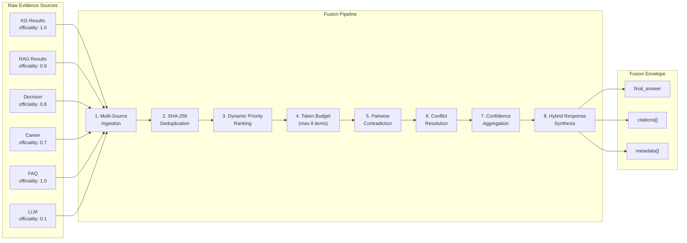
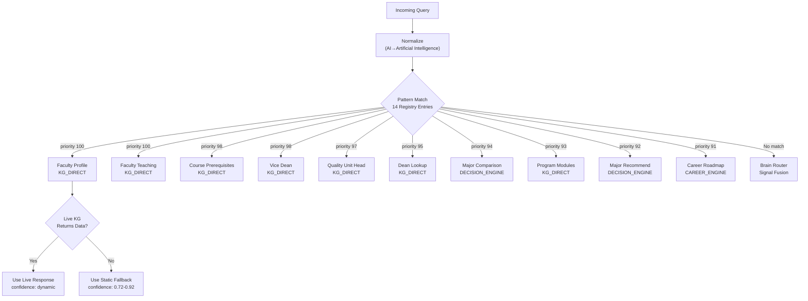
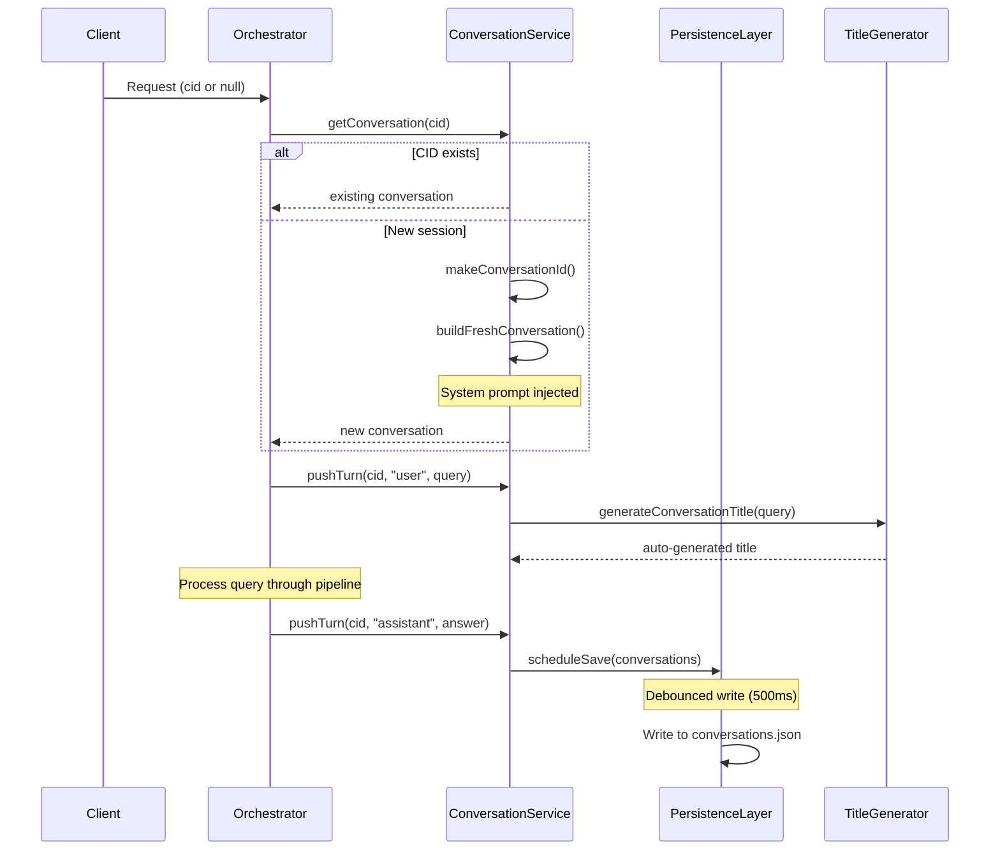
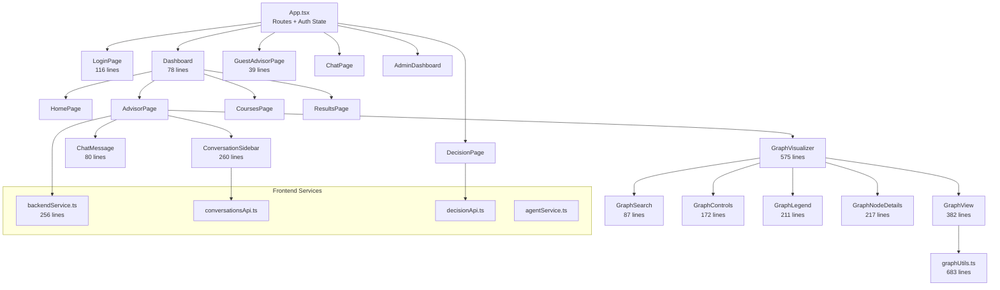
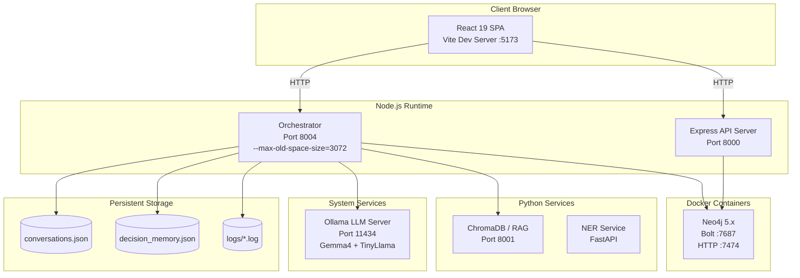
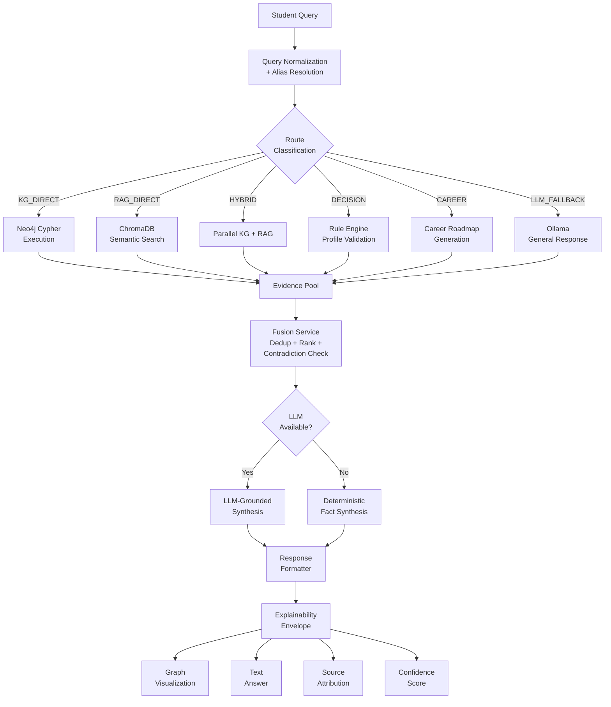

# AAST AI Agent Platform — Architectural Diagrams

> **Format:** Mermaid diagrams derived from source code analysis  
> **Coverage:** 10 architectural views from system topology to data flow

---

## Diagram 1: System Topology — Service Dependencies

---

## Diagram 2: Request Processing Pipeline — Sequence Diagram

---

## Diagram 3: Brain Router — Signal Fusion Flowchart

---

## Diagram 4: Circuit Breaker — State Machine Diagram

---

## Diagram 5: Evidence Fusion Pipeline

---

## Diagram 6: Golden Path Decision Tree

---

## Diagram 7: Conversation Lifecycle

---

## Diagram 8: Frontend Component Hierarchy

---

## Diagram 9: Deployment Topology

---

## Diagram 10: Data Flow Architecture

---

*All diagrams are derived directly from source code analysis of the AAST AI Agent Platform codebase. Render using any Mermaid-compatible viewer.*
