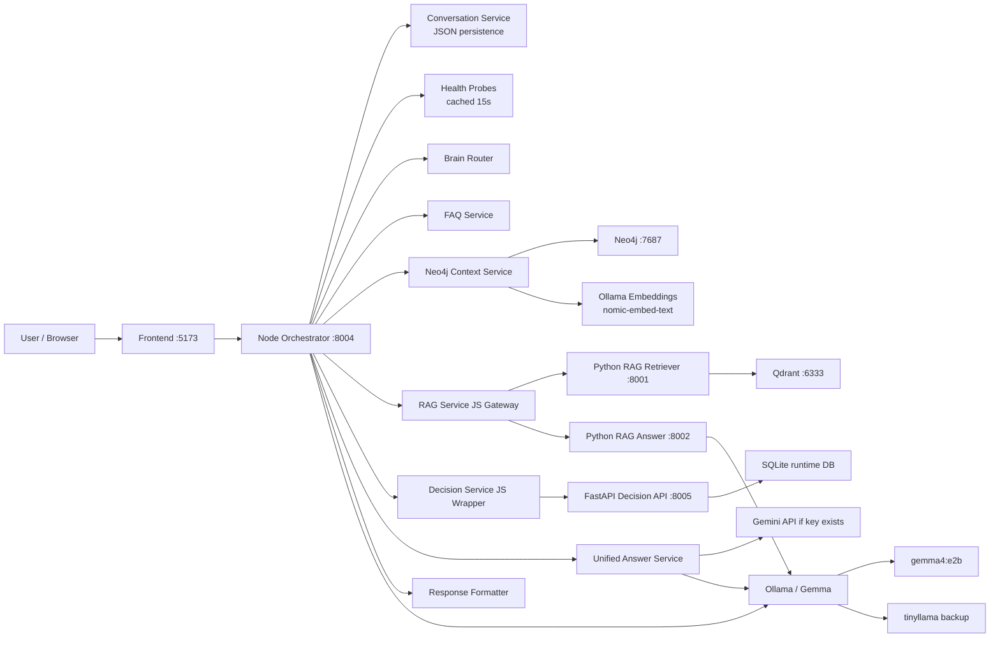
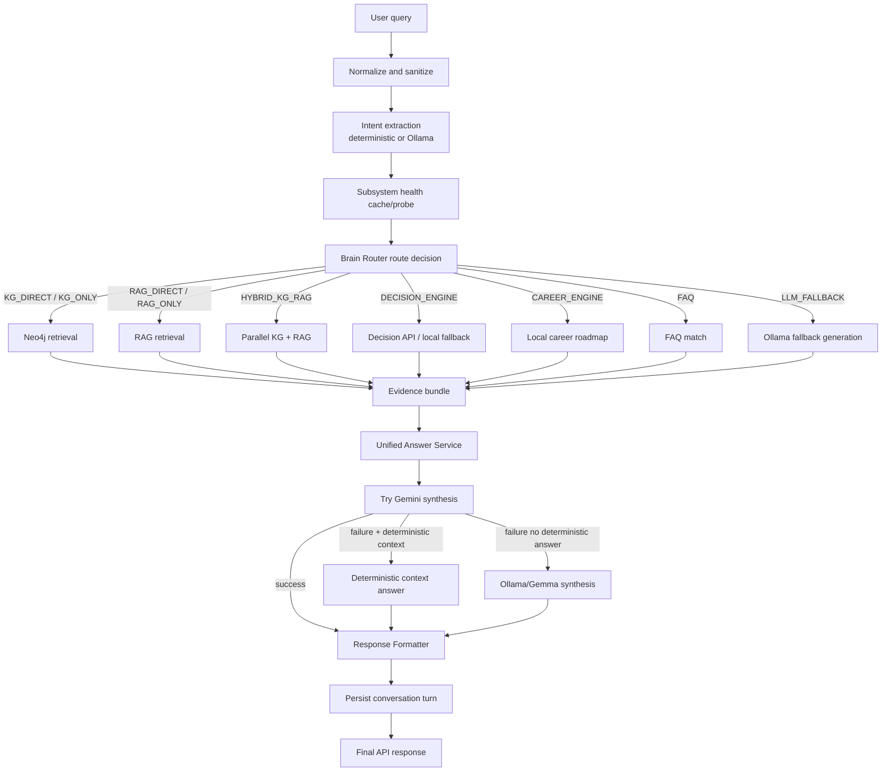
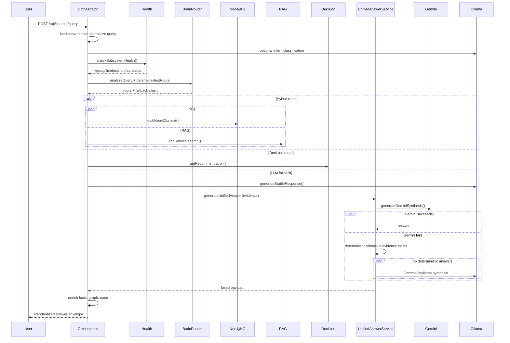
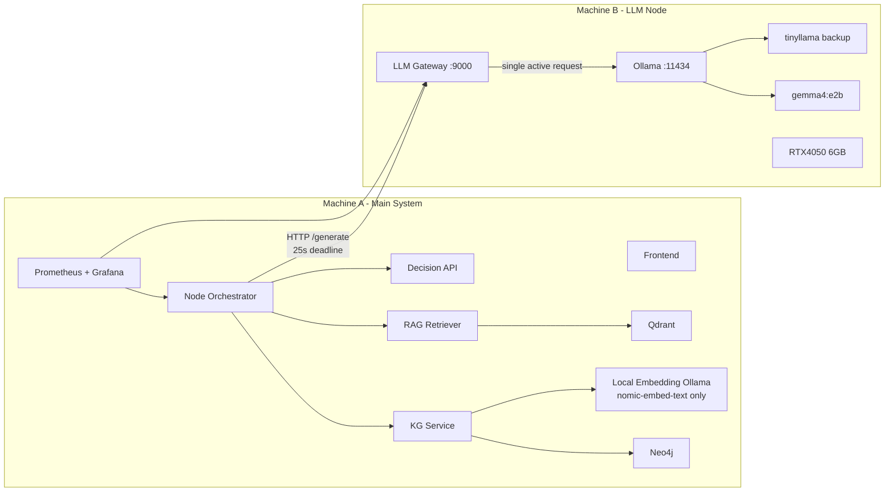

# Production Architecture Review and Redesign Proposal

Project root audited: `C:\AI_AGENT`

Active backend source: `C:\AI_AGENT\aast-ai-agent-main\backend`

Date: 2026-06-20

## Executive Verdict

The current platform is a strong graduation-grade hybrid AI system, but it is not yet production-grade. The main weakness is not one bad component. The weakness is that request execution crosses many independently timed, partly cached, partly optimistic subsystems: intent LLM, health probes, Neo4j, KG embeddings through Ollama, RAG retriever, Qdrant, decision API, Gemini final synthesis, Ollama/Gemma fallback, optional humanization, and file-backed memory.

The current plan of keeping all services on Machine A and moving only Gemma to Machine B is helpful, but not optimal as stated. It reduces GPU pressure on Machine A, but it does not define an LLM gateway contract, observability, strict queue behavior, endpoint split between embeddings and generation, or defense-ready failure isolation.

Final recommendation: **Gemma should be backup/controlled synthesis for the graduation demo, not the unconditional primary path.** The primary demo path should be deterministic KG/RAG/decision evidence plus safe deterministic synthesis. Gemma should be used only when the evidence path is healthy and the LLM queue is available.

## Evidence Notes

This report is based on the active runtime files, not comments alone:

- `orchestrator.js` mounts the main query endpoint and coordinates route selection, KG/RAG/decision calls, final synthesis, and response formatting.
- `brainRouter.js` scores KG, RAG, hybrid, decision, career, FAQ, and LLM fallback routes.
- `unifiedAnswerService.js` performs Gemini-first synthesis, deterministic fallback, and Ollama fallback.
- `ollamaService.js`, `modelFailoverManager.js`, `gemmaRequestLimiter.js`, and `llmConfig.js` contain the real Gemma queue, timeout, retry, and failover behavior.
- `docker-compose.yml` defines frontend, backend, decision API, RAG retriever, RAG answer, Qdrant, and Neo4j.
- Runtime check: Docker Desktop was not reachable, backend health on `127.0.0.1:8004` was unavailable, local Ollama on `127.0.0.1:11434` was reachable, and the local GPU reported `NVIDIA GeForce RTX 4050 Laptop GPU, 6141 MiB`.

## 1. Current Architecture Diagrams

### Component Diagram

### Data Flow Diagram

### Request Lifecycle Diagram

## 2. Failure Point Analysis

| Component | Failure Mode | Severity | Probability | Fix |
|---|---:|---:|---:|---|
| Orchestrator | Whole request depends on many nested timeouts and fallback paths; `timeoutWrapper` converts errors to `null`, hiding root cause | High | High | Preserve typed timeout/error reason in every fallback result; expose per-stage spans |
| Health probes | Cached health can be stale for 15s; fast/optimistic health can mark services healthy before a real probe | High | Medium | Disable optimistic route decisions for defense queries unless services are actually probed |
| Brain Router | Same query can route differently when health cache, golden path, or context changes | High | Medium | Add route-decision trace diffing and fixed demo route locks for approved defense questions |
| Intent classifier | Ollama timeout or malformed JSON falls back to GENERAL, changing route | Medium | High | Prefer deterministic intent for known academic entities; log intent timeout as first-class metric |
| KG service | Neo4j query plus embedding call to Ollama; if Ollama is remote/busy, KG vector retrieval can fail or slow | High | Medium | Split generation and embedding endpoints; keep embeddings local or isolate on a second Ollama instance |
| Neo4j | Heap/pagecache are small; vector index or Cypher latency can spike | Medium | Medium | Prewarm queries, verify indexes at startup, add p95 query latency metrics |
| RAG JS gateway | Multi-pass retrieval can amplify latency; circuit breaker opens after repeated errors | High | Medium | Cap route-level RAG budget and emit pass-level latency/failure metrics |
| RAG retriever | Lazy embedding model load causes slow first query | Medium | High | Warm retriever before demo; expose embedding-loaded readiness gate |
| Qdrant | Fresh volume or missing collection gives empty RAG evidence | High | Medium | Startup check must validate collection exists and has points |
| RAG answer | Separate answer service calls Ollama; may compete with main orchestrator LLM calls | Medium | Medium | For defense, avoid duplicate LLM answer path or make it go through one LLM gateway |
| Decision API | HTTP timeout / invalid response causes fallback recommendation | Medium | Medium | Lower timeout for demo and preflight decision health with representative request |
| Conversation memory | JSON persistence is debounced; process crash can lose latest turn | Low | Medium | Flush on response completion for defense mode or use SQLite |
| Gemini | External API key, network, 429, timeout, empty output | High | Medium | Disable for local-only defense mode or make provider policy explicit |
| Ollama/Gemma | Queue timeout, cold start, partial GPU offload, VRAM/RAM pressure | Critical | High | Single active request, small queue, warm model, deterministic fallback as primary safety |
| Machine A-B network | Remote Ollama unavailable, IP changes, firewall blocks port | High | Medium | Static IP/Tailscale, health endpoint, firewall allowlist, explicit failover |
| Humanizer | Optional Gemini post-processing can change latency and response text after core answer | Medium | Medium | Disable during defense unless traced and bounded |
| Observability | Metrics are in-memory JSON, not Prometheus; no distributed trace | High | High | Add Prometheus + OpenTelemetry request spans |

## 3. Resource Analysis

### Machine A

Current compose places almost everything on Machine A:

- Node backend with `NODE_OPTIONS=--max-old-space-size=4096`.
- Neo4j with heap max `1G` and pagecache `512m`.
- Qdrant vector storage.
- RAG retriever with CPU embedding settings and lazy model initialization.
- RAG answer service.
- Decision API with SQLite and optional Whisper cache.
- Frontend.

Expected pressure on 16GB RAM is high. A realistic local run can consume:

| Service | Expected Resource Pressure |
|---|---|
| Docker Desktop overhead | 1-2GB RAM |
| Node backend | 300MB to 2GB, up to 4GB heap cap |
| Neo4j | 1.5-2GB with heap/pagecache/log overhead |
| Qdrant | 500MB-2GB depending collection size |
| RAG retriever | 1.5-3GB after embedding model load |
| Decision API | 300MB-1GB; more if voice model loads |
| Browser/IDE/OS | 4-8GB |

Conclusion: Machine A should not also run heavy Gemma generation during the defense. Moving generation to Machine B is good, but only if endpoint, queue, and monitoring are redesigned.

### Machine B

Runtime evidence from local machine:

- GPU: `NVIDIA GeForce RTX 4050 Laptop GPU`
- VRAM: `6141 MiB`
- Ollama models installed locally included `gemma4:e2b`, `gemma4:e4b`, `tinyllama`, `nomic-embed-text`, and `llava`.
- `gemma4:e2b` metadata reported `parameter_size=5.1B`, `quantization_level=Q4_K_M`, model size about `7.16GB`.
- `gemma4:e4b` model size is about `9.61GB`.

Can Gemma reliably run on RTX 4050 6GB?

**Conditionally.** `gemma4:e2b` can be used for a controlled demo if it is warmed, single-concurrency, short-context, and not sharing GPU with other applications. It is not reliable as an unconditional production primary on 6GB VRAM because the model file plus KV cache and runtime overhead exceed comfortable full-GPU residency. Partial CPU offload can work but adds latency variance. `gemma4:e4b` should not be used for the demo on 6GB VRAM.

Required constraints:

- `GEMMA_MAX_ACTIVE_REQUESTS=1`
- `GEMMA_QUEUE_MAX_DEPTH=2` or `3`, not `24`
- `GEMMA_QUEUE_TIMEOUT_MS=8000` to fail fast
- context budget near 2800-3500 tokens
- `num_predict` near 128-220
- model warmed before demo
- no parallel browser/GPU-heavy workloads on Machine B

## 4. Bottleneck Investigation

Most likely reasons the same question sometimes succeeds and sometimes fails:

| Rank | Cause | Confidence | Why |
|---:|---|---:|---|
| 1 | Ollama/Gemma queue saturation or deadline exhaustion | 30% | Code uses single active Gemma request with queue timeout; multiple LLM uses can stack |
| 2 | Gemma cold start / partial GPU offload / VRAM pressure | 18% | `gemma4:e2b` is larger than comfortable 6GB full residency |
| 3 | Health cache and optimistic routing changing route selection | 14% | Health is cached and golden paths can use optimistic status |
| 4 | RAG retriever cold start or multi-pass latency | 12% | Lazy embedding and PASS 1/PASS 2 retrieval can exceed route budgets |
| 5 | KG embedding dependency on Ollama | 9% | KG vector retrieval calls `/api/embeddings`; remote/busy Ollama affects KG |
| 6 | Machine A memory pressure | 7% | Node, Neo4j, Qdrant, RAG, Docker, browser compete for 16GB |
| 7 | Machine A-B network or remote Ollama host mismatch | 5% | Moving only Gemma requires explicit `OLLAMA_BASE_URL`; IP/firewall issues become failures |
| 8 | Decision API timeout or invalid response | 3% | Less central, but recommendation route can degrade |
| 9 | Gemini/humanizer variance | 2% | External synthesis/humanization path can add latency or fallback behavior |

## 5. Observability Review

Current verified observability:

- `routes/health.js` exposes `/health`, `/health/enterprise`, and `/health/metrics`.
- `metrics.js` stores counters and timers in memory.
- `responseFormatter.js` adds trace metadata to response envelopes.
- `ollamaService.js` records generation metadata, breaker state, failover, queue depth, prompt truncation, and token estimates.
- `ragService.js` has internal telemetry for retrieval passes and circuit breaker state.

Missing for production-grade diagnosis:

- No Prometheus exposition format verified.
- No distributed trace propagation across Node, Python RAG, decision API, Neo4j, Qdrant, and Ollama.
- No p50/p95/p99 latency histogram per stage.
- No durable metrics backend.
- No centralized log search.
- No GPU/VRAM telemetry in the health contract.
- No per-request cause tree showing which fallback fired first.

Recommended metrics:

| Metric | Type | Labels |
|---|---|---|
| `aast_request_total` | counter | route, status |
| `aast_request_duration_seconds` | histogram | route |
| `aast_stage_duration_seconds` | histogram | stage, route |
| `aast_route_selected_total` | counter | route, reason |
| `aast_route_fallback_total` | counter | from_route, to_route, reason |
| `aast_kg_latency_seconds` | histogram | intent |
| `aast_neo4j_latency_seconds` | histogram | query_type |
| `aast_embedding_latency_seconds` | histogram | model |
| `aast_rag_latency_seconds` | histogram | pass |
| `aast_rag_source_count` | histogram | category |
| `aast_decision_latency_seconds` | histogram | endpoint |
| `aast_llm_latency_seconds` | histogram | model, role, provider |
| `aast_llm_queue_depth` | gauge | model |
| `aast_llm_queue_timeout_total` | counter | model |
| `aast_llm_breaker_state` | gauge | model, state |
| `aast_gemma_memory_pressure` | gauge | level |
| `aast_fallback_count_total` | counter | reason |
| `aast_success_rate` | gauge | route |
| `aast_error_rate` | gauge | route |

Minimum dashboard for defense:

- Overall success/fallback/timeout counts.
- Route distribution.
- Current health of KG, RAG, decision, LLM.
- Gemma queue depth and breaker state.
- p95 total latency.
- p95 KG/RAG/LLM latency.
- Last 20 requests with request ID, route, fallback reason, and answer tier.

## 6. Distributed Deployment Design

Current plan:

- Machine A: all services except Gemma.
- Machine B: Gemma only.

Verdict: **NO, not optimal as stated.**

Better design:

Key design decisions:

- Do not expose raw Ollama as the only contract. Put a small LLM gateway on Machine B with `/health`, `/ready`, `/generate`, `/metrics`, `/warmup`.
- Split generation and embedding endpoints. Today KG embeddings use Ollama. If `OLLAMA_BASE_URL` points to Machine B and Machine B runs only Gemma, KG embeddings can fail.
- Keep `nomic-embed-text` local on Machine A or install it on Machine B and define `EMBEDDING_BASE_URL` separately.
- Use a static LAN IP, DHCP reservation, or Tailscale name for Machine B.
- Firewall Machine B to allow only Machine A to call the LLM gateway.
- Propagate `X-Request-ID` from orchestrator to every service.

Timeout and retry strategy:

| Call | Timeout | Retry | Circuit Breaker |
|---|---:|---:|---|
| Frontend to backend | 35s | none | frontend shows degraded message |
| Backend whole request | 30s | none | final deterministic fallback |
| KG query | 4-8s | none | fallback to RAG if route allows |
| Embedding | 5-8s | 1 retry only | fallback to keyword Cypher |
| RAG retriever | 8-12s | 1 retry for network/5xx | open after 3 failures |
| Decision API | 3-5s | 1 retry only | fallback advisory result |
| LLM gateway | 20-25s | no retry after queue timeout | open after 3 generation failures |
| Gemini | disabled in local defense mode | none | not used |

## 7. Version 2 Architecture

Goals:

- High reliability for defense.
- Low operational complexity.
- Local deployment only.
- No Kubernetes.
- No cloud dependency.
- Works on two RTX4050 laptops.

V2 service boundaries:

| Service | Host | Responsibility |
|---|---|---|
| Frontend | A | UI only |
| Orchestrator API | A | request lifecycle, routing, evidence fusion |
| KG service | A | Neo4j retrieval and graph evidence |
| Local embedding service | A | `nomic-embed-text`; separate from generation |
| RAG retriever | A | Qdrant semantic retrieval |
| Qdrant | A | vector storage |
| Neo4j | A | graph storage |
| Decision API | A | rule-based recommendation |
| LLM Gateway | B | queue, health, metrics, model generation |
| Ollama/Gemma | B | local LLM inference |
| Monitoring | A | Prometheus + Grafana + log viewer |

Required APIs:

- `GET /health` on every service.
- `GET /ready` on retriever, KG, and LLM gateway.
- `GET /metrics` in Prometheus text format.
- `POST /generate` on LLM gateway.
- `POST /warmup` on LLM gateway and RAG retriever.
- `POST /smoke-test` optional local-only endpoint or script for defense validation.

Response policy:

1. Prefer deterministic FAQ/KG/RAG/decision answers when evidence is enough.
2. Use Gemma only to phrase or synthesize verified evidence.
3. If Gemma queue is busy, return deterministic evidence answer instead of waiting.
4. If no evidence exists, say insufficient verified information.
5. Disable cloud Gemini in local defense mode.

## 8. Gemma Primary Decision

Recommendation: **B) Backup Model.**

No hedging: for the graduation demo, Gemma should not be the unconditional primary answer generator.

Reason:

- The active model `gemma4:e2b` is around 7.16GB on disk and targets a 6GB laptop GPU. It can run, but not with enough headroom to be the always-on primary under variable context and queue conditions.
- The code already supports deterministic fallback and evidence-first response construction. That is more defensible academically than relying on an LLM for every final answer.
- Network separation adds another failure domain. A remote Gemma node should improve Machine A resource pressure, but it should not become the single point of failure for every answer.
- Defense success depends on repeatability. Deterministic KG/RAG/decision first, Gemma second, is more repeatable.

Best demo policy:

- Primary: deterministic evidence retrieval and deterministic answer construction.
- Secondary: Gemma synthesis when queue depth is zero and memory pressure is normal.
- Backup: static/golden deterministic fallback for approved defense queries.

## 9. Final Score

| Category | Current Score /100 | Target V2 Score /100 |
|---|---:|---:|
| Reliability | 48 | 82 |
| Scalability | 42 | 65 |
| Observability | 45 | 85 |
| Maintainability | 58 | 75 |
| Fault Tolerance | 55 | 82 |
| Graduation Readiness | 62 | 88 |

Current overall score: **52/100**

Target overall score: **80/100**

Interpretation: the system is impressive and defensible as a hybrid academic AI prototype, but it is not production-grade until observability, endpoint separation, and deterministic degraded operation are tightened.

## 10. Prioritized Action Plan

### Priority 1 - Must Do Before Defense

| Action | Effort | Risk | Impact |
|---|---:|---:|---:|
| Freeze active source root and mark nested duplicate backend copies as stale/non-runtime | 1h | Low | High |
| Add one defense startup checklist: Docker, Neo4j, Qdrant, RAG, decision, Ollama, model tags, GPU memory | 2h | Low | High |
| Split LLM generation endpoint from embedding endpoint in config | 3-5h | Medium | Critical |
| Configure Machine B with static IP/Tailscale, firewall allowlist, Ollama/Gemma warmup | 2-4h | Medium | Critical |
| Set Gemma defense limits: one active request, queue depth 2-3, fast queue timeout | 30m | Low | High |
| Disable Gemini and optional humanizer for local-only defense mode | 1-2h | Low | High |
| Add Prometheus-format `/metrics` or a minimal JSON-to-Prometheus bridge | 3-6h | Medium | High |
| Add request ID propagation to RAG, decision, KG, LLM calls | 2-4h | Medium | High |
| Build a 20-query repeatability smoke test and run it before defense | 3-5h | Low | Critical |
| Prewarm RAG retriever, Neo4j representative queries, and Gemma before demo | 1h | Low | High |

### Priority 2 - Should Do

| Action | Effort | Risk | Impact |
|---|---:|---:|---:|
| Add OpenTelemetry spans for orchestrator, RAG, decision, KG, LLM | 1-2 days | Medium | High |
| Add Grafana dashboard for route success, fallback, queue, latency | 1 day | Low | High |
| Add LLM gateway wrapper on Machine B instead of direct raw Ollama calls | 1 day | Medium | High |
| Add startup validation for Qdrant collection and Neo4j vector indexes | 4-6h | Low | High |
| Make `ragService.search(query, options)` actually honor `topK` or remove ignored arguments | 2-3h | Low | Medium |
| Preserve typed errors from `timeoutWrapper` instead of returning `null` | 2-4h | Medium | High |
| Add persistent request audit log with route, timings, evidence counts, fallback cause | 4-6h | Low | High |

### Priority 3 - Future Work

| Action | Effort | Risk | Impact |
|---|---:|---:|---:|
| Replace JSON conversation persistence with SQLite | 1-2 days | Medium | Medium |
| Add model-quality evaluation set and nightly regression benchmark | 1-2 days | Low | High |
| Add GPU telemetry exporter for Machine B | 1 day | Medium | Medium |
| Add local reranker for RAG quality | 2-4 days | Medium | Medium |
| Add multi-model local routing only after stability is proven | 3-5 days | Medium | Medium |

## Hard Truths

1. The architecture is too LLM-centric for reliability. Retrieval and deterministic synthesis should be the primary defense path.
2. Moving Gemma to another PC without splitting embedding from generation can accidentally move KG embedding dependency too.
3. The current observability is useful for a developer, but insufficient for explaining random failures under pressure.
4. The same question succeeds/fails because the runtime state is part of routing: health cache, model warm state, queue state, and fallback path all influence the answer.
5. A 6GB RTX4050 can support a controlled local Gemma demo, but not an unconditional production primary model role.

## Final Recommended Defense Architecture

Use Machine A as the deterministic academic evidence system. Use Machine B as a bounded LLM synthesis accelerator. Make the demo prove that even if Gemma fails, the system still returns a grounded, explainable answer from KG/RAG/decision evidence. That is the strongest academic story and the most reliable engineering design.
