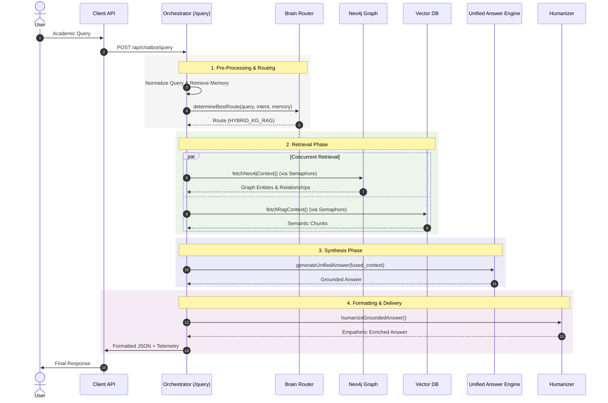
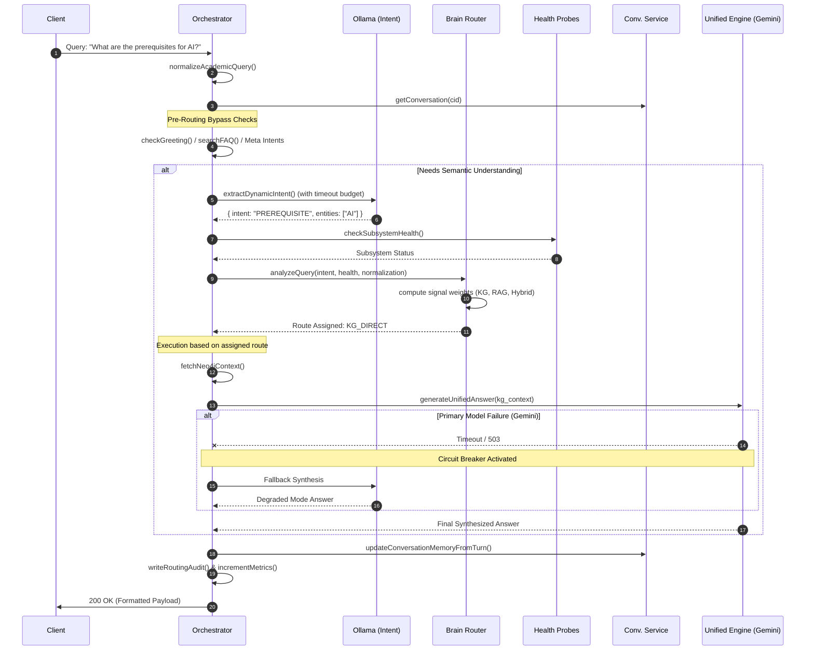
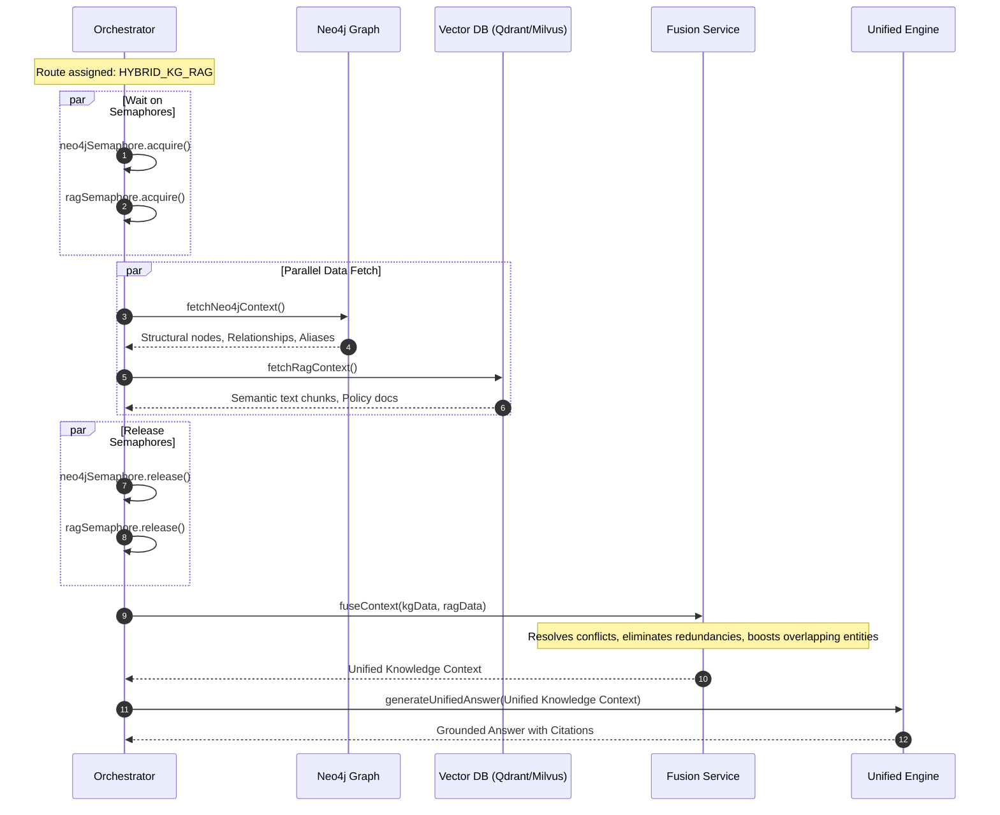
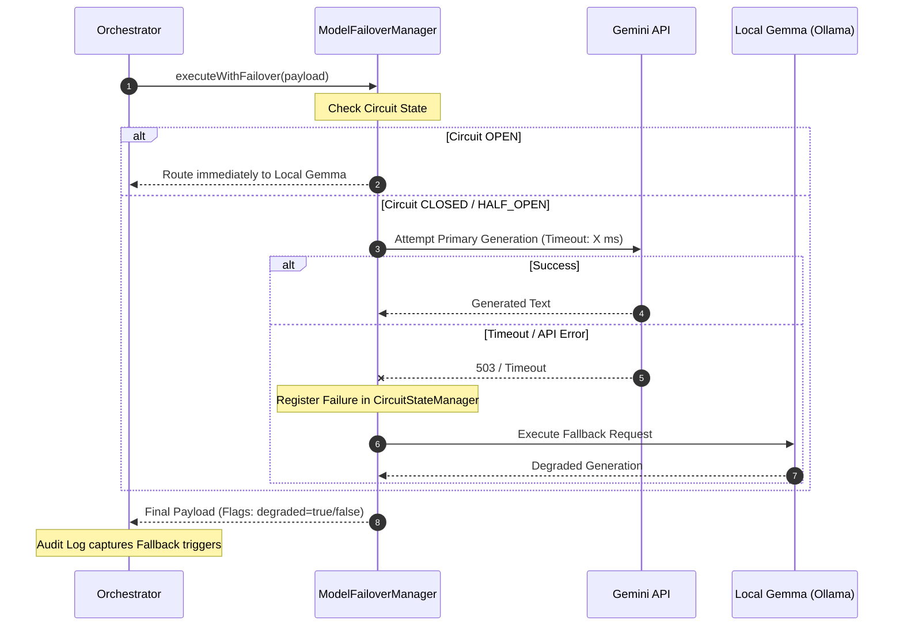
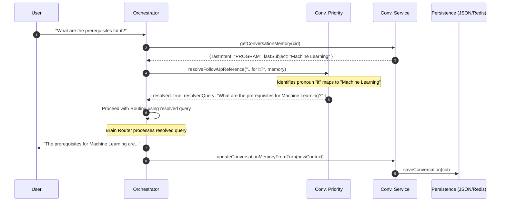

# Explainable Hybrid GraphRAG Academic AI Platform
## Architecture & System Sequence Documentation

## Table of Contents

1. [Introduction](#1-introduction)
2. [System Context](#2-system-context)
3. [Architectural Overview](#3-architectural-overview)
4. [Sequence Diagrams](#4-sequence-diagrams)
   - [Diagram 1: High Level System Flow](#diagram-1--high-level-system-flow)
   - [Diagram 2: Detailed Query Lifecycle](#diagram-2--detailed-query-lifecycle)
   - [Diagram 3: Hybrid GraphRAG Flow](#diagram-3--hybrid-graphrag-flow)
   - [Diagram 4: Failover & Reliability Flow](#diagram-4--failover--reliability-flow)
   - [Diagram 5: Conversation Memory Flow](#diagram-5--conversation-memory-flow)
5. [Engineering Notes](#5-engineering-notes)
6. [Reliability & Failover Notes](#6-reliability--failover-notes)
7. [Architectural Observations](#7-architectural-observations)
8. [Conclusion](#8-conclusion)

---

## 1. Introduction

This document provides a rigorous, deep-technical architectural analysis of the Explainable Hybrid GraphRAG Academic AI Platform. It captures the true system flows, orchestrations, fallback chains, and retrieval topologies implemented in the production codebase.

The system goes far beyond a simple Large Language Model (LLM) wrapper; it is a highly distributed AI orchestration platform featuring intelligent heuristic and semantic routing, strict concurrency controls, cascading failovers, memory management, and deterministic observability layers.

---

## 2. System Context

The platform is designed to provide authoritative, grounded, and academically verified answers to students and faculty. To achieve this safely, it employs several key subsystems:

- **Intelligent Brain Router**: A multi-signal heuristic and semantic router that assigns queries to the optimal processing path.
- **Hybrid GraphRAG Fusion**: Parallel retrieval across Neo4j Knowledge Graphs and Vector RAG, merged dynamically to prevent hallucination.
- **Enterprise Reliability**: Circuit breakers, semaphores for concurrent connections (LLM, Neo4j, RAG), and multi-tier model failovers (e.g., Gemini to Ollama).
- **Conversational Explainability**: Every response includes telemetry detailing the exact route, confidence score, and bypassed sub-systems.
- **Memory & Humanization**: Lightweight conversation memory and an egress post-processing humanizer for grounded empathy.

---

## 3. Architectural Overview

The core orchestrator (`orchestrator.js`) coordinates incoming traffic by immediately applying query normalization and executing fast pre-routing bypass checks (Greetings, Meta-Intents, FAQs). 

If a query requires semantic understanding, the platform extracts intents using a local LLM (with strict time budgets and LRU caching), then routes the signal through the Brain Router. The execution phase utilizes concurrency-safe retrievals against graph and vector databases, fusing results before passing them to the Unified Answer Engine (UAE). Finally, the Humanization middleware enriches the response before delivery.

---

## 4. Sequence Diagrams

### Diagram 1 — High Level System Flow

**Purpose:** Executive-level architecture understanding showing the broad request-response lifecycle from the user to the foundational AI layers.

### Diagram 2 — Detailed Query Lifecycle

**Purpose:** Deep technical lifecycle analysis detailing normalization, fallback logic, deterministic overrides, and observability.

### Diagram 3 — Hybrid GraphRAG Flow

**Purpose:** Show hybrid retrieval orchestration, detailing how semantic search and graph traversal merge synchronously.

### Diagram 4 — Failover & Reliability Flow

**Purpose:** Document the enterprise reliability engineering, demonstrating multi-tier fallback.

### Diagram 5 — Conversation Memory Flow

**Purpose:** Show conversational persistence architecture and follow-up reference resolution.

