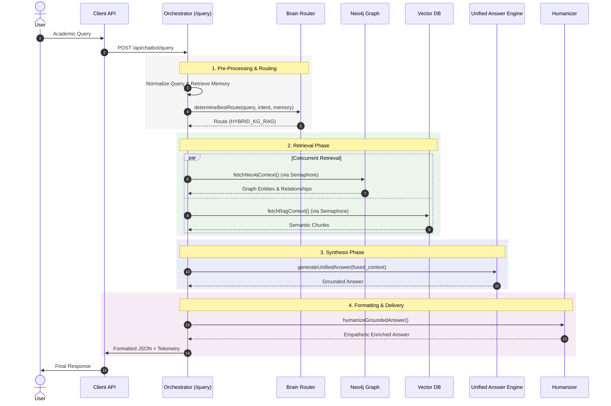

# INTERNAL_TEAM_DOCUMENTATION.md

## 1. System Overview

**Platform Purpose:**
The Explainable Hybrid GraphRAG Academic AI Platform provides authoritative, grounded, and academically verified answers to students and faculty. It acts as an academic advisory engine.

**Hybrid Retrieval Philosophy:**
To mitigate unverified information and hallucination, the system unifies graph-based structural relationships (Neo4j) with semantic vector retrieval (Qdrant). This hybrid approach bounds responses to documented facts.

**Orchestration Architecture:**
The backend is a Node.js (Express) application operating as the central API orchestrator. It manages intake, normalizes queries, coordinates intelligent routing, dispatches parallel/sequential retrieval, and manages LLM-assisted synthesis under strict concurrency controls.

## 2. High-Level Architecture

The architecture is separated into multiple logical layers and services. across multiple containers and distinct logical layers.

*   **Frontend Layer:** A React 19 SPA running on Vite (port 5173). Features specialized components for Graph Visualization, Conversation Sidebar, and Decision interactions.
*   **Orchestration Layer:** Node.js Express backend (`orchestrator.js`) on port 8004. Manages the API gateway, concurrency semaphores, and memory coordination.
*   **Routing Layer:** `brainRouter.js` applies heuristic rules, intent extraction, and threshold scoring to assign queries to the optimal execution path.
*   **Retrieval Layer:**
    *   **Neo4j Knowledge Graph:** Provides deterministic curriculum, syllabus, and structural ontology data.
    *   **Vector RAG:** Python FastAPI service backed by Qdrant. Performs semantic multi-pass search.
    *   **Decision Engine:** Python FastAPI service backed by SQLite, provides major recommendations and profile matching.
*   **Synthesis Layer:** `unifiedAnswerService.js` synthesizes context using the Gemini API as primary, with local Ollama fallback.
*   **Persistence Layer:** `persistenceLayer.js` writes lightweight JSON files to disk with debounced scheduling for conversation memory and decision profiles.
*   **Observability Layer:** Structured JSON loggers, in-memory `metrics.js` counters, and routing audit JSONL files.
*   **Reliability Layer:** Includes `circuitStateManager.js` and `modelFailoverManager.js` to manage failover states, health probes, and API degradation gracefully.

### High-Level System Flow Diagram

## 3. Runtime Request Lifecycle

The entire lifecycle for a standard query (`POST /api/chatbot/query`):

1.  **Request Entry:** Middleware (`cors`, `bodyParser.json()`) parses the request. Response is wrapped to measure `http_chatbot_latency_ms` and apply optional humanization.
2.  **Validation & Normalization:** Checks for empty queries. Applies `normalizeAcademicQuery()` to correct known entity misspellings or aliases.
3.  **Conversation Loading:** Generates or normalizes the `cid`. Loads `convo` from JSON persistence, reading prior messages and lightweight `priorConversationMemory`.
4.  **Pre-Routing Bypasses:** Sequential execution of local bypasses:
    *   `detectMetaConversationIntent()` (Route: `CONVERSATION_META`)
    *   `detectLightConversationalIntent()` (Route: `CONVERSATION_LIGHT`)
    *   `resolveFollowUpReference()` (Updates query or routes to `CONVERSATION_FOLLOWUP_CLARIFY`)
    *   `classifyGoldenQuery()` (Locks deterministic paths)
    *   `detectAcademicMultiIntents()`
    *   `isDemoGraphQuery()`
    *   `checkGreeting()` / `searchFAQ()`
5.  **Intent Extraction:** Tries golden matches, follow-up hints, ontology heuristics, profile heuristics, or finally calls `extractDynamicIntent()` via Ollama with a strict timeout.
6.  **Routing Analysis:** `brainRouter.analyzeQuery()` extracts signal weights. `determineBestRoute()` computes the final route based on confidence thresholds and subsystem health.
7.  **Retrieval Dispatch:** Depending on route (e.g., `KG_DIRECT`, `HYBRID_KG_RAG`), calls `fetchNeo4jContext()`, `ragService.search()`, or both concurrently via `Promise.allSettled()`. Governed by semaphores.
8.  **Evidence Fusion:** The `fusionService` merges KG and RAG data if hybrid, applying SHA-256 deduplication, ranking formulas, and pairwise contradiction detection.
9.  **Synthesis:** `generateUnifiedAnswer()` verifies minimum confidence limits. If sufficient, prompts Gemini. If Gemini times out, falls back to Ollama. Memory pressure or missing evidence can trigger deterministic context fallback.
10. **Formatting & Telemetry:** `responseFormatter.format()` standardizes the response envelope (adding trace metadata, routing confidence, used facts). `writeRoutingAudit()` logs the routing details.
11. **Persistence:** The assistant's turn and updated lightweight memory are saved to `conversationService`.
12. **Response Delivery:** Transmitted to the frontend.

## 4. Backend Service Reference

Detailed reference for active orchestrator runtime services.

### `orchestrator.js`
*   **Purpose:** Primary API Gateway and lifecycle coordinator.
*   **Runtime Role:** Mounts routers, initializes Neo4j connection, loads memory on startup. Applies `modelFailoverManager.waitForStartupCompletion()` and `gemmaWarmService.start()`.
*   **Dependencies:** Express, Neo4j, BrainRouter, UnifiedAnswer, Memory Services.
*   **Reliability:** Implements global route timeouts and catch-all error handling. Uses semaphores to cap maximum concurrent connections to subsystems.

### `services/brainRouter.js`
*   **Purpose:** Multidimensional signal fusion and route classification.
*   **Runtime Role:** Scores routes using heuristics, category detection, and intent.
*   **Dependencies:** `ragService.detectQueryCategory()`, `academicAliases`, `routingCalibration`.
*   **Fallback:** Appends second-best routes to a fallback chain on ambiguity detection. Degrades choices based on `checkSubsystemHealth()`.

### `services/responseFormatter.js`
*   **Purpose:** Ensures consistent client API contract structure.
*   **Runtime Role:** Standardizes keys (`final_answer`, `citations`, `confidence`, `graph`). Injects tracing metrics, response tier, and reasoning.

### `services/ragService.js`
*   **Purpose:** Node HTTP client wrapping the Python RAG engine.
*   **Runtime Role:** Multi-pass search logic (Pass 1: Broad/Expanded, Pass 2: Deep/Simplified, Pass 3: Answer Engine). Normalizes outputs.
*   **Dependencies:** `axios`, `axios-retry`.
*   **Reliability:** Internal `axios-retry` logic for 5xx errors. Uses local circuit breaker. Never throws exceptions directly; returns canonical failure envelopes on total failure.

### `services/neo4jcontext.js`
*   **Purpose:** Structural graph data and ontology retrieval.
*   **Runtime Role:** Selects indices, executes deterministic Cypher queries for curriculum/ontology, or queries Neo4j vector indices (using Ollama embeddings).
*   **Fallback:** Missing indices trigger fallback index attempts. Returns empty graph responses instead of crashing on failures.

### `services/unifiedAnswerService.js`
*   **Purpose:** Central synthesis orchestration.
*   **Runtime Role:** Trims context arrays based on prompt size budgets. Assesses missing evidence to short-circuit LLM calls. Primary synthesis via `generateGeminiSynthesis`.
*   **Dependencies:** `geminiService`, `ollamaService`, `convertToGraphData`.
*   **Fallback:** Drops to deterministic hybrid context fallback or local `generateStableResponse` (Ollama) upon Gemini timeout/failure. Contains logic to repair truncated LLM JSON.

### `services/decisionService.js`
*   **Purpose:** Recommendation logic and user profile memory management.
*   **Runtime Role:** Rule-based extraction of percentages/budgets. Communicates with the external Python Decision API via `/api/v1/decisions/recommend`. Generates local career roadmaps.
*   **Dependencies:** Local `decision_memory.json`, external Decision API container.

### `services/ollamaService.js`
*   **Purpose:** Interface to the local open-weight model infrastructure.
*   **Runtime Role:** Embeddings generation (nomic-embed-text), dynamic intent extraction, and fallback synthesis (Gemma/TinyLlama).
*   **Dependencies:** Governed tightly by `modelFailoverManager`.

### `services/modelFailoverManager.js` & `circuitStateManager.js`
*   **Purpose:** Fault tolerance state machines for LLM availability.
*   **Runtime Role:** Tracks statuses (`WAITING_FOR_OLLAMA`, `PRIMARY_COLD`, `CLOSED`, `DEGRADED`, `OPEN`, `HALF_OPEN`). Shifts traffic to backup models based on threshold crossing. Probes failing primary models to auto-recover.

### `services/conversationService.js` & `services/persistenceLayer.js`
*   **Purpose:** Distributed session context memory.
*   **Runtime Role:** Synchronizes chat turns, updates abstract conversation metadata (`lastIntent`, `lastTopic`). Uses `persistenceLayer.js` for debounced (500ms) JSON file writes with temp-file rename safety.

### `services/metrics.js` & `services/logger.js`
*   **Purpose:** Platform observability.
*   **Runtime Role:** `logger.js` offers daily rotated, structured JSON logging with regex-based secret redaction. `metrics.js` stores active counter and timer telemetry accessible via `/health/metrics`.

### `services/healthProbes.js`
*   **Purpose:** Caches diagnostic health across subsystems.
*   **Runtime Role:** Refreshes checks against Neo4j, RAG, Ollama, and Decision systems every 15s. Degrades routes preemptively if subsystems fail probes.

## 5. Routing & Classification Architecture

The BrainRouter executes highly deterministic control flow. 

**Routing Philosophy:**
Rather than feeding queries blindly to an LLM, the system classifies them using 20+ feature checks.

1.  **Alias & Ontology Matching:** Uses 316 dictionary aliases from `academicAliases.js`. Recognizes curriculum names, administrative titles, and campus locations.
2.  **Signal Generation:** Distinct scores computed for KG, RAG, Hybrid, Decision, and Career based on extracted entities, categories, and historical conversation routes.
3.  **Deterministic Calibration:**
    *   KG direct threshold: > 0.70
    *   RAG direct threshold: > 0.70
    *   Hybrid trigger: KG > 0.34 AND RAG > 0.34
4.  **Ambiguity Handling:** If the difference between top signals is ≤ 0.12, the query is marked ambiguous. The system favors `HYBRID_KG_RAG` to ensure broad coverage, and expands the fallback chain to include the second-best route.

## 6. Retrieval & Evidence Fusion

**Retrieval Semantics:**
*   **Neo4j (KG):** Utilized for topological queries. E.g., course prerequisites, faculty hierarchy, program structure. Embedding generated via `BAAI/bge-m3` or direct string matches.
*   **Qdrant (RAG):** Utilized for policy, scholarships, textual rules. RAG service utilizes a 3-pass escalating retrieval model.
*   **Parallel Execution:** The `HYBRID_KG_RAG` route spawns parallel queries capped independently by `neo4jSemaphore` (10) and `ragSemaphore` (8).

**Evidence Fusion (`fusionService.js`):**
When hybrid evidence is fetched, it is piped through a deduplication engine:
*   **Deduplication:** Computes SHA-256 over normalized text (lowercase, stripped punctuation). 
*   **Ranking Budget:** Maximum of 8 evidence items are retained, scored using `confidence x 0.45 + officiality x 0.35 + priority x 0.15`.
*   **Contradiction Handling:** Pairwise checks for GPA mismatch, waived/required conflicts, allowed/prohibited inconsistencies based on regex proximity.

## 7. LLM Infrastructure & Reliability

The LLM layer is treated as probabilistic and externally dependent.

**Providers:**
*   **Primary Synthesis:** Google Gemini via HTTP requests.
*   **Intent / Backups / Embedding:** Local Ollama running `Gemma`, `TinyLlama`, and `nomic-embed-text`.

**Reliability Subsystems:**
*   **Circuit Breaker:** Starts in `WAITING_FOR_OLLAMA`. `PRIMARY_COLD` forces the first payload to accept higher latencies. After consecutive timeouts (Gemini failing), transitions to `DEGRADED`, activating the local Ollama backup model. Total failure moves to `OPEN` (Deterministic payload return). 
*   **Prompt Budgeting:** Strict memory pressure detection based on V8 RSS metrics. High memory pressure restricts LLM context limits from 4096 tokens down to 512, or completely bypasses generation.
*   **Execution Wrappers:** `timeoutWrapper()` limits LLM inference strictly to predefined budgets (`primaryMs`: 12s, `backupMs`: 10s). 

## 8. Conversation Memory & Persistence

Memory operates completely stateless within the Node.js process, persisting reactively to JSON.

*   **Architecture:** `Map` objects held in RAM in `orchestrator.js`.
*   **Context Format:** `MAX_CONTEXT_TURNS` limits prompts to the most recent 12 messages to bound LLM token cost. 
*   **Lightweight Extraction:** Instead of raw text history, `conversationMemory` extracts `lastTopic`, `lastIntent`, `recentSubjects`. E.g., if user asks "What are the prerequisites for it?", `resolveFollowUpReference()` maps "it" to the `lastTopic` without an LLM call.
*   **Write Persistence:** JSON modifications are funneled through `persistenceLayer.js` via a 500ms debouncer. Writes occur safely via `.tmp` extensions followed by OS-level file renames to prevent corruption on crash.

## 9. Frontend Architecture

The frontend is a decoupled React 19 SPA interacting over HTTP JSON.

*   **D3/Graph Visualizer Architecture:** A heavily segmented D3.js implementation (`GraphVisualizer`, `GraphSearch`, `GraphControls`, `GraphView`, `GraphLegend`). Graph nodes are transmitted in the backend envelope and rendered reactively based on the query route.
*   **Component Structure:** `AdvisorPage` houses the `ConversationSidebar` and the main `ChatMessage` list.
*   **Interaction Model:** Users interact via textual chat; the frontend `backendService.ts` issues `POST /api/chatbot/query`.

## 10. Performance & Scalability

**Current Latency Budgets:**
*   Query Normalization: ~2ms
*   Brain Router Analysis: ~15-25ms
*   KG Retrieval: 800 - 2,400ms
*   RAG Retrieval: 500 - 2,000ms
*   Gemini Inference: 2,000 - 12,000ms
*   Ollama Fallback: 1,500 - 10,000ms
*   *Total Standard Query Time: 3.3s - 16.5s*

**Scalability Bottlenecks:**
1.  **Single-Concurrency LLM Gate:** `MAX_CONCURRENT_LLM` is 5, queuing requests synchronously.
2.  **In-Memory Session Store:** JSON memory map scales linearly with concurrent sessions.
3.  **Process Topology:** Node.js runs single-threaded without cluster mode; no horizontal scaling utilized yet.

## 11. Reliability & Failure Handling

System assumes everything will fail. Most critical external calls implement fallback or degraded execution behavior..

*   **Missing Subsystem Recovery:** If Neo4j cannot connect at boot, `orchestrator.js` still boots successfully, gracefully degrading all `KG_DIRECT` routes to `RAG_ONLY` or `LLM_FALLBACK`.
*   **Route Cascading:** If a `KG_DIRECT` retrieval returns null, BrainRouter dynamically re-evaluates the fallback chain, checking if RAG is healthy enough to handle the query.
*   **Final degraded response handling:** If `unifiedAnswerService.js` throws an error, the orchestrator defaults to `fusionService.fuse()`. If that times out, it responds with a static "Fatal Error" API envelope containing HTTP 200 to prevent frontend crashes.

## 12. Observability & Diagnostics

*   **Logging:** `logger.js` writes daily rotated files (Max 5MB). Actively runs redaction Regex patterns against passwords and API keys before stdout/disk write.
*   **Metrics Engine:** `metrics.js` tracks raw gauge counters and response distributions.
*   **Auditing:** `routing-audit.jsonl` tracks individual decision boundaries per query. Useful for post-mortem evaluations of BrainRouter thresholds.

## 13. Experimental / Legacy / Partial Systems

During source inspection, several subsystems were identified as inactive or partially implemented:

*   **Legacy Databases:** `mongodb://`, `mysql2`, and `meilisearch` code exists in legacy routers and `index.js`, but these are explicitly skipped by the active `npm run start:orchestrator` process.
*   **Unused Vector Code:** `knowledgeGraphService.js` imports `chromadb`, but is marked as unused and disconnected from the primary runtime flow. 
*   **Incomplete Logic:** `decisionService.compareMajors()` contains unreachable logging logic post-return. `ragService.search(query, {topK})` is called with options, but the function signature in the RAG service lacks the parameters argument.
*   **Caching:** `neo4jCache` is defined and reported on the health endpoint, but the active retrieval write path is currently disabled/unverified.
*   **Streamlit UI:** Located in `rag_system/app.py`, this is a debug UI that is not orchestrated by the production `docker-compose.yml`.

## 14. Engineering Tradeoffs

*   **Parallel Retrieval Overhead:** Executing `HYBRID_KG_RAG` retrieves dual datasets, doubling internal processing and memory overhead to ensure broader contextual coverage on ambiguous queries.
*   **JSON Persistence vs. Database:** Utilizing debounced JSON files minimizes infrastructural dependency, but limits multi-node horizontal scaling. 

## 15. Future Architecture Directions

*   **Distributed State Management:** Replacing `conversations.json` with a dedicated Redis instance to allow multi-instance Node orchestration.
*   **Retrieval Optimization:** Implementing a TTL-based query caching layer over Qdrant RAG responses to reduce duplicate embeddings requests.
*   **Database Scaling:** Introduction of Neo4j read replicas to expand the `MAX_CONCURRENT_NEO4J` semaphore threshold safely.
*   **Telemetry Maturation:** Migration from internal `metrics.js` to an OpenTelemetry collector layer to visualize cross-container request tracing.

## 16. Appendix

### Routing Calibration Constants
*   `KG_CONFIDENCE_THRESHOLD`: 0.40
*   `HYBRID_CONFIDENCE_THRESHOLD`: 0.34
*   `LLM_FALLBACK_THRESHOLD`: 0.18
*   `ROUTE_AMBIGUITY_MARGIN`: 0.12
*   `DETERMINISTIC_KG_THRESHOLD`: 0.70
*   `DETERMINISTIC_RAG_THRESHOLD`: 0.70

### Concurrency Semaphores
*   `MAX_CONCURRENT_LLM`: 5
*   `MAX_CONCURRENT_NEO4J`: 10
*   `MAX_CONCURRENT_RAG`: 8

### Configured Deadlines
*   `KG_ROUTE_TIMEOUT_MS`: 5,000ms
*   `RAG_ROUTE_TIMEOUT_MS`: 20,000ms
*   `UNIFIED_SYNTHESIS_ROUTE_TIMEOUT_MS`: 65,000ms
*   `primaryMs` (LLM Generation): 12,000ms
*   `backupMs` (LLM Generation): 10,000ms
