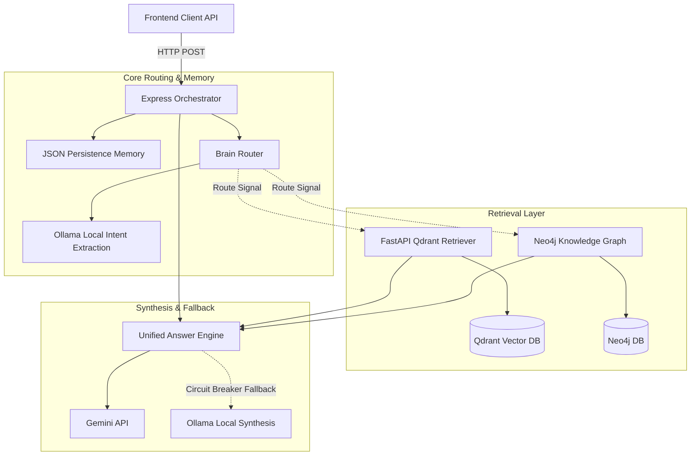
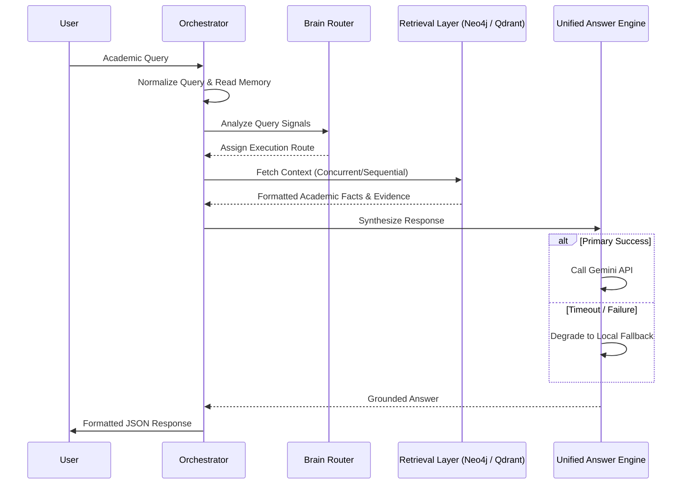

# Explainable Hybrid GraphRAG Academic AI Platform
## Architecture & System Sequence Documentation

## 2. Introduction

This document details the backend architecture and engineering design of the academic advisory AI platform. The system addresses the need for accurate, context-aware academic guidance by combining heuristic routing with a hybrid retrieval approach. By unifying graph-based structural relationships with semantic vector retrieval, the architecture mitigates the generation of unverified information and ensures responses are bounded by documented facts.

---

## 3. System Overview

The backend architecture centers on an orchestration layer built in Node.js (Express), which manages incoming queries and coordinates retrieval and synthesis. An internal routing module evaluates query heuristics and intents to select the optimal retrieval path. Depending on the evaluated route, the system fetches data from a Neo4j Knowledge Graph, a Qdrant-backed Vector RAG system, or both concurrently. Retrieved context is then synthesized by a unified answer engine, which relies on the Gemini API with local Ollama fallback capabilities.

---

## 4. High-Level Architecture

### Architecture Diagram

### Request Flow Diagram

---

## 5. Detailed Architecture

### Orchestrator
The central Node.js API orchestrator handles request intake, concurrency management, and response formatting. It applies query normalization, processes bypass checks for FAQs and greetings, and enforces system-wide timeouts. The orchestrator delegates tasks to specialized subsystems and coordinates fallback execution if primary services fail.

### Brain Router
A multi-signal heuristic router that determines the retrieval execution path. It extracts intents using a local LLM under strict time budgets and evaluates signals against defined thresholds (e.g., hybrid confidence, direct graph thresholds). The router assigns the query to specific execution paths such as direct graph retrieval, vector RAG, or hybrid parallel retrieval. 

### Neo4j Layer
Handles curriculum, syllabus, and structural ontology retrieval. The layer generates embeddings via Ollama to query vector indexes or executes deterministic Cypher traversals for recognized entities. Access to Neo4j is throttled by a concurrency semaphore. Unverified cache mechanisms (e.g., Neo4jCache) are present in the codebase but are disconnected from the active retrieval path.

### RAG Layer
A multi-pass retrieval service implemented in Python (FastAPI). It interfaces with a Qdrant vector database using BAAI/bge-m3 embeddings. The service executes an initial broad search, followed by a deeper simplified query pass if needed. It features a local circuit breaker and normalizes search results before returning them to the orchestrator.

### Unified Answer Engine
Synthesizes the final response by merging user queries, conversation history, and context retrieved from the graph and vector databases. The engine prioritizes the Gemini API for generation. It incorporates strict confidence and evidence gates; queries lacking sufficient retrieved evidence bypass generation and return a deterministic fallback. If Gemini fails or times out, the engine defaults to a local fallback synthesis.

### Conversation Memory
A lightweight persistence layer managing recent user interaction history. Conversations are stored locally in JSON format with debounced disk writes. The memory subsystem tracks recent topics, entities, and intents, allowing the system to resolve follow-up references before routing.

### Reliability Layer
Implements circuit breakers, fallback loops, and subsystem health probes. A state manager monitors LLM health, transitioning through closed, degraded, and open states based on failure thresholds. Retrieval systems are protected by configurable semaphores, ensuring bounded concurrency. Fallback synthesis is delegated to local models when primary external APIs are unresponsive.

### Response Formatter
Constructs the final structured JSON envelope for the client API. It normalizes route telemetry, applies latency metrics, and formats citations, used facts, and explainability reasoning into a uniform structure.

---

## 6. AI Query Lifecycle

1. **Request Entry**: The request enters via the primary orchestrator route with initial validation for payload structure.
2. **Normalization & Memory**: The query is normalized, and follow-up references are resolved using conversational memory context.
3. **Pre-routing & Intent**: Pre-routing bypass checks handle deterministic edge cases. If semantic understanding is needed, local models extract intent.
4. **Routing Evaluation**: Signal scores are computed based on thresholds to assign the optimal execution path.
5. **Retrieval**: Concurrent or sequential data fetches pull structural relationships from Neo4j and semantic policies from Qdrant.
6. **Synthesis**: Retrieved context is consolidated and formatted into a prompt. The primary external API handles generation, with a fallback to local synthesis on timeout.
7. **Formatting**: Output is sanitized, traces are applied, and the JSON envelope is sent to the client.

---

## 7. Sequence Diagram Summary

- **High Level System Flow**: Demonstrates the basic path from the client request through routing, retrieval, synthesis, and final delivery.
- **Detailed Query Lifecycle**: Outlines intent extraction, health verification, and execution failover mechanisms.
- **Hybrid GraphRAG Flow**: Details the parallel execution of Neo4j and vector retrieval operations and the subsequent context fusion.
- **Failover & Reliability Flow**: Highlights the circuit state manager's role in shifting traffic from primary APIs to local backup models during degraded states.
- **Conversation Memory Flow**: Explains the update and persistence of lightweight JSON session data and its role in resolving conversational references.

---

## 8. Technologies Used

- **Node.js (Express)**: Primary API orchestrator.
- **Python (FastAPI)**: RAG retriever and answer engine endpoints; decision API backend.
- **Neo4j**: Knowledge graph and structural data store.
- **Qdrant**: Primary vector database for semantic chunk retrieval.
- **Google Gemini**: Primary synthesis API.
- **Ollama**: Local intent extraction, embedding generation, and synthesis fallback.
- **SQLite (via SQLAlchemy)**: Relational store for the decision API container.
- **JSON Files**: Local persistence for conversation and decision memory.

*Note: ChromaDB, MongoDB, MySQL, and MeiliSearch are present in the repository but represent legacy, unused, or partially integrated experimental paths not active in the primary orchestrator runtime.*

---

## 9. Engineering Challenges & Solutions

- **Routing Ambiguity**: Handled by evaluating multiple signals and prepending close-second routes to a fallback chain when confidence margins overlap.
- **Retrieval Coordination**: Addressed by executing parallel retrieval against graph and vector stores, capped by independent semaphores to prevent resource exhaustion.
- **Fallback Handling**: Managed through a stateful circuit breaker that tracks failure rates and shifts generation load to local models during API degradation.
- **Reliability Management**: Maintained by periodic health probes with caching and bounded route-level timeouts.
- **Memory Persistence**: Implemented via a lightweight JSON persistence layer with debounced writes to balance I/O with data durability.
- **Response Grounding**: Enforced through confidence gating; responses are aborted or degraded if retrieval yields insufficient evidence.

---

## 10. Future Work

- Extend decision memory to capture deeper longitudinal profile interactions.
- Optimize heuristic routing weights based on expanded evaluation telemetry.
- Refine vector index fallback logic within the graph retrieval path.
- Standardize cache synchronization for the currently disconnected Neo4jCache implementation.

---

## 11. Conclusion

The academic advisory AI platform demonstrates a reliability-focused backend architecture. By unifying deterministic graph traversals with semantic vector retrieval, the system delivers grounded and verifiable responses. Its comprehensive routing logic, defined concurrency boundaries, and multi-tiered fallback mechanisms ensure operational availability and academic integrity without relying on unchecked generative behaviors.
