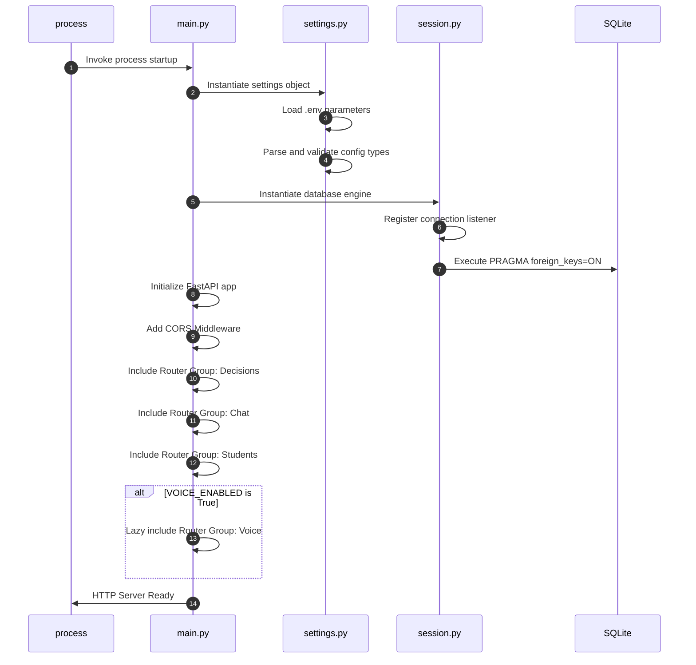
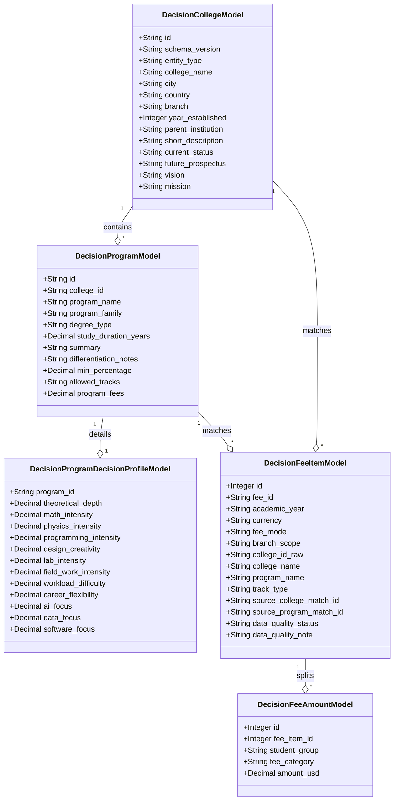
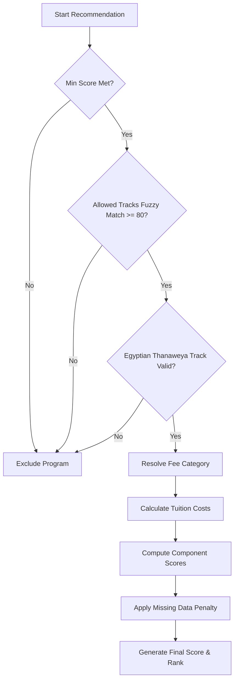
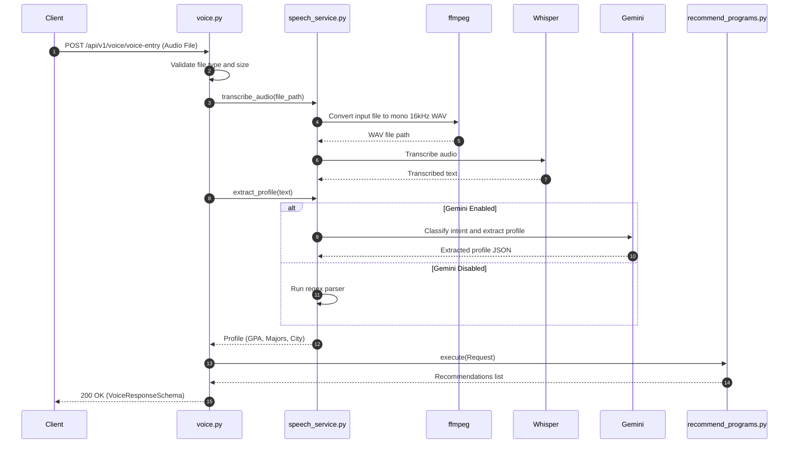

# AAST College Decision Support System
## Reverse Engineering & System Reconstruction Specification

This document provides a complete technical reconstruction of the **College Decision Support System Backend**. It is designed to enable support, maintenance, auditing, and full reimplementation of the system.

---

## 1. Executive Summary

### Problem Solved
Choosing a university program is a complex decision involving multiple variables. The **AAST College Decision Support System** resolves this by dynamically matching students with Arab Academy for Science, Technology and Maritime Transport (AAST) programs. It matches students by analyzing their academic profiles, high school certificate credentials, track limitations, location preferences, and financial budget, and produces ranked recommendations backed by complete financial transparency.

### Target Audience & Users
*   **Students**: Direct applicants seeking automated guidance on programs they are eligible for and can afford.
*   **AI Agent Orchestrator**: The primary frontend AI advisor uses this backend as a tool to fetch verified recommendations.
*   **Admissions Administrators**: Manage program cut-offs, tracks, and fees.

### System Boundaries
*   **Inputs**: School certificate type, high school percentage score, student fee group (`supportive_states` vs. `other_states`), semester budget in USD, preferred branch/city, interest keywords, and study track.
*   **Outputs**: A ranked list of program recommendations, matching scores (0-100), full tuition and additional fee breakdowns, decision-data completeness scores, diagnostic warnings, and natural language explanations.
*   **Business Objective**: Provide a deterministic recommendation and financial quoting service that enforces strict academic policy gates and delivers explainable matches.

---

## 2. Repository Inventory

The codebase is organized into modular layers matching clean architecture boundaries:

| Path | Purpose | Key Dependencies |
| :--- | :--- | :--- |
| **ENTRYPOINT & SETTINGS** | | |
| [main.py](file:///C:/AI_AGENT/college-decision-system-backend/app/main.py) | Application initializer, registers middlewares (CORS), mounts router groups, and registers health checks. | `fastapi`, `app.api.v1.routers` |
| [settings.py](file:///C:/AI_AGENT/college-decision-system-backend/app/config/settings.py) | Loads settings from `.env` or system environment, validating parameters and parsing debug flags. | `pydantic-settings` |
| **CONTROLLERS / ROUTERS** | | |
| [decisions.py](file:///C:/AI_AGENT/college-decision-system-backend/app/api/v1/routers/decisions.py) | Main recommendation endpoint. Evaluates client parameters, runs recommendations, and serializes output structures. | `app.application.use_cases.recommend_programs` |
| [chat.py](file:///C:/AI_AGENT/college-decision-system-backend/app/api/v1/routers/chat.py) | Conversational endpoint mapping student messages to recommendation tool calling. | `app.application.services.agent_service` |
| [voice.py](file:///C:/AI_AGENT/college-decision-system-backend/app/api/v1/routers/voice.py) | Speech-to-decision endpoint. Performs WAV transcription, parses parameters, and resolves programs. | `app.application.services.speech_service` |
| [admin.py](file:///C:/AI_AGENT/college-decision-system-backend/app/api/v1/routers/admin.py) | Administrative dashboard endpoint to read and update program admission percentages, tracks, and fees. | `sqlalchemy.orm` |
| [students.py](file:///C:/AI_AGENT/college-decision-system-backend/app/api/v1/routers/students.py) | Utility test endpoint to validate client payload shapes. | `app.api.v1.schemas.student` |
| **SERVICES & USE CASES** | | |
| [recommend_programs.py](file:///C:/AI_AGENT/college-decision-system-backend/app/application/use_cases/recommend_programs.py) | Core orchestration use case. Fetches candidates, applies gatekeepers, evaluates scores, applies penalties, and sorts. | `thefuzz.process`, `app.application.services` |
| [agent_service.py](file:///C:/AI_AGENT/college-decision-system-backend/app/application/services/agent_service.py) | Orchestrates multi-turn conversation memory, system prompts, and tool configurations for Gemini. | `google-generativeai` |
| [fee_category_resolver.py](file:///C:/AI_AGENT/college-decision-system-backend/app/application/services/fee_category_resolver.py) | Resolves the student's high school percentage and certificate into a fee category (A, B, C) with fallbacks. | `app.infrastructure.db.repositories.decision_fee_repo` |
| [tuition_calculator.py](file:///C:/AI_AGENT/college-decision-system-backend/app/application/services/tuition_calculator.py) | Quotes base tuition and aggregates recurring, one-time, and unknown-frequency fee additions. | `app.infrastructure.db.repositories.decision_fee_repo` |
| [interest_expansion_service.py](file:///C:/AI_AGENT/college-decision-system-backend/app/application/services/interest_expansion_service.py) | Expands student interests into sibling and parent categories and computes fuzzy token search scores. | `thefuzz.process`, `thefuzz.fuzz` |
| [training_intensity_deriver.py](file:///C:/AI_AGENT/college-decision-system-backend/app/application/services/training_intensity_deriver.py) | Merges 5 program and college signals to derive training intensity (low, medium, high) with imputations. | `app.application.services.decision_numeric_normalizer` |
| [decision_numeric_normalizer.py](file:///C:/AI_AGENT/college-decision-system-backend/app/application/services/decision_numeric_normalizer.py) | Heuristically normalizes database numeric values to 0.0-1.0 and 0.0-10.0 ranges, handling decimal scaling. | `decimal.Decimal` |
| [speech_service.py](file:///C:/AI_AGENT/college-decision-system-backend/app/application/services/speech_service.py) | Lazily loads OpenAI Whisper and executes local audio transformations and transcribing. | `openai-whisper`, `imageio_ffmpeg` |
| [ingestion_service.py](file:///C:/AI_AGENT/college-decision-system-backend/app/application/services/ingestion_service.py) | Validates raw JSON exports and ingests them into relational SQLAlchemy tables. | `app.api.v1.schemas.normalization` |
| **DATA & ACCESS OBJECTS** | | |
| [session.py](file:///C:/AI_AGENT/college-decision-system-backend/app/infrastructure/db/session.py) | Establishes the SQLAlchemy engine and mounts SQLite pragmas (Foreign Key enforcement). | `sqlalchemy.create_engine` |
| [integrity.py](file:///C:/AI_AGENT/college-decision-system-backend/app/infrastructure/db/integrity.py) | Runs pre-flight relational audits, counting orphans, duplicates, mapping gaps, and schema drifts. | `sqlalchemy.inspect` |
| [decision_fee_repo.py](file:///C:/AI_AGENT/college-decision-system-backend/app/infrastructure/db/repositories/decision_fee_repo.py) | Contains text normalizations, college alias matching, and fuzzy matching for fee rules. | `difflib.SequenceMatcher` |
| [decision_program_repo.py](file:///C:/AI_AGENT/college-decision-system-backend/app/infrastructure/db/repositories/decision_program_repo.py) | Performs candidate program searches with joins on level profiles, requirements, and outcomes. | `sqlalchemy.orm.joinedload` |
| [decision_college_repo.py](file:///C:/AI_AGENT/college-decision-system-backend/app/infrastructure/db/repositories/decision_college_repo.py) | Fetches colleges with nested training and admission structures. | `sqlalchemy.orm.selectinload` |
| [chat_repo.py](file:///C:/AI_AGENT/college-decision-system-backend/app/infrastructure/db/repositories/chat_repo.py) | Persists and loads conversational history for multi-turn chats. | `sqlalchemy.orm.Session` |
| **SCHEMAS & MODELS** | | |
| [decision_common.py](file:///C:/AI_AGENT/college-decision-system-backend/app/infrastructure/db/models/decision_common.py) | Common base mixins and safe numeric processors for malformed database decimal strings. | `sqlalchemy.types.TypeDecorator` |
| [decision_college.py](file:///C:/AI_AGENT/college-decision-system-backend/app/infrastructure/db/models/decision_college.py) | Models for colleges, leadership, Level profiles, admissions, accreditations, facilities, and mobility. | `sqlalchemy.orm.Mapped` |
| [decision_program.py](file:///C:/AI_AGENT/college-decision-system-backend/app/infrastructure/db/models/decision_program.py) | Models for programs, decision profiles, career paths, traits, and employment outlooks. | `sqlalchemy.orm.Mapped` |
| [decision_fee.py](file:///C:/AI_AGENT/college-decision-system-backend/app/infrastructure/db/models/decision_fee.py) | Models for fee items, amounts, global policies, category rules, and rule thresholds. | `sqlalchemy.orm.Mapped` |
| [decision_scholarship.py](file:///C:/AI_AGENT/college-decision-system-backend/app/infrastructure/db/models/decision_scholarship.py) | Models for scholarships and their eligibility lists. | `sqlalchemy.orm.Mapped` |
| [chat_message.py](file:///C:/AI_AGENT/college-decision-system-backend/app/infrastructure/db/models/chat_message.py) | Model for chat logs, session mapping, roles, and tool calls. | `sqlalchemy.Column` |
| [decision_schema.py](file:///C:/AI_AGENT/college-decision-system-backend/app/domain/entities/decision_schema.py) | Domain model contracts representing college JSON files before database ingestion. | `pydantic.BaseModel` |

---

## 3. System Architecture

The College Decision Support System Backend operates as a downstream FastAPI service. It is invoked via HTTP by a front-end client or the primary Node.js Express orchestrator (`orchestrator.js`):

```
                  +-----------------------------------+
                  |        Express Orchestrator       |
                  |         (orchestrator.js)         |
                  +-----------------+-----------------+
                                    | HTTP Request
                                    | (Authorized with X-Internal-Secret)
                                    v
+-----------------------------------+-----------------------------------+
|                     FastAPI Application Startup                       |
|   +---------------------------------------------------------------+   |
|   |                          Routers                              |   |
|   |  [/decisions/recommend]  [/chat/message]  [/voice/voice-entry]|   |
|   +-------------------------------+-------------------------------+   |
|                                   | Orchestrates
|                                   v
|   +-------------------------------+-------------------------------+   |
|   |                       Use Case Pipeline                       |   |
|   |                 [RecommendProgramsUseCase]                    |   |
|   +----+--------------------------+-------------------------------+   |
|        |                          | Uses Services
|        |                          v
|        |      +-------------------+--------------------+
|        |      | [FeeCategoryResolver]  [SpeechService] |
|        |      | [TuitionCalculator]    [WhisperModel]  |
|        |      +----------------------------------------+
|        v
|   +----+--------------------------+-------------------------------+   |
|   |                     Repositories Layer                        |   |
|   |  [DecisionProgramRepo]  [DecisionCollegeRepo]  [DecisionFeeRepo]  |
|   +-------------------------------+-------------------------------+   |
|                                   | Reads/Writes (SQLAlchemy)
|                                   v
|   +-------------------------------+-------------------------------+   |
|   |                     Database & Safegards                      |   |
|   |      [dev.db (SQLite)] <----+ [integrity.py Audit Checks]     |   |
|   +---------------------------------------------------------------+   |
+-----------------------------------------------------------------------+
```

### Components and Interactions

*   **API Routers**: Expose endpoints for recommendations ([decisions.py](file:///C:/AI_AGENT/college-decision-system-backend/app/api/v1/routers/decisions.py)), conversational chat ([chat.py](file:///C:/AI_AGENT/college-decision-system-backend/app/api/v1/routers/chat.py)), and voice processing ([voice.py](file:///C:/AI_AGENT/college-decision-system-backend/app/api/v1/routers/voice.py)).
*   **Orchestration Use Case**: The [RecommendProgramsUseCase](file:///C:/AI_AGENT/college-decision-system-backend/app/application/use_cases/recommend_programs.py#L157) class coordinates GPA gates, allowed track matches, location-budget evaluations, scoring calculations, and explanations.
*   **Helper Services**:
    *   [FeeCategoryResolver](file:///C:/AI_AGENT/college-decision-system-backend/app/application/services/fee_category_resolver.py#L29) maps certificate and scores to fee categories A, B, or C.
    *   [TuitionCalculator](file:///C:/AI_AGENT/college-decision-system-backend/app/application/services/tuition_calculator.py#L45) quotes base tuition and aggregates ancillary fees.
    *   [SpeechService](file:///C:/AI_AGENT/college-decision-system-backend/app/application/services/speech_service.py#L42) converts speech to text using Whisper and parses parameters.
*   **Repositories Layer**: Encapsulates DB lookups and fuzzy matching ([DecisionProgramRepository](file:///C:/AI_AGENT/college-decision-system-backend/app/infrastructure/db/repositories/decision_program_repo.py#L19), [DecisionCollegeRepository](file:///C:/AI_AGENT/college-decision-system-backend/app/infrastructure/db/repositories/decision_college_repo.py#L12), [DecisionFeeRepository](file:///C:/AI_AGENT/college-decision-system-backend/app/infrastructure/db/repositories/decision_fee_repo.py#L270)).
*   **Auditing and Integrity Layer**: The [integrity.py](file:///C:/AI_AGENT/college-decision-system-backend/app/infrastructure/db/integrity.py) script scans for schema anomalies and orphaned keys.

---

## 4. Application Startup Flow

The application startup lifecycle resolves configuration, binds database pragmas, and registers router groups:



*   **Whisper Lazy Loading**: The speech transcription model is not loaded during [main.py](file:///C:/AI_AGENT/college-decision-system-backend/app/main.py) startup. To avoid high memory consumption, [SpeechService.whisper_model](file:///C:/AI_AGENT/college-decision-system-backend/app/application/services/speech_service.py#L57) is lazy-loaded using a threading lock on the first `/voice-entry` request.

---

## 5. API Catalogue

### 1. `POST /api/v1/decisions/recommend`
*   **Purpose**: Resolves program recommendations for students or AI agents.
*   **Security**: Requires header `X-Internal-Secret` validated via [verify_internal_secret](file:///C:/AI_AGENT/college-decision-system-backend/app/api/v1/dependencies/security.py#L5) (bypassed in test/delivery checks).
*   **Request Schema**: [RecommendProgramsRequestSchema](file:///C:/AI_AGENT/college-decision-system-backend/app/api/v1/schemas/decision.py#L129)
    ```json
    {
      "certificate_type": "Egyptian Thanaweya Amma (Science)",
      "high_school_percentage": 85.0,
      "student_group": "other_states",
      "budget": 5000.0,
      "preferred_branch": "Abukir",
      "preferred_city": "Alexandria",
      "interests": ["AI", "software"],
      "track_type": "regular",
      "max_results": 5,
      "min_results": 3
    }
    ```
*   **Response Schema**: `RecommendProgramsResponseSchema`
    ```json
    {
      "total_candidates_considered": 133,
      "recommendations": [
        {
          "program_id": "CCIT_ABUKIR__ARTIFICIAL_INTELLIGENCE",
          "program_name": "Artificial Intelligence",
          "college_id": "CCIT_ABUKIR",
          "college_name": "College of Computing and Information Technology",
          "confidence_level": "Medium",
          "score": 77.12,
          "recommendation_score": 77.12,
          "match_type": "Exact",
          "estimated_semester_fee": 5165.0,
          "currency": "USD",
          "warnings": []
        }
      ]
    }
    ```
*   **Error Conditions**:
    *   `403 Forbidden`: Missing or invalid `X-Internal-Secret` header.
    *   `422 Unprocessable Entity`: Validation failures (e.g., GPA < 0 or > 100).

### 2. `POST /api/v1/chat/message`
*   **Purpose**: Handles multi-turn conversational queries for recommendation generation.
*   **Request Schema**: [ChatRequestSchema](file:///C:/AI_AGENT/college-decision-system-backend/app/api/v1/schemas/chat.py#L4) containing `session_id` and `message`.
*   **Response Schema**: [ChatResponseSchema](file:///C:/AI_AGENT/college-decision-system-backend/app/api/v1/schemas/chat.py#L8) returning assistant text `reply` and `recommendations` list.

### 3. `POST /api/v1/voice/voice-entry`
*   **Purpose**: Accepts audio files, transcribes them via Whisper, parses student parameters, and returns recommendations.
*   **Request Schema**: `multipart/form-data` with `file: UploadFile`.
*   **Response Schema**: [VoiceResponseSchema](file:///C:/AI_AGENT/college-decision-system-backend/app/api/v1/routers/voice.py#L9) containing transcribed `text`, chat `reply`, and `recommendations`.
*   **Error Conditions**:
    *   `404 Not Found`: Voice subsystem disabled (`VOICE_ENABLED = false`).
    *   `400 Bad Request`: Empty transcription or unsupported audio.
    *   `413 Payload Too Large`: Upload exceeds `VOICE_MAX_UPLOAD_MB` limit.

### 4. `GET /api/v1/voice/voice-health`
*   **Purpose**: Returns Whisper initialization status, device type, load time, and transcription counts.

### 5. `GET /api/v1/admin/programs`
*   **Purpose**: Fetches administrative program requirements, tracks, and fees.

### 6. `PUT /api/v1/admin/programs/{program_id}`
*   **Purpose**: Updates a program's requirements.
*   **Request Body**: [ProgramUpdateRequest](file:///C:/AI_AGENT/college-decision-system-backend/app/api/v1/routers/admin.py#L17) containing `min_percentage` (Decimal), `program_fees` (Decimal), and `allowed_tracks` (string representation of list).

### 7. `POST /api/v1/students/evaluate`
*   **Purpose**: Validates student payload structures and echoes it back.
*   **Request Schema**: [StudentInputSchema](file:///C:/AI_AGENT/college-decision-system-backend/app/api/v1/schemas/student.py#L6)

---

## 6. Decision Engine

The decision engine ranks programs by resolving user constraints against program attributes. It is implemented in the [RecommendProgramsUseCase](file:///C:/AI_AGENT/college-decision-system-backend/app/application/use_cases/recommend_programs.py#L157) class and utilizes the following sub-components:

```
Input Request
     |
     v
+----+---------------------------------------------------+
|               Candidate Querying                       |
| Queries program database using geographic filters     |
+----+---------------------------------------------------+
     |
     v
+----+---------------------------------------------------+
|             Constraint Relaxation                      |
| If results < min_results, drops geographic filters    |
+----+---------------------------------------------------+
     |
     v
+----+---------------------------------------------------+
|             Eligibility Filter                        |
| Enforces Min Score and Allowed Tracks fuzzy match     |
+----+---------------------------------------------------+
     |
     v
+----+---------------------------------------------------+
|         Track-based Compatibility Gates                |
| Applies strict Egyptian High School track blocks       |
+----+---------------------------------------------------+
     |
     v
+----+---------------------------------------------------+
|              Scoring Pipeline                          |
| Compares student interests, budget, employment         |
| outlook, location, and admissions compatibility        |
+----+---------------------------------------------------+
     |
     v
+----+---------------------------------------------------+
|              Penalty Deduction                         |
| Deducts points for missing metadata and fallbacks    |
+----+---------------------------------------------------+
     |
     v
+----+---------------------------------------------------+
|                  Ranking                               |
| Sorts by final score, confidence, and tuition cost     |
+----+---------------------------------------------------+
```

---

## 7. Eligibility Engine

The eligibility engine filters out candidates before scoring. It consists of two main layers:

### Layer 1: Schema-Level Academic Admission Gates
1.  **High School Percentage Score**: Evaluated against the program's required minimum percentage. If `percentage` < `min_percentage`, the candidate is excluded.
2.  **Allowed Tracks Check**: Compares the student's study track (e.g. Science, Math, Literature) against the program's [allowed_tracks](file:///C:/AI_AGENT/college-decision-system-backend/app/infrastructure/db/models/decision_program.py#L51) string list. It uses fuzzy matching with a threshold of **80**:
    $$\text{MatchScore} = \text{FuzzMatch}(\text{StudentTrack}, \text{AllowedTracks}) \ge 80$$
    If no track matches, the program is excluded.

### Layer 2: Egyptian Thanaweya Amma (Secondary Certificate) Restrictions
Strict institutional gates are enforced based on the student's secondary track in the [_is_track_compatible](file:///C:/AI_AGENT/college-decision-system-backend/app/application/use_cases/recommend_programs.py#L1204) helper:

*   **Science Track (علمي علوم)**:
    *   *Rule*: Cannot join Engineering.
    *   *Implementation*: Blocks colleges with IDs containing `cet_` or names containing `engineering`. Eligible for Computing, AI, Pharmacy, Dentistry, and Medicine.
*   **Math Track (علمي رياضة)**:
    *   *Rule*: Cannot join Medical programs (Medicine, Pharmacy, Dentistry).
    *   *Implementation*: Blocks colleges with IDs containing `pharm_`, `dent_`, or `med_`, and names containing `pharmacy`, `dentistry`, or `medicine`. Eligible for Engineering, Computing, and AI.
*   **Literature Track (أدبي)**:
    *   *Rule*: Restricted to humanities, business, languages, and management. Cannot join STEM, computing, AI, engineering, or medical fields.
    *   *Implementation*:
        *   Blocks forbidden program families: `AI_FAMILY`, `CS_FAMILY`, `CYBERSEC_FAMILY`, `DATA_FAMILY`, `IS_FAMILY`, `SOFTWARE_FAMILY`, `ENGINEERING_FAMILY`, `HEALTHCARE_FAMILY`.
        *   Blocks colleges with IDs or names containing: `ccit`, `cet`, `pharm`, `dent`, `med`, `cai`.
        *   Blocks programs with names or IDs containing keywords: `artificial intelligence`, `intelligent systems`, `computer science`, `cybersecurity`, `software engineering`, `engineering`, `medicine`, `pharmacy`, `dentistry`.

---

## 8. Scoring Engine

The recommendation score is calculated using a weighted multi-factor formula, minus missing data penalties.

### 1. Raw Weighted Score ($Score_{weighted}$)
The raw score is calculated using six components:

$$Score_{weighted} = 0.60 \cdot S_{interest} + 0.20 \cdot S_{affordability} + 0.10 \cdot S_{employment} + 0.05 \cdot S_{location} + 0.025 \cdot S_{flexibility} + 0.025 \cdot S_{admission}$$

Where:
*   **Interest Score** ($S_{interest}$): Evaluated by matching interest keywords against program traits, career roles, names, summaries, and parent families. Expanded categories are resolved in [InterestExpansionService](file:///C:/AI_AGENT/college-decision-system-backend/app/application/services/interest_expansion_service.py#L7) using `fuzz.partial_ratio` (threshold 85) or token subset checks. If the match is profile-only (no keyword match in text), the score is capped by `PROFILE_ONLY_CAPS` (e.g. 0.35 for engineering). If $S_{interest} < 0.50$, the candidate is discarded.
*   **Affordability Score** ($S_{affordability}$):
    *   Stated budget $\ge$ tuition fee: $1.0$ (Affordable)
    *   Stated budget $\ge$ tuition fee $\times 1.15$: $0.7$ (Stretch)
    *   Stated budget $<$ tuition fee $\times 1.15$: $0.2$ (Not Affordable)
    *   Missing budget or tuition: $0.55$ (if budget is null) or $0.15$ (if tuition is null)
*   **Employment Score** ($S_{employment}$): Average of `egypt_market_score` and `international_market_score` from the program's outlook. If program data is missing, it falls back to college-level scores with a maximum cap of $0.70$.
*   **Location Score** ($S_{location}$): Averages $1.0$ for exact city and branch matches, $0.35$ for city mismatches, and $0.30$ for branch mismatches.
*   **Career Flexibility Score** ($S_{flexibility}$): Evaluates `career_flexibility` from the program's decision profile. If missing, falls back to the college level capped at $0.70$.
*   **Admissions Score** ($S_{admission}$): Evaluates certificate compatibility. Returns $1.0$ if the certificate is in the college's accepted list, $0.35$ if not listed, and $0.45$ if college admission data is missing.

### 2. Missing Data Penalty ($P_{missing}$)
Calculates penalties for missing metadata to adjust the recommendation score:

$$P_{missing\_base} = \sum P_{component} + \sum P_{tuition}$$

| Component | Penalty | Condition |
| :--- | :--- | :--- |
| **No Profile** | $+0.05$ | Program lacks a decision profile. |
| **No Training Data** | $+0.10$ | College lacks training and practice metadata. |
| **No Employment Data**| $+0.05$ | Program lacks employment outlook metadata. |
| **No Admission Data** | $+0.05$ | College lacks admission requirements metadata. |
| **Tuition Unavailable**| $+0.30$ | Tuition fee cannot be resolved. |
| **Branch Fallback** | $+0.15$ | Fee is estimated using branch average. |
| **College Fallback** | $+0.05$ | Fee is estimated using college average. |
| **Fee Data Incomplete**| $+0.10$ | Matched fee item is flagged as incomplete or contains unknown frequency fees. |

*   **Age Dampener**: To prevent penalizing newly added programs before their metadata is complete, a dampener is applied to programs created within the last 30 days:
    $$\text{If } \text{Age}_{\text{days}} \le 30, \quad P_{missing} = P_{missing\_base} \times 0.5$$
    $$\text{Otherwise}, \quad P_{missing} = P_{missing\_base}$$

### 3. Final Recommendation Score ($Score_{final}$)
The final score is bounded between $0.0$ and $100.0$:

$$Score_{final} = \max\left(0.0, Score_{weighted} - P_{missing}\right) \times 100$$

> [!WARNING]
> **Score Weight Mismatch & Code Drift**:
> There is a discrepancy between the scoring math and the visual breakdown returned to clients in [recommend_programs.py](file:///C:/AI_AGENT/college-decision-system-backend/app/application/use_cases/recommend_programs.py):
> *   **Actual Math Weights**: Interest (60%), Affordability (20%), Employment (10%), Location (5%), Flexibility (2.5%), Admission (2.5%).
> *   **Visual Breakdown Weights**: Interest (32%), Affordability (28%), Employment (20%), Location (10%), Flexibility (5%), Admission (5%).
> This causes the sum of the components in the visual breakdown generated by [_build_score_breakdown](file:///C:/AI_AGENT/college-decision-system-backend/app/application/use_cases/recommend_programs.py#L1035) to differ from the actual final score returned to the user.

---

## 9. Business Rules Catalogue

### RULE-001: Literature Track STEM Block
*   **Description**: Prevent literature students from enrolling in science, computing, or engineering programs.
*   **Condition**: `certificate_type` contains "literature", "literary", or "adabi".
*   **Trigger**: Ingestion or query matching.
*   **Outcome**: Exclude candidate programs with families in (`AI_FAMILY`, `CS_FAMILY`, `CYBERSEC_FAMILY`, `DATA_FAMILY`, `IS_FAMILY`, `SOFTWARE_FAMILY`, `ENGINEERING_FAMILY`, `HEALTHCARE_FAMILY`) or colleges (`ccit`, `cet`, `pharm`, `dent`, `med`, `cai`).
*   **Priority**: Critical.

### RULE-002: Math Track Medical Block
*   **Description**: Prevent math track students from enrolling in medical fields.
*   **Condition**: `certificate_type` contains "math" or "mathematics".
*   **Trigger**: Program eligibility check.
*   **Outcome**: Exclude candidate programs in colleges (`pharm_`, `dent_`, `med_`).
*   **Priority**: Critical.

### RULE-003: Science Track Engineering Block
*   **Description**: Prevent science track students from enrolling in engineering fields.
*   **Condition**: `certificate_type` contains "science" and does not contain "math".
*   **Trigger**: Program eligibility check.
*   **Outcome**: Exclude candidate programs in colleges (`cet_` or names containing `engineering`).
*   **Priority**: Critical.

### RULE-004: Minimum Score Admission Gate
*   **Description**: Filter out students who do not meet the minimum score requirement.
*   **Condition**: `high_school_percentage` < `program.min_percentage`.
*   **Trigger**: Gatekeeper check.
*   **Outcome**: Exclude program from recommendations.
*   **Priority**: High.

### RULE-005: Interest Hard Limit
*   **Description**: Filter out programs with weak keyword/profile interest alignment.
*   **Condition**: Computed interest score $S_{interest} < 0.50$.
*   **Trigger**: Scoring phase.
*   **Outcome**: Exclude program from recommendations.
*   **Priority**: High.

---

## 10. Data Models



*   **Colleges**: Represented by [DecisionCollegeModel](file:///C:/AI_AGENT/college-decision-system-backend/app/infrastructure/db/models/decision_college.py#L20).
*   **Programs**: Represented by [DecisionProgramModel](file:///C:/AI_AGENT/college-decision-system-backend/app/infrastructure/db/models/decision_program.py#L21) with nested decision metrics stored in [DecisionProgramDecisionProfileModel](file:///C:/AI_AGENT/college-decision-system-backend/app/infrastructure/db/models/decision_program.py#L89).
*   **Tuition and Fees**: Stored in [DecisionFeeItemModel](file:///C:/AI_AGENT/college-decision-system-backend/app/infrastructure/db/models/decision_fee.py#L30) (mapping parameters) and split into tiers using [DecisionFeeAmountModel](file:///C:/AI_AGENT/college-decision-system-backend/app/infrastructure/db/models/decision_fee.py#L91).

---

## 11. Database Analysis

The application uses SQLite as its primary database engine. The schema contains **27 active tables** with indexes on foreign keys to optimize joins:

### Key Table Schemas & Constraints
*   **`decision_colleges`**: Primary key `id` (Text). Represents AAST colleges (e.g. `CCIT_ABUKIR`, `CET_ALAMEIN`).
*   **`decision_programs`**: Primary key `id` (Text). Foreign key `college_id` references `decision_colleges(id)` with cascade delete. Unique constraint on `(college_id, program_name)`.
*   **`decision_program_decision_profiles`**: Primary key `program_id` (Text). Foreign key references `decision_programs(id)` with cascade delete. Stores profile ratings.
*   **`decision_fee_items`**: Primary key `id` (Integer). Unique constraint on `fee_id`. Foreign keys `source_college_match_id` and `source_program_match_id` reference colleges and programs.
*   **`decision_fee_amounts`**: Primary key `id` (Integer). Unique constraint on `(fee_item_id, student_group, fee_category)`. Binds student group and category to base USD amount.

### SQLite Pragma Settings
Enforced on connection in [session.py](file:///C:/AI_AGENT/college-decision-system-backend/app/infrastructure/db/session.py):
```sql
PRAGMA foreign_keys=ON;
```

### Database Integrity Audits
The [integrity.py](file:///C:/AI_AGENT/college-decision-system-backend/app/infrastructure/db/integrity.py) module provides diagnostic checks to verify data consistency:
*   **Orphan Queries**: Identifies child rows referencing missing parents (e.g. `programs_missing_college`, `fee_amounts_missing_fee_item`).
*   **Duplicate Queries**: Identifies duplicate records (e.g. `duplicate_program_name_per_college`).
*   **Mapping Gap Queries**: Identifies missing foreign key linkages (e.g. `fee_items_unmatched_raw_college_ids`).
*   **Schema Drift Analysis**: Compares the database state against SQLAlchemy models.

---

## 12. Configuration Registry

Configurations are loaded from `.env` and managed in [settings.py](file:///C:/AI_AGENT/college-decision-system-backend/app/config/settings.py):

| Variable | Default Value | Purpose | Impact of Changing |
| :--- | :--- | :--- | :--- |
| `DATABASE_URL` | `sqlite:///./dev.db` | Path to the SQLite database. | Moves the database file location. |
| `DECISION_GEMINI_ENABLED`| `True` | Enables Gemini for chat and speech profiles. | If `False`, falls back to local regex-based parsing. |
| `GEMINI_API_KEY` | `None` (SecretStr) | API key for Gemini. | Required for Gemini integration. |
| `INTERNAL_SECRET_KEY` | `None` (SecretStr) | Header validation token for security. | Secures decision API routes. |
| `VOICE_ENABLED` | `True` | Enables the voice router. | If `False`, voice endpoints return 404. |
| `VOICE_WHISPER_MODEL` | `"base"` | Whisper model size (tiny, base, small, medium, large). | Larger models increase transcription accuracy but require more memory/CPU. |
| `VOICE_DEVICE` | `"cpu"` | Computation device for PyTorch (cpu/cuda).| Using `"cuda"` requires a GPU and speeds up transcription. |

---

## 13. Recommendation Generation Pipeline

When a client calls `POST /api/v1/decisions/recommend`, the request is processed through the following pipeline steps:

```
                  [Client Request]
                         |
                         v
            +-------------+-------------+
            |     Schema Validation     |
            |   Validates request types   |
            +-------------+-------------+
                         |
                         v
            +-------------+-------------+
            |    Candidate Querying     |
            | Filters by city & branch  |
            +-------------+-------------+
                         |
                         v
            +-------------+-------------+
            |    Constraint Relaxation  |
            | Drops geography if < min  |
            +-------------+-------------+
                         |
                         v
            +-------------+-------------+
            |     Gatekeeper Filters    |
            |  Enforces score & tracks  |
            +-------------+-------------+
                         |
                         v
            +-------------+-------------+
            |   Fee Resolution & Quote  |
            | Maps category A, B, or C  |
            +-------------+-------------+
                         |
                         v
            +-------------+-------------+
            |    Factor-based Scoring   |
            |   Computes weighted score |
            +-------------+-------------+
                         |
                         v
            +-------------+-------------+
            |     Penalty Deduction     |
            | Subtracts missing data pts|
            +-------------+-------------+
                         |
                         v
            +-------------+-------------+
            |      Sorting & Output     |
            |   Sorts and returns list  |
            +---------------------------+
```

---

## 14. Explainability Layer

The explainability layer generates natural language summaries and confidence ratings to justify recommendations:

### 1. Confidence Level Mapping
Confidence ratings are determined by the missing data penalty score ($P_{missing}$):
*   **High Confidence**: $P_{missing} == 0.0$ (Complete metadata, verified program tuition, and no fallback averages).
*   **Medium Confidence**: $0.0 < P_{missing} \le 0.15$ (Minor fallbacks, e.g. college average fallback instead of program-specific tuition).
*   **Low Confidence**: $P_{missing} > 0.15$ (Significant missing data, e.g. missing program profile or using branch average fallback).

### 2. Explanation Summary Generation
Summaries are compiled by combining the top scoring factors:
*   *Interest*: `"Matched interests: AI."`
*   *Affordability*: `"Estimated semester tuition fits the stated budget."` (or `"is close to"` / `"is above"`).
*   *Employment*: `"Employment outlook is strong relative to other options."` (score $\ge 0.70$).
*   *Training*: `"Derived training intensity is high."`
*   *Completeness*: If completeness is $< 100\%$: `"Decision-data completeness is 95% and partial data reduced the score by 0.05 points."`

---

## 15. Failure Mode Analysis

The backend incorporates fallbacks to ensure availability during failures:

### 1. Incomplete Student Inputs
*   **No GPA**: If `high_school_percentage` is missing, the fee category resolver returns `unresolved`, and the tuition calculator flags `tuition_unavailable = True`. The program remains eligible but receives a score penalty.
*   **No Budget**: If `budget` is missing, the affordability score falls back to a neutral score of `0.55`.

### 2. Missing Program Tuition
*   **College-Level Fallback**: If a program does not have a specific fee item, the system calculates the average fee of all programs in the same college. The recommendation is flagged with `used_college_fallback = True`.
*   **Branch-Level Fallback**: If the college has no fee data, the system calculates the average fee of all colleges in the same branch, returning it with a `low` confidence rating and applying a `0.15` penalty.
*   **Tuition Unavailable**: If no fallback average can be calculated, the program is scored with a `0.30` penalty, and `tuition_unavailable = True` is returned.

### 3. Voice Extraction Failure
*   If Whisper transcription fails or returns empty text, the voice endpoint raises an `HTTP 400 Bad Request` error.
*   If the Gemini API fails or times out during profile extraction, the system falls back to a local, regex-based deterministic parser.

---

## 16. Security Review

### 1. Authentication & API Protection
*   The `POST /api/v1/decisions/recommend` endpoint is protected by the [verify_internal_secret](file:///C:/AI_AGENT/college-decision-system-backend/app/api/v1/dependencies/security.py#L5) dependency.
*   Clients must supply the token in the `X-Internal-Secret` header. It is validated against the environment's `INTERNAL_SECRET_KEY`.
*   *Exemption*: The token check is bypassed if `pytest` is in the running modules or if the command is executed by `run_delivery_checks.py`.

### 2. Database Protection
*   SQLAlchemy ORM parameterized queries are used to prevent SQL Injection risks.
*   SQLite foreign key constraints are explicitly enabled at connection time to prevent structural data corruption.
*   Dirty database types are intercepted by [SafeNumeric](file:///C:/AI_AGENT/college-decision-system-backend/app/infrastructure/db/models/decision_common.py#L39) to protect memory structures from malformed data strings.

### 3. Sensitive Data Exposure
*   `GEMINI_API_KEY` and `INTERNAL_SECRET_KEY` are declared as Pydantic `SecretStr` objects to prevent accidental exposure in application logs.

---

## 17. Performance Analysis

### 1. Potential Bottlenecks
*   **Whisper Transcription Latency**: Transcribing audio on the CPU using the `base` model can introduce latency (often 2-5 seconds depending on audio length).
*   **Fuzzy Search Loops**: The use of `thefuzz` in candidate searches and track checks can become a bottleneck as the number of programs increases.
*   **Synchronous Endpoints**: API routes are synchronous, which can limit throughput under concurrent load.

### 2. Optimization Opportunities
*   **Preloading models**: Preloading the Whisper model in a background thread during startup instead of lazy loading on the first request.
*   **GPU Acceleration**: Setting `VOICE_DEVICE = "cuda"` in production to offload transcription to a GPU.
*   **Fuzzy Match Cache**: Caching resolved interests inside [InterestExpansionService](file:///C:/AI_AGENT/college-decision-system-backend/app/application/services/interest_expansion_service.py#L7) to avoid repeated fuzzy evaluations.

---

## 18. Developer Onboarding Guide

### 1. Setup & Installation
1.  Install dependencies:
    ```bash
    pip install -r requirements.txt
    ```
2.  Create `.env` using `.env.example` as a template and set the required variables:
    ```ini
    GEMINI_API_KEY=your_gemini_key
    INTERNAL_SECRET_KEY=aast-internal-secret-2024
    DATABASE_URL=sqlite:///./dev.db
    VOICE_ENABLED=true
    ```
3.  Initialize the SQLite database schema and run migrations:
    ```bash
    alembic upgrade head
    ```

### 2. Running the Server Locally
Run the FastAPI application locally using Uvicorn:
```bash
uvicorn app.main:app --host 127.0.0.1 --port 8005 --reload
```

### 3. Running Verification Checks & Tests
Execute the delivery checks script to verify schema migrations, run tests, and perform smoke tests:
```bash
python scripts/run_delivery_checks.py
```

---

## 19. Visual Documentation

### 1. Decision Evaluation Flow
The lifecycle of a single candidate program evaluation within [RecommendProgramsUseCase](file:///C:/AI_AGENT/college-decision-system-backend/app/application/use_cases/recommend_programs.py#L157):



### 2. API Flow for Voice-to-Decision
The processing steps for the speech-to-decision endpoint in [voice.py](file:///C:/AI_AGENT/college-decision-system-backend/app/api/v1/routers/voice.py):



---

## 20. Improvement Opportunities

1.  **Resolve Score Weight Mismatch**: Align the weights used in the scoring formula with the visual contributions returned to the client in [_build_score_breakdown](file:///C:/AI_AGENT/college-decision-system-backend/app/application/use_cases/recommend_programs.py#L1035) to ensure the breakdown components sum to the final score.
2.  **Add Interest Alignment Cache**: Implement caching in [InterestExpansionService](file:///C:/AI_AGENT/college-decision-system-backend/app/application/services/interest_expansion_service.py#L7) to avoid redundant fuzzy matching evaluations on common query terms.
3.  **Introduce Async Endpoints**: Convert the FastAPI route handlers and repository calls to `async/await` to improve concurrency and throughput under load.
