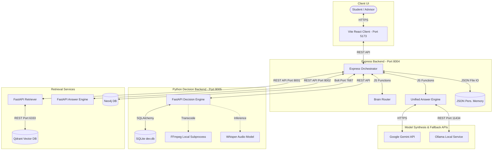

```mermaid
graph TD
    subgraph Client UI
        User([Student / Advisor]) <-->|HTTPS| ReactClient[Vite React Client - Port 5173]
    end

    subgraph Express Backend - Port 8004
        ReactClient <-->|REST API| ExpressOrch[Express Orchestrator]
        ExpressOrch <-->|JS Functions| Router[Brain Router]
        ExpressOrch <-->|JS Functions| UAE[Unified Answer Engine]
        ExpressOrch <-->|JSON File IO| DebPers[(JSON Pers. Memory)]
    end

    subgraph Python Decision Backend - Port 8005
        ExpressOrch <-->|REST API| FastAPI_Dec[FastAPI Decision Engine]
        FastAPI_Dec <-->|SQLAlchemy| SQLite[(SQLite dev.db)]
        FastAPI_Dec -.->|Transcode| FFmpeg[FFmpeg Local Subprocess]
        FastAPI_Dec -.->|Inference| Whisper[Whisper Audio Model]
    end

    subgraph Retrieval Services
        ExpressOrch <-->|REST API Port 8001| FastAPI_Ret[FastAPI Retriever]
        ExpressOrch <-->|REST API Port 8002| FastAPI_Ans[FastAPI Answer Engine]
        FastAPI_Ret <-->|REST Port 6333| Qdrant[(Qdrant Vector DB)]
        ExpressOrch <-->|Bolt Port 7687| Neo4jDB[(Neo4j DB)]
    end

    subgraph Model Synthesis & Fallback APIs
        UAE <-->|HTTPS| Gemini[Google Gemini API]
        UAE <-->|REST Port 11434| Ollama[Ollama Local Service]
    end
```