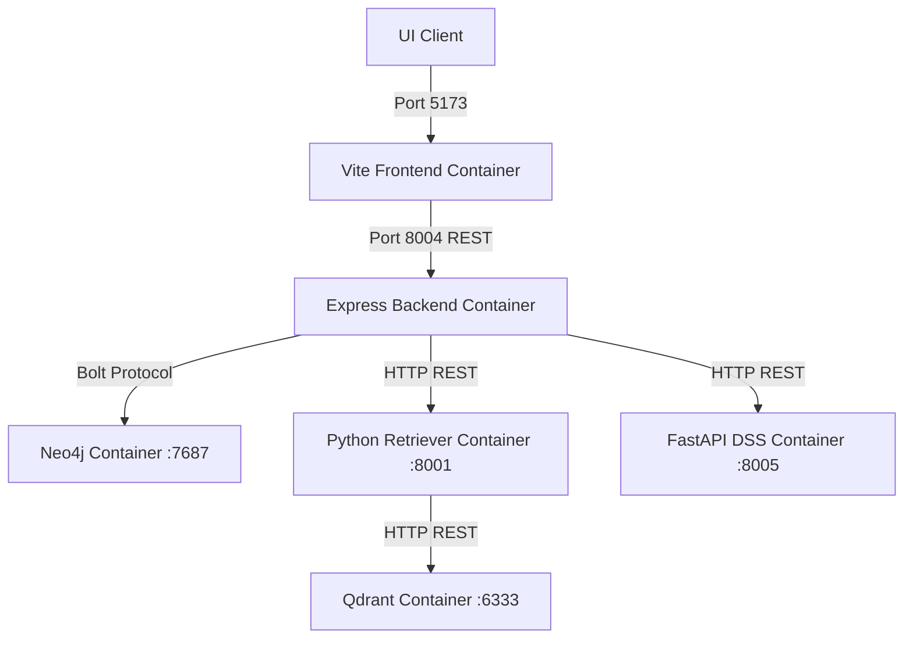

# ARCHITECTURE BASELINE v1.0
**AAST Academic AI Agent Platform**

This document establishes the official, authoritative Reference Architecture Baseline for the AAST Academic AI Agent Platform. It serves as the design freeze standard for all future development, restructuring, and deployment tasks.

---

## 1. System Overview

The AAST Academic AI Agent Platform is an explainable, hybrid decision-support system designed to assist prospective and current students in matching profiles with academic departments, calculating program compatibility, navigating career roadmaps, and retrieving institutional guidelines. The system combines graph-based reasoning (Neo4j GraphRAG), vector similarity document search (Qdrant Python RAG), and multi-criteria academic match scoring (FastAPI DSS) under a Node.js Express Orchestrator.

---

## 2. Runtime Request Lifecycle

```text
Student Query
    │
    ▼
[UI Layer] Frontend Client (React / Port 5173)
    │  (HTTP POST /api/chat)
    ▼
[Control Layer] Express API (`orchestrator.js` / Port 8004)
    │
    ▼
[Decision Engine] Brain Router (`brainRouter.js` rules classification)
    │
    ├──► [Route: KG_ONLY / KG_DIRECT] ────► GraphRAG (Neo4j / Port 7687)
    ├──► [Route: RAG_ONLY] ───────────────► Python RAG (FastAPI :8001 -> Qdrant :6333)
    ├──► [Route: DSS] ────────────────────► DSS Service (FastAPI :8005 -> SQLite)
    └──► [Route: HYBRID_KG_RAG] ──────────► Both GraphRAG AND Python RAG concurrently
    │
    ▼
[Fusion Layer] Context Fusion (`unifiedAnswerService.js` / fallback `fusionService.js`)
    │  (De-duplicates, ranks, and resolves contradictions)
    ▼
[LLM Inference] modelFailoverManager.js (Ollama Gemma :11434 / fallback Gemini API)
    │
    ▼
[Format Layer] Response Formatter (`responseFormatter.js` / humanizer)
    │  (Generates clean Markdown & structures score data tables)
    ▼
Frontend Client (React UI renders markdown stream to user)
```

---

## 3. Frontend Architecture

*   **Role:** Single Page Application (SPA) providing conversational interfaces, interactive query trees, and profile entry forms.
*   **State Management:** Local component state for chat threads, historical logs, and profile grids.
*   **API Client:** Communicates exclusively with the Node.js Express server on `/api/chat` using Axios, supporting chunked streaming responses.
*   **Isolation:** Bypasses direct access to Neo4j, Qdrant, SQLite, or DSS APIs.

---

## 4. Node.js Orchestrator Architecture

*   **Role:** Central server and message broker managing request contexts, session history files, and concurrency pipelines.
*   **Routing Logic (`brainRouter.js`):** Classifies user intent based on keyword parsing, course codes, and conversational state, matching inputs to distinct execution pathways.
*   **State Management:** Stateless API layer relying on localized filesystem JSON stores for conversation history writebacks.
*   **Security:** Communicates with backend microservices using a shared gateway token (`INTERNAL_SECRET_KEY`).

---

## 5. GraphRAG Architecture (Neo4j)

*   **Role:** Performs semantic structural entity queries to resolve academic hierarchies, prerequisites, department links, and faculty teaching roles.
*   **Implementation:** Node.js driver (`db/neo4j.js`) executes Cypher queries against the Neo4j Graph DB.
*   **Context Generation:** `neo4jcontext.js` extracts matching subgraphs and maps entities into formatted text arrays.
*   **Schema Maintenance:** Production embeddings are generated by `embed_nodes.py`, and database repairs are run via `fix_db.js`.

---

## 6. Traditional Python RAG Architecture (Qdrant)

*   **Role:** Performs semantic similarity matches against institutional documents, catalog guidelines, and registry policy PDFs.
*   **Retrieval Pipeline (`phase3_retriever.py`):** FastAPI app running on Port 8001. Embeds query terms using local HuggingFace models (`BAAI/bge-m3`) and fetches vector-matched documents from the Qdrant database.
*   **Grounded Generation (`phase4_llm_answer_engine.py`):** FastAPI app running on Port 8002 that serves as a grounded fallback answer synthesizer.

---

## 7. DSS Microservice Architecture (FastAPI)

*   **Role:** Standalone student Decision Support System (DSS) calculating matching scores and career paths.
*   **Data Model:** Manages user profile structures, grades cutoffs, budget requirements, and career track definitions inside a local SQLite database (`dev.db`).
*   **REST Interface:** Exposes `/recommend/programs` and `/recommend/careers` endpoints.

---

## 8. Context Fusion Architecture

If multiple sources (GraphRAG and Python RAG) return data, the Fusion Layer (`unifiedAnswerService.js`/`fusionService.js`) resolves the context:
1.  **Deduplication:** Filters overlapping text chunks and redundant facts.
2.  **Ranking:** Sorts context facts by relevance confidence.
3.  **Conflict Resolution:** Applies override rules (e.g., direct policy documents override LLM text).
4.  **Inference Injection:** Passes clean context to the LLM generation prompt.

---

## 9. LLM Architecture

*   **Primary Engine:** Local Ollama runtime hosting the `gemma4:e2b` model.
*   **Warming System (`gemmaWarmService.js`):** Runs startup queries to load model weights into RAM.
*   **Cloud Fallback:** Integrates Google Gemini API (`geminiService.js`) as a high-capacity backup when Ollama is offline or overloaded.

---

## 10. Database Architecture

*   **Neo4j Graph Database:** Exposes Bolt port `7687` for production graph traversals. *Status: Active Production.*
*   **Qdrant Vector Database:** Exposes REST port `6333` for vector search (managed by the Python RAG retriever). *Status: Active Production.*
*   **SQLite Database:** Encapsulated inside the DSS Microservice container to store student profiles. *Status: Active Production.*
*   **Local JSON Storage:** File storage (`data/`) for chat histories. *Status: Active Production.*
*   **MySQL Database (`mysql2`):** *Status: Deprecated/Legacy.* Bypassed by the active production orchestrator and unused in runtime operations.

---

## 11. Infrastructure Architecture

*   **Logger (`logger.js`):** Unified logging standard exporting stdout logs to files under `/app/logs`.
*   **Metrics (`metrics.js`):** Exposes endpoint performance and model latency metrics.
*   **Health Monitor (`healthMonitor.js`):** Performs port pings on startup to verify component status.

---

## 12. Failure Handling Architecture

*   **Neo4j Database Offline:** Bypasses GraphRAG and falls back to traditional Python RAG.
*   **DSS Microservice Offline:** Logs a warnings array and returns general advising text without matching metrics.
*   **Ollama Server Offline:** Falls back to Google Gemini Cloud API.
*   **LLM Synthesis Failure:** Falls back to `fusionService.js` to render raw context facts directly without LLM processing.

---

## 13. Circuit Breaker Architecture

*   **Circuit State Manager (`circuitStateManager.js`):** Protects LLM query pathways by tracking failure rates.
*   **States:**
    *   `CLOSED`: Default state. Ollama handles all inference requests.
    *   `OPEN`: If Ollama consecutive failures exceed thresholds, queries fail fast and redirect to Gemini.
    *   `HALF-OPEN`: Periodically test Ollama recovery with single check requests.

---

## 14. Deployment Architecture

The entire platform is deployable as isolated Docker containers coordinated via Docker Compose:



---

## 15. Ports and Services Table

| Service / Container Name | Port | Protocol | Internal Directory Path | Active Production Status |
| :--- | :--- | :--- | :--- | :---: |
| **Vite Frontend** | `5173` | HTTP | `aast-ai-agent-main/frontend` | Active |
| **Node.js Orchestrator** | `8004` | HTTP | `aast-ai-agent-main/backend` | Active |
| **RAG Retriever** | `8001` | HTTP | `aast-ai-agent-main/backend/rag_system` | Active |
| **RAG Answer Engine** | `8002` | HTTP | `aast-ai-agent-main/backend/rag_system` | Active |
| **Decision API (DSS)** | `8005` | HTTP | `college-decision-system-backend` | Active |
| **Qdrant Vector DB** | `6333` | HTTP | External Container | Active |
| **Neo4j Graph DB** | `7687` | Bolt | External Container | Active |
| **Ollama Server** | `11434`| HTTP | Host System | Active |

---

## 16. Technology Stack Table

| Core Boundary | Tech Component | Version / Target | Purpose / Role |
| :--- | :--- | :--- | :--- |
| **Frontend Client** | React, Vite, TypeScript | React 19 / TypeScript 5.9 | UI Layout & Interactive Charts |
| **Orchestration** | Node.js, Express.js | Node 20 / Express 4.18 | Request control, session logic, and API gateway |
| **DSS Engine** | Python, FastAPI, SQLite | Python 3.10 / SQLite | Match metrics computation & career roadmap database |
| **Retrieval Engine** | Python, FastAPI, Qdrant | Python 3.10 / Qdrant v1.12 | Vector search backend & document parser |
| **Graph Database** | Neo4j Community | Neo4j 5.26 | Academic catalog hierarchy mappings |
| **Local LLM API** | Ollama, Gemma 2B | Gemma4:e2b | Local text generation |
| **Cloud LLM API** | Google Gemini SDK | Gemini 2.0 | High-capacity fallback text generation |

---

## 17. Architecture Decisions and Rationale

1.  **FastAPI/Node Hybrid Structure:** Node handles high-concurrency websocket and REST session management, while Python/FastAPI encapsulates machine learning libraries (embeddings, PyTorch, SQLAlchemy).
2.  **FastAPI DSS Isolation:** Keeps the DSS recommendation microservice separate from the Node Express controller, permitting independent deployments and scaling.
3.  **Python-Only Qdrant Client:** Qdrant DB is accessed *only* through the Python retriever container, reducing the footprint of the Node backend container.
4.  **Local/Cloud Hybrid LLM:** Combines cost-efficiency (local Gemma) with high-availability reliability (Gemini fallback).

---

## 18. Future Roadmap

1.  **Batch 1 & 2 (COMPLETED):** Documentation consolidated under `docs/`; research utilities and datasets relocated to `graphrag/research/` and `data/`.
2.  **Batch 3 (Deferred for approval):** Infrastructure separation. Relocate logger, metrics, circuit breakers, and telemetry utilities under `backend/infrastructure/`.
3.  **Batch 4 (Deferred for approval):** Support routing utilities. Relocate aliases, normalization scripts, and health probes to `routing/`, `conversation/`, and `llm/` directories.
4.  **Batch 5 (Deferred for approval):** Core services. Relocate conversation lifecycle, title generators, and synthesis handlers to `conversation/` and `synthesis/` directories.
5.  **Batch 6 (Deferred for approval):** Core entry points. Relocate main Express orchestrator and GraphRAG database drivers.
