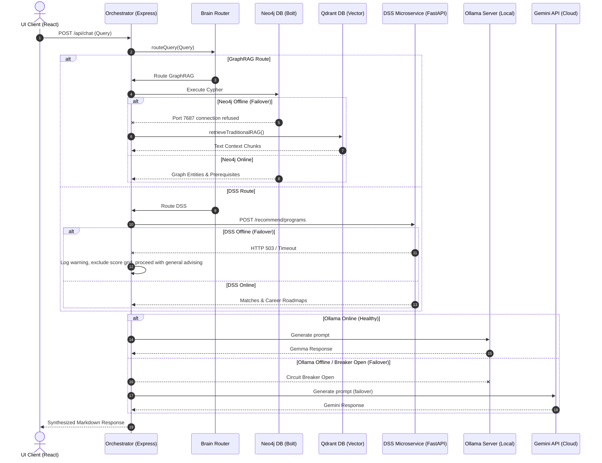

# System Context Map
**AAST AI Agent Runtime Architecture**

This document details the runtime context, request lifecycles, database systems, external models, failure fallbacks, and circuit breaker paths of the AAST AI Agent Platform.

---

## 1. Runtime Request Lifecycle

When a user submits a query to the AAST AI Agent Platform, the system executes the following sequential steps:

1.  **User Input:** The student enters an academic inquiry into the React frontend.
2.  **Frontend Client:** Resolves the request parameters and transmits an HTTP POST request to the Express API backend.
3.  **Express Route:** The backend server (`index.js`/`orchestrator.js`) intercepts the query on `/api/chat`.
4.  **Orchestrator:** Initiates the request context, assigns a request ID, and retrieves the chat history from the session storage.
5.  **Brain Router:** Analyzes the prompt and conversational context, executing intent classification and aliases resolution to choose the best routing strategy (e.g., GraphRAG, Hybrid, Python RAG, or DSS).
6.  **GraphRAG Engine (Neo4j):** If routed to graph traversal, executes Cypher queries to extract entities, relationships, and course prerequisites from Neo4j.
7.  **Python RAG (Traditional Vector RAG):** If routed to standard text search, performs vector similarity matching against text chunk databases to extract contextual snippets.
8.  **DSS Microservice:** If query matches student profiling or college recommendations, triggers a REST request to the FastAPI backend to compute matching scores.
9.  **Unified Answer Service:** Merges retrieved graph facts, RAG text chunks, and DSS score metrics into a unified generation prompt context for the LLM.
10. **Response Formatter:** Formats raw LLM strings, structures program grids, and humanizes the output into clean markdown.
11. **Client Render:** Exposes the completed answer via an HTTP response stream back to the UI.

---

## 2. Component Inventory

### 2.1 Services Involved
*   **Express Orchestrator:** Production control hub handling HTTP REST routing and task delegation.
*   **FastAPI Decision API:** Independent recommendation microservice matching student profiles.
*   **Ollama API Server:** Local LLM execution server.
*   **Gemini API Integration:** Remote cloud LLM backup service.
*   **MeiliSearch Server:** Fast keyword index search service (optional).

### 2.2 Databases Involved
*   **Neo4j Graph Database:** Backs GraphRAG, mapping entities (Courses, Specializations, Professors, Careers).
*   **Qdrant Vector Database:** Stores vector embeddings of catalog documents and policies for traditional RAG.
*   **MySQL Database:** Stores user credentials and student profiling indexes.
*   **Disk Session Storage:** Local filesystem storage holding JSON chat history records.

### 2.3 External Models Involved
*   **Gemma 2B / Gemma 7B (`gemma4:e2b`):** Local primary model executing text generation tasks.
*   **Google Gemini Pro / Flash (`gemini-2.0`):** Cloud-based backup LLM used during Ollama offline failovers.
*   **Nomic Embed Text (`nomic-embed-text`):** Local model generating text embeddings.

---

## 3. Failure Fallback & Circuit Breaker Paths

The system utilizes multiple fallbacks and breaker policies to ensure continuous operation under partial system failures:

```mermaid
graph TD
    Query[User Query] --> Router{Brain Router}
    
    %% GraphRAG Path
    Router -->|Graph Path| Neo4jCheck{Neo4j Online?}
    Neo4jCheck -->|YES| GraphRAG[Neo4j Cypher Traversal]
    Neo4jCheck -->|NO (FAIL)| RAGFallback[Degrade to Traditional Vector RAG]
    
    %% DSS Path
    Router -->|DSS Path| DSSCheck{DSS Online?}
    DSSCheck -->|YES| DSSAPI[FastAPI match program/careers]
    DSSCheck -->|NO (FAIL)| DSSFallback[Exclude matched scores, log warning, return advisor text only]
    
    %% LLM Execution Path
    GraphRAG & RAGFallback & DSSAPI & DSSFallback --> LLMCheck{Ollama Breaker Closed?}
    LLMCheck -->|YES| OllamaLLM[Execute Local Gemma 2B]
    LLMCheck -->|NO (FAIL / OPEN)| GeminiLLM[Failover to cloud Google Gemini API]
    
    OllamaLLM -->|Error Rate > Limit| OpenBreaker[Open Circuit Breaker]
    OpenBreaker --> GeminiLLM
```

---

## 4. Sequence Diagram

This diagram maps the runtime query execution sequence, showing failover redirections:


