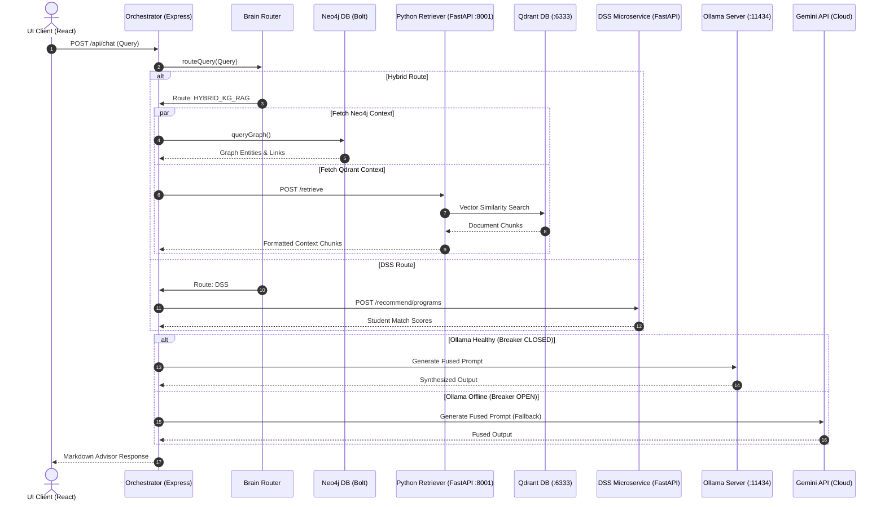
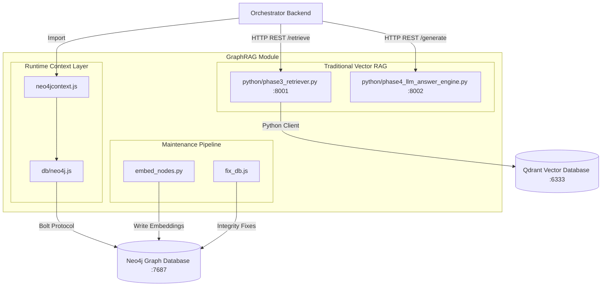
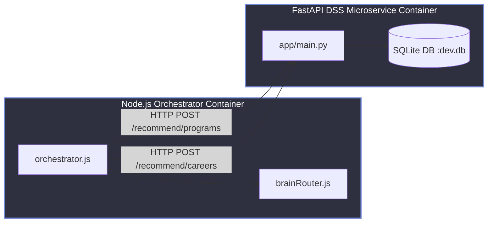

# System Context Map (v2.0)
**AAST AI Agent System Architecture & Dependencies**

This document establishes the verified system context, runtime lifecycle, database classifications, and hybrid retrieval/fusion pathways of the AAST Academic AI Agent Platform, backed by direct codebase evidence.

---

## 1. Corrected Runtime Request Lifecycle

The system operates as a unified hybrid pipeline. Subsystems do not run in absolute isolation; rather, query routing, retrieval, context fusion, and answer synthesis function as a single, coordinated flow:

```text
User Query
    │
    ▼
Frontend UI Client (React)
    │  (HTTP POST /api/chat)
    ▼
Express Route (`orchestrator.js` Port 8004)
    │
    ▼
Orchestrator Backend
    │
    ▼
Brain Router (`brainRouter.js` classification)
    │
    ├──► [Route: KG_ONLY / KG_DIRECT] ────► GraphRAG (Neo4j)
    ├──► [Route: RAG_ONLY] ───────────────► Traditional Python RAG (FastAPI :8001 -> Qdrant :6333)
    ├──► [Route: DSS] ────────────────────► DSS Recommendations (FastAPI :8005 -> SQLite)
    └──► [Route: HYBRID_KG_RAG] ──────────► Both GraphRAG AND Traditional Python RAG concurrently
    │
    ▼
Context Fusion Layer (`unifiedAnswerService.js` / fallback `fusionService.js`)
    │  (Merges, ranks, and overrides retrieved contexts)
    ▼
LLM Inference Layer (`ollamaService.js` -> Gemma / fallback `geminiService.js` -> Gemini)
    │
    ▼
Response Formatter (`responseFormatter.js` / humanizer)
    │  (Generates clean Markdown & structures data grids)
    ▼
Frontend UI Client (React rendering final stream)
```

---

## 2. Verified Infrastructure Inventory

The platform relies on the following verified active runtime services:

*   **Node.js Express Server (Port 8004):** Executes `orchestrator.js` as the production system orchestrator. Coordinates session memory, routing, and synthesis.
*   **Python FastAPI RAG Retriever (Port 8001):** Executes `phase3_retriever.py` to retrieve rule contexts using BAAI/bge-m3 embeddings and queries the local Qdrant database.
*   **Python FastAPI RAG Answer Engine (Port 8002):** Executes `phase4_llm_answer_engine.py` as a grounded LLM fallback handler.
*   **Python FastAPI DSS Microservice (Port 8005):** Executes `app/main.py` inside `college-decision-system-backend/` to calculate student fits and career paths.
*   **Vite React Frontend Client (Port 5173):** Serves the UI application.
*   **Ollama Local LLM API (Port 11434):** Hosts the primary local Gemma model.
*   **Google Gemini API (Cloud):** Serves as the remote backup LLM.
*   **MeiliSearch Server (Port 7700):** *UNVERIFIED / OPTIONAL INFRASTRUCTURE*. Listed as a dependency in legacy configuration but not actively referenced in the chat runtime pipeline of `orchestrator.js`.

---

## 3. Verified Database Inventory

Based on direct codebase imports and connection strings, the database boundaries are classified as follows:

*   **Neo4j Graph Database (`bolt://neo4j:7687`):**
    *   *Classification:* `PRODUCTION`
    *   *Direct Imports:* `neo4j-driver` inside `aast-ai-agent-main/backend/db/neo4j.js`.
    *   *Active References:* Imported in `neo4jcontext.js` and initialized as a process singleton in `orchestrator.js` to back GraphRAG.
*   **Qdrant Vector Database (`http://qdrant:6333`):**
    *   *Classification:* `PRODUCTION`
    *   *Direct Imports:* `qdrant_client` inside `phase2_qdrant_ingestion.py` and `phase3_retriever.py`.
    *   *Active References:* Querying is managed by the FastAPI `rag-retriever` service on port 8001. The Node.js orchestrator does *not* query Qdrant directly (making the Node package `@qdrant/js-client-rest` unused in `orchestrator.js`).
*   **SQLite Database (`sqlite:////app/runtime/dev.db`):**
    *   *Classification:* `PRODUCTION`
    *   *Active References:* Configured in `docker-compose.yml` to store student profiling criteria and career maps for the FastAPI DSS microservice container.
*   **Local JSON File System Store:**
    *   *Classification:* `PRODUCTION`
    *   *Active References:* `persistenceLayer.js` writes chat session files to the local disk directory (`data/conversations.json`).
*   **MySQL Database (`mysql2`):**
    *   *Classification:* `DEPRECATED / LEGACY`
    *   *Active References:* MySQL is *only* imported in `db/mysql.js` and `routes/mysql.js`. These are loaded in `index.js` (the legacy server entrypoint) but are **completely unused** by the production orchestrator (`orchestrator.js`), which runs authentication-free behind an internal gateway secret.

---

## 4. Verified External Model Inventory

*   **Gemma 2B / 7B (`gemma4:e2b`):** Local primary model hosted via Ollama on port 11434. Used by `unifiedAnswerService.js` for primary synthesis.
*   **Google Gemini Pro / Flash (`gemini-2.0`):** Remote cloud backup LLM accessed via `geminiService.js`.
*   **Nomic Embed Text (`nomic-embed-text`):** Local model used via Ollama to generate vector embeddings.

---

## 5. Hybrid Retrieval & Context Fusion Architecture

The platform supports a non-exclusive **Hybrid Retrieval** pipeline. If the `brainRouter` identifies a query requesting both structural facts (like course prerequisites) and general policy guidelines, it fires a hybrid route (`ROUTES.HYBRID_KG_RAG`).

### 5.1 Retrieval Phase
The orchestrator executes retrieval tasks concurrently:
1.  Queries Neo4j via `neo4jcontext.js` (retrieving entity relationships).
2.  Queries the FastAPI retriever on port 8001 (retrieving vector matched text chunks from Qdrant).

### 5.2 Context Fusion Phase
The retrieved contexts are passed to `unifiedAnswerService.js` (or fallback to `fusionService.js`):
*   **Deduplication:** Clears duplicate chunks and matches redundant fact patterns.
*   **Evidence Ranking:** Sorts retrieved context by similarity confidence and semantic relevance to the query.
*   **Token Budgeting:** Trims context recursively to fit the LLM prompt window limits.
*   **Policy Overrides:** Resolves contradictions between sources using hard-coded priority mappings (e.g., policy documents override LLM text).
*   **LLM Synthesis:** The fused context is injected into the Gemma model prompt to generate a single, unified advisory response.

---

## 6. Failure Fallback & Circuit Breaker Architecture

The system implements failover guards at every integration layer:

*   **LLM Circuit Breaker:** `circuitStateManager.js` monitors failures and response timeouts for the local Ollama service. If consecutive failures exceed limits, the circuit changes from `CLOSED` to `OPEN`, redirecting LLM synthesis to the cloud `geminiService.js`.
*   **Neo4j Graph Database Fallback:** If the Neo4j port check fails, the orchestrator degrades search queries to Traditional Python RAG (retrieving vector data from Qdrant only).
*   **DSS Microservice Fallback:** If the FastAPI DSS port is unreachable, the orchestrator logs a warning and omits match scores, delivering a general advisor text block instead of crashing.
*   **LLM Synthesis Fallback:** If the Gemma model fails to generate a response, the orchestrator triggers the `fusionService.js` to construct a deterministic response listing raw verified context facts directly.

---

## 7. Architectural Diagrams

### 7.1 Runtime Sequence Diagram



---

### 7.2 GraphRAG Architecture Diagram



---

### 7.3 DSS Integration Diagram



---

## 8. Architecture Corrections Compared to Previous Version

*   **Qdrant Direct Queries:** Corrected the claim that the Node.js backend queries Qdrant directly. Codebase checks confirm that Node.js uses the Python retriever (`phase3_retriever.py`) on port 8001 as an intermediary, and `@qdrant/js-client-rest` imports are completely absent.
*   **MySQL Database Status:** Downgraded MySQL from Production to `DEPRECATED / LEGACY`. Checked imports confirm that MySQL is completely bypassed by the active orchestrator (`orchestrator.js`), which functions authentication-free behind internal secrets, using disk JSON files for session store.
*   **DSS Database Store:** Identified SQLite as the active production database for the FastAPI DSS microservice, replacing the assumption that DSS relies on MySQL.
*   **Hybrid Coexistence:** Clarified that retrieval paths are not mutually exclusive. The `brainRouter` invokes both GraphRAG and Python RAG concurrently during hybrid routes, with context fusion performed at the synthesis layer by `unifiedAnswerService.js` and `fusionService.js`.
