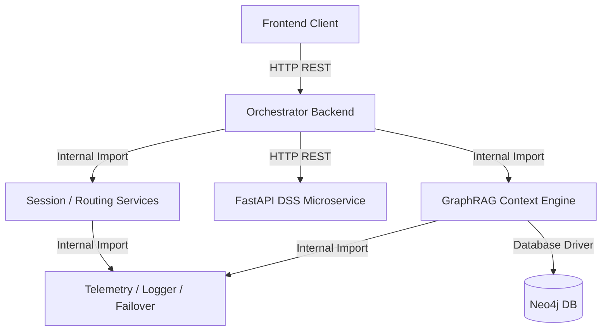
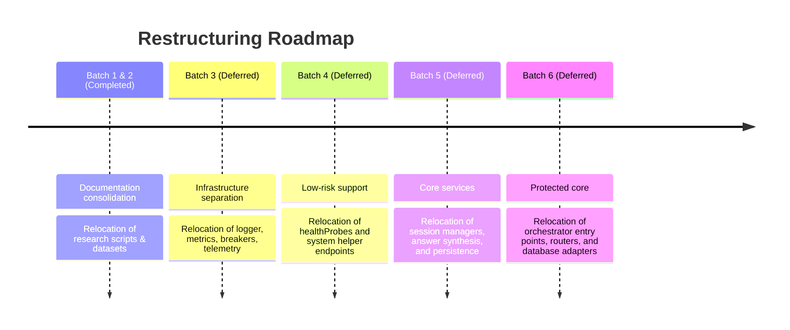

# Target Architecture Specification (v2.0)
**AAST AI Agent System Restructuring**

This document establishes the architecture design, module boundaries, interface definitions, dependency rules, and future migration roadmap for the AAST AI Agent Platform.

---

## 1. Final Folder Structure

The target architecture reorganizes the repository into distinct, domain-specific modules:

```text
C:\Users\mh978\Downloads\AI_AGENT\
├── docs/                             # Centralized system documentation & architecture audits
│   ├── architecture/
│   ├── api/
│   ├── deployment/
│   ├── development/
│   ├── reports/
│   └── diagrams/
├── data/                             # Centralized data resources
│   ├── datasets/colleges/            # College program criteria & curriculum datasets
│   └── scraping/step8/               # Static scraping scripts & cached playwright pages
├── graphrag/                         # Knowledge Graph and Traditional RAG logic
│   ├── research/                     # Research utilities (ner_service.py, embed_server_rag.py)
│   ├── core/                         # Production graph adapters & traversals
│   │   ├── db/neo4j.js               # Neo4j shared connection driver
│   │   ├── neo4jcontext.js           # Production Cypher queries & context generator
│   │   └── embed_nodes.py            # Production node embedding maintenance script
│   └── maintenance/
│       └── fix_db.js                 # KG data repair & cleanup utilities
├── services/                         # Shared backend service components
│   ├── monitoring/                   # Operations telemetry & logs
│   │   ├── logger.js
│   │   ├── metrics.js
│   │   └── gemmaTelemetryService.js
│   ├── failover/                     # Health checks and model failover management
│   │   ├── circuitStateManager.js
│   │   ├── healthMonitor.js
│   │   └── healthProbes.js
│   └── orchestration/                # Session lifecycle & routing core
│       ├── conversationService.js
│       ├── persistenceLayer.js
│       ├── brainRouter.js
│       └── unifiedAnswerService.js
├── aast-ai-agent-main/               # Primary application wrappers
│   ├── backend/                      # Production orchestrator entry points (index.js, orchestrator.js)
│   └── frontend/                     # Production React UI client
└── college-decision-system-backend/  # Standalone FastAPI DSS Recommendation Subsystem
```

---

## 2. Module Boundaries

The platform is partitioned into five distinct logical boundaries:

1.  **Frontend (UI Layer):** Handles user interactions, visualization of query trees, and session management interfaces. Communicates *exclusively* via REST endpoints exposed by the Orchestrator Backend.
2.  **Orchestrator Backend (Control Layer):** Intercepts user queries, routes requests, updates conversation history, manages fallback logic, and aggregates results. It acts as the traffic controller.
3.  **GraphRAG / RAG (Retrieval Layer):** Encapsulates Neo4j database connections, vector databases, search logic, and context chunk extraction. It has no knowledge of session routing or UI layouts.
4.  **Decision Support System (DSS Layer):** An independent FastAPI microservice that processes academic profiles, scores college match percentages, and returns career roadmaps. It does not access chat histories or the graph database directly.
5.  **Infrastructure Services (Utility Layer):** Cross-cutting services (logging, circuit breakers, system metrics) that provide utility methods to the Retrieval and Control layers.

---

## 3. Public Interfaces

Public interfaces define communication channels between major components:

*   **Orchestrator API (Express -> Frontend):**
    *   `POST /api/chat`: Submits a user query; returns a stream or unified synthesis answer.
    *   `GET /api/history/:sessionId`: Retrieves previous message thread contexts.
    *   `GET /api/health`: Exposes service orchestrator metrics.
*   **DSS API (FastAPI -> Orchestrator):**
    *   `POST /recommend/programs`: Matches a student profile percentage against academic programs.
    *   `POST /recommend/careers`: Suggests career tracks aligned with student interest scores.
*   **GraphRAG API (neo4jcontext -> Orchestrator):**
    *   `queryGraph(queryText)`: Runs Cypher queries against Neo4j to retrieve entity graphs.

---

## 4. Internal Interfaces

Internal interfaces govern communications within module boundaries:

*   **Session Storage:**
    *   `conversationService` queries `persistenceLayer.readSession(id)` and `writeSession(id, data)` to commit conversation states to disk.
*   **LLM Failover Guard:**
    *   `modelFailoverManager` invokes `circuitStateManager.checkBreaker(serviceName)` and `recordFailure(serviceName)` to lock out failing LLM backends (Ollama/Gemini).

---

## 5. Dependency Directions

Dependencies must always flow **downward** and **inward** toward the core system drivers, preventing circular dependencies:



---

## 6. Allowed Imports

*   Files under `aast-ai-agent-main/backend/` may import services from `services/orchestration/` and `graphrag/core/`.
*   Files under `services/orchestration/` may import infrastructure services from `services/monitoring/` and `services/failover/`.
*   Database drivers under `graphrag/core/db/` may only import external database packages (`neo4j-driver`) and the system logger `services/monitoring/logger.js`.

---

## 7. Forbidden Imports

*   **No Circular References:** Files in `services/monitoring/` or `services/failover/` must **never** import files from `services/orchestration/` or `aast-ai-agent-main/backend/`.
*   **No Database Bypass:** The Frontend React client must **never** import database drivers or attempt direct connections to Neo4j, MySQL, Qdrant, or the FastAPI DSS backend.
*   **No Cross-Talk:** The FastAPI DSS microservice must **never** import or write to Node.js session files or conversation logs.
*   **No Research Imports:** Production code must **never** import files from `graphrag/research/` (e.g., `embed_server_rag.py` or `ner_service.py`).

---

## 8. Future Migration Roadmap

Once Phase 1 & 2 Audits are approved, the restructuring proceeds in the following sequential batches to ensure continuous system compilation and functionality:


