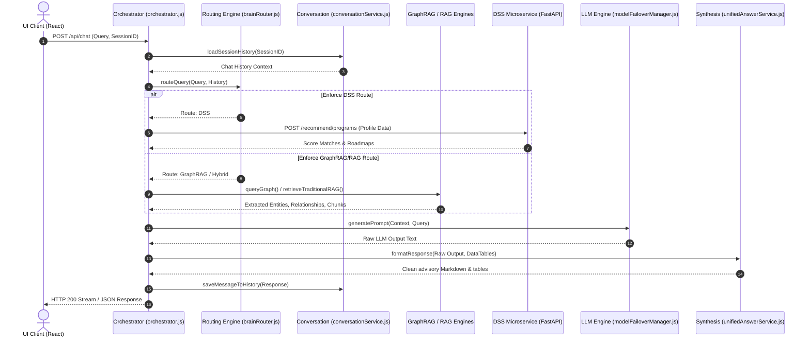
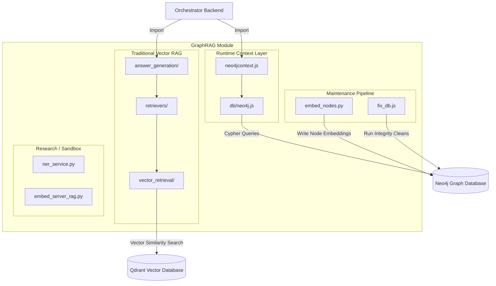
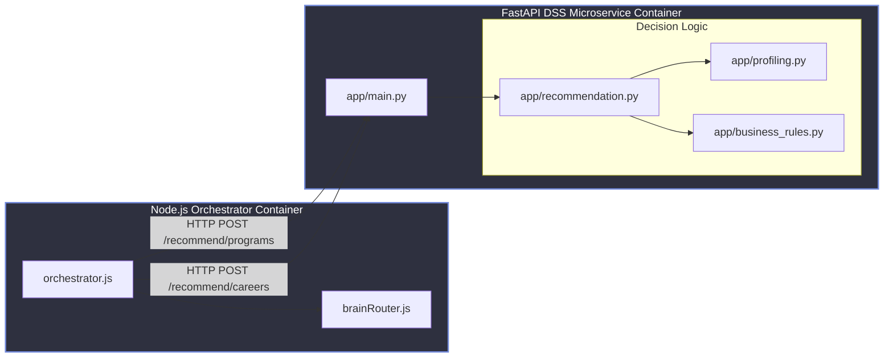

# Target Architecture Specification (v3.0)
**AAST AI Agent System Restructuring**

This document establishes the revised system architecture design, module boundaries, public/internal interfaces, dependency rules, and future migration roadmap for the AAST AI Agent Platform.

---

## 1. Revised Folder Structure

The restructuring organizes the backend codebase into clean, domain-specific modules separating routing, synthesis, session conversation, LLM handlers, infrastructure, and GraphRAG operations:

```text
C:\Users\mh978\Downloads\AI_AGENT\
├── docs/                             # Consolidated documentation & audits
├── data/                             # Relocated datasets and scraping caches
│   ├── datasets/colleges/
│   └── scraping/step8/
│
├── backend/                          # Core Node.js Express Backend
│   ├── orchestrator/
│   │   └── orchestrator.js           # Central server & routing hub
│   │
│   ├── routing/                      # Query analysis, decision, and intent routing
│   │   ├── brainRouter.js            # Evaluates queries and assigns retrieval strategies
│   │   ├── academicAliases.js        # Resolves synonyms for courses/specializations
│   │   ├── academicQueryNormalizer.js# Standardizes spelling & course code variations
│   │   └── faqService.js             # Handles direct deterministic matches for FAQ queries
│   │
│   ├── conversation/                 # Chat session lifecycle, context, and memory
│   │   ├── conversationService.js    # Manages chat thread states and active history
│   │   ├── titleGenerator.js         # Generates summary titles for new threads
│   │   ├── greetings.js              # Manages introductory greetings and basic chat
│   │   ├── conversationMetaIntent.js # Traces structural user intent shifts (e.g., reset)
│   │   └── conversationPriority.js   # Determines critical query highlights in memory
│   │
│   ├── synthesis/                    # Final answer assembly, humanization, and formatting
│   │   ├── unifiedAnswerService.js   # Synthesizes chunks into a cohesive final paragraph
│   │   ├── responseFormatter.js      # Translates data tables and roadmaps to clean markdown
│   │   └── conversationalHumanizer.js# Adjusts tone and vocabulary for academic advising
│   │
│   ├── llm/                          # LLM execution adapters and token limiters
│   │   ├── geminiService.js          # Google Gemini API adapter
│   │   ├── ollamaService.js          # Local Ollama (Gemma) execution adapter
│   │   ├── modelFailoverManager.js   # Handles backup switching if primary LLM fails
│   │   ├── gemmaWarmService.js       # Prewarms local LLM weights on startup
│   │   └── ollamaReadinessService.js # Preflight check for Ollama API port status
│   │
│   ├── infrastructure/               # Low-level systems utilities, telemetry, & persistence
│   │   ├── logger.js                 # Unified stdout/file stream writer
│   │   ├── metrics.js                # System execution statistics collection
│   │   ├── persistenceLayer.js       # Handles binary/JSON read/writes of chat sessions
│   │   ├── circuitStateManager.js    # In-memory circuit breaker status checks
│   │   ├── healthMonitor.js          # Background health check ping loop for system ports
│   │   ├── healthProbes.js           # Health endpoints exporter
│   │   └── gemmaTelemetryService.js  # Telemetry collector for Ollama execution metrics
│   │
│   └── graphrag/                     # Graph and Traditional Retrieval Engines
│       ├── runtime/                  # Production retrieval adapters
│       │   ├── neo4jcontext.js       # Context generator via Graph traversals & Cypher
│       │   └── db/
│       │       └── neo4j.js          # Neo4j shared connection driver
│       │
│       ├── maintenance/              # Graph sync and database check utilities
│       │   ├── embed_nodes.py        # Generates & saves graph node embeddings to database
│       │   └── fix_db.js             # Runs integrity fixes and prunes duplicate links
│       │
│       ├── research/                 # Standalone experimental/research scripts
│       │   ├── ner_service.py        # Named Entity Recognition test script
│       │   └── embed_server_rag.py   # RAG vector server experiment
│       │
│       └── rag_system/               # Traditional Vector RAG Retrieval Engine
│           ├── retrievers/           # Query parsing and text chunk fetchers
│           ├── answer_generation/    # Context blending and basic text RAG synthesizers
│           └── vector_retrieval/     # Qdrant/Chroma vector database adapters
│
├── college-decision-system-backend/  # Independent deployable FastAPI DSS Microservice
└── aast-ai-agent-main/frontend/      # React UI client application
```

---

## 2. Module Rationales

1.  **`orchestrator` (Control Hub):** Serves as the central backend entry point. It handles HTTP server bootstrapping, middleware, request validation, and orchestrates query lifecycle processing by delegating to specialized engines.
2.  **`routing` (Decision Engine):** Inspects user inputs and maps them to specialized routes (e.g., standard RAG, Neo4j GraphRAG traversal, FAQ static answers, or direct DSS API calls). This decoupling prevents query routing logic from cluttering the orchestration layers.
3.  **`conversation` (Memory Layer):** Manages session states, chat histories, conversational greetings, and title generation.
4.  **`synthesis` (Response Formatter):** Merges raw text context and graph data chunks, formats them into markdown (tables/lists), and humanizes the output.
5.  **`llm` (Execution Adapters):** Abstract layer over language model APIs, executing text generation prompts and handling failovers automatically if Ollama goes offline.
6.  **`infrastructure` (System Core):** Direct low-level hooks for disk persistence, error logging, performance metrics, and port checks.
7.  **`graphrag` (Retrieval Layer):** The primary knowledge source of the application, housing the two distinct retrieval engines (traditional chunk vector retrieval and Cypher graph traversal).
8.  **`college-decision-system-backend` (Recommendation Engine):** A completely isolated Python FastAPI microservice that computes program fits and career recommendations based on student profile criteria.

---

## 3. Module Boundaries

*   **Frontend Client:** Interacts *only* with the `orchestrator` via HTTP REST. It has no access to databases, LLMs, or internal backend services.
*   **Orchestrator Backend:** Exposes the API endpoint for the client, orchestrates query flows, and calls internal submodules.
*   **DSS Microservice:** Completely independent deployable unit. Exposes REST endpoints to the orchestrator.
*   **GraphRAG / RAG Engines:** Do not know about session state, routing, or the frontend. They receive abstract strings/queries and return formatted raw data.
*   **Infrastructure Utilities:** Shared library imported by other submodules. They do not import routing or synthesis layers.

---

## 4. Public Interfaces

*   **Orchestration API (Express -> UI Client):**
    *   `POST /api/chat`: Submits user query.
    *   `GET /api/history/:sessionId`: Fetches thread history.
*   **DSS Microservice API (FastAPI -> Orchestrator):**
    *   `POST /recommend/programs`: Returns matched college programs.
    *   `POST /recommend/careers`: Returns career roadmap suggestions.
*   **GraphRAG Runtime API (neo4jcontext -> Orchestrator):**
    *   `queryGraph(queryText)`: Returns Cypher-traversed entities and relationships.

---

## 5. Internal Interfaces

*   **Memory Interface:**
    *   `conversationService` queries `persistenceLayer.readSession(id)` and `writeSession(id, data)` to serialize chat states to disk.
*   **Failover Guard Interface:**
    *   `modelFailoverManager` invokes `circuitStateManager.checkBreaker(serviceName)` and `recordFailure(serviceName)` to lock out failing LLM endpoints.

---

## 6. Dependency Directions

Dependencies must strictly flow downwards towards low-level drivers, or inwards towards core business logic. Circular imports are blocked:

*   `orchestrator` $\rightarrow$ `routing` $\rightarrow$ `graphrag/runtime` & `llm` & `synthesis`
*   `conversation` $\rightarrow$ `infrastructure/persistenceLayer`
*   `llm/modelFailoverManager` $\rightarrow$ `infrastructure/circuitStateManager`
*   `graphrag/runtime/db/neo4j` $\rightarrow$ `infrastructure/logger`

---

## 7. Allowed Imports

*   `orchestrator/` files can import from `routing/`, `conversation/`, `synthesis/`, and `llm/`.
*   `routing/` files can import from `graphrag/runtime/` and `synthesis/`.
*   `llm/` adapters can import from `infrastructure/` (e.g. `logger`, `circuitStateManager`).
*   `infrastructure/` files must remain self-contained (only importing Node/npm libraries).

---

## 8. Forbidden Imports

*   `infrastructure/` files must **never** import from `synthesis/`, `llm/`, `routing/`, or `orchestrator/`.
*   `routing/` must **never** import the `orchestrator` or access Express request/response objects directly.
*   `college-decision-system-backend/` files must **never** import any JavaScript modules or read session files.
*   `graphrag/research/` scripts must **never** be imported in any production file.

---

## 9. Architectural Diagrams

### 9.1 Runtime Architecture Diagram

This diagram maps the end-to-end query flow from the UI through the orchestrator, decision routing, LLM/retrieval execution, and synthesis phases:



---

### 9.2 GraphRAG Architecture Diagram

This diagram displays the distinct retrieval pipelines within the `graphrag/` module, separating Traditional Vector RAG from Neo4j GraphRAG, and showing how the database schemas are maintained:



---

### 9.3 DSS Integration Diagram

This diagram highlights the microservice boundaries of the FastAPI DSS engine, its deployable isolation, and its interaction with the Orchestrator Backend:



---

## 10. Migration Roadmap

To execute the restructure safely, the transition will proceed through the remaining batches:

1.  **Batch 1 & 2 (COMPLETED):** Documentation consolidated under `docs/`; research utilities (`ner_service.py`, `embed_server_rag.py`) and datasets relocated under `graphrag/research/` and `data/`.
2.  **Batch 3 (Deferred for approval):** Infrastructure separation. Relocate `logger.js`, `metrics.js`, `persistenceLayer.js`, `circuitStateManager.js`, `healthMonitor.js`, `healthProbes.js`, and `gemmaTelemetryService.js` under `backend/infrastructure/`.
3.  **Batch 4 (Deferred for approval):** Support routing utilities. Relocate `academicAliases.js`, `academicQueryNormalizer.js`, `faqService.js`, `greetings.js`, and model check helpers to their respective modules (`routing/`, `conversation/`, `llm/`).
4.  **Batch 5 (Deferred for approval):** Core services. Move `conversationService.js`, `titleGenerator.js`, `conversationMetaIntent.js`, `conversationPriority.js` under `backend/conversation/` and `unifiedAnswerService.js` under `backend/synthesis/`.
5.  **Batch 6 (Deferred for approval):** Protected Core. Relocate `orchestrator.js`, `brainRouter.js`, and GraphRAG production drivers (`db/neo4j.js`, `neo4jcontext.js`) to their destination modules.
