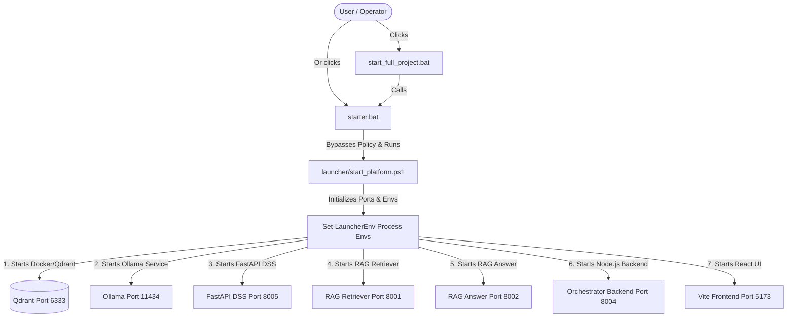

# Entrypoint Analysis: AAST Academic AI Agent

This document analyzes the startup and runtime entry points of the AAST Academic AI Agent platform, detailing the flow from batch file execution to service availability.

---

## 1. Primary Startup Scripts & Bootstrap Flow

The entry point path is initiated by the operator using batch files at the project root:

### Script Execution Parameters:
*   `starter.bat` accepts parameter modes: `demo` (default), `full`, `quick`.
*   PowerShell wrapper `launcher/start_platform.ps1` checks for port collisions, pre-warms Ollama models, and runs health probes against each listener.

---

## 2. Core Subsystem Entry Points

### 2.1 Main Backend (Express.js Orchestrator)
*   **Path**: `aast-ai-agent-main/backend/orchestrator.js`
*   **Command**: `npm run start:orchestrator` -> executes `node --max-old-space-size=3072 orchestrator.js`
*   **Initialization Sequence**:
    1.  Loads environment variables via `dotenv.config()`.
    2.  Validates that `INTERNAL_SECRET_KEY` is present.
    3.  Attempts to establish connection to Neo4j database using `connectNeo4j()` and caches the connection as a global singleton (`global.neo4jInitialized`).
    4.  Registers Express JSON parsing and CORS middleware.
    5.  Mounts API routers:
        *   `/api/chatbot` -> `routes/chatbot.js` (legacy/testing router)
        *   `/api/decision` -> `routes/decision.js` (DSS forwarding router)
        *   `/api/conversations` -> `routes/conversations.js` (session manager router)
        *   `/health` & `/api/health` -> `routes/health.js` (central health monitor)
    6.  Starts listening on `ORCHESTRATOR_PORT` (default `8004`).

### 2.2 Decision Support System (FastAPI Microservice)
*   **Path**: `college-decision-system-backend/app/main.py`
*   **Command**: `python -m uvicorn app.main:app --host 127.0.0.1 --port 8005`
*   **Initialization Sequence**:
    1.  Loads settings from `app/config/settings.py` (validated by `pydantic_settings`).
    2.  Creates a FastAPI app instance.
    3.  Adds CORS middleware targeting the Vite frontend origin (`http://localhost:5173`).
    4.  Registers API endpoints:
        *   `/api/v1/students` -> `app/api/v1/routers/students.py`
        *   `/api/v1/decisions` -> `app/api/v1/routers/decisions.py`
        *   `/api/v1/chat` -> `app/api/v1/routers/chat.py`
        *   `/api/v1/admin` -> `app/api/v1/routers/admin.py`
        *   `/api/v1/voice` (conditional on settings) -> `app/api/v1/routers/voice.py`
    5.  Exposes `/health` endpoint containing voice runtime status.

### 2.3 RAG Retriever Service
*   **Path**: `aast-ai-agent-main/backend/rag_system/phase3_retriever.py`
*   **Command**: `python -m uvicorn phase3_retriever:app --host 127.0.0.1 --port 8001`
*   **Initialization Sequence**:
    1.  Reads Qdrant hosts and embedding model configurations (`BAAI/bge-m3`).
    2.  Establishes connection to local Qdrant container.
    3.  Initializes `EmbeddingEngine` (either eager or lazy load of sentence-transformers).
    4.  Exposes POST `/search` endpoint to fetch vector matches with category boosters.

### 2.4 RAG Answer Engine Service
*   **Path**: `aast-ai-agent-main/backend/rag_system/phase4_llm_answer_engine.py`
*   **Command**: `python -m uvicorn phase4_llm_answer_engine:app --host 127.0.0.1 --port 8002`
*   **Initialization Sequence**:
    1.  Validates primary model settings.
    2.  Exposes POST `/generate` endpoint which accepts vector context and routes reasoning tasks to Ollama.

### 2.5 React Frontend
*   **Path**: `aast-ai-agent-main/frontend/`
*   **Command**: `npm run dev:lowmem` -> executes Vite server under memory-constrained Node flags.
*   **Entry Point File**: `aast-ai-agent-main/frontend/index.html` loading `src/index.tsx` (React application mount).

---

## 3. Legacy/Alternative Entry Points

*   **Path**: `aast-ai-agent-main/backend/index.js`
    *   **Command**: `npm run start` or database-specific shortcuts like `npm run neo`, `npm run sql`, `npm run meili`.
    *   **Evaluation**: This is a legacy multi-mode single-database routing server. It was used before `orchestrator.js` was introduced to unify the system. It connects to MongoDB, MySQL, and MeiliSearch, none of which are utilized in the main `orchestrator.js`. It is marked as **LEGACY / PROTOTYPE**.
