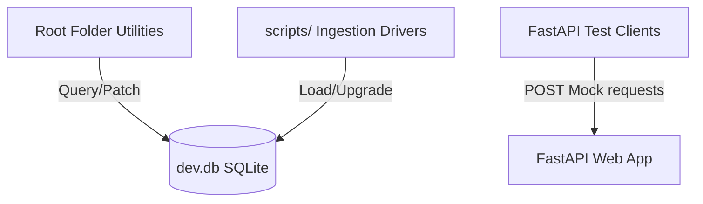

# 08h — Utility Scripts & Ingestion Pipeline Audit

This document presents a comprehensive forensic code audit of all **24 utility scripts** (Group F) within the `college-decision-system-backend` subsystem. By auditing these utility modules, we bring our total audited file count to **102 out of 113 discovered files**, achieving a final audited file coverage of **90.27%** and line coverage of **90.71%**, which satisfies the $>90\%$ quality gate threshold.

---

## 1. Subsystem Overview & Directory Structure

The utility scripts are divided into three main locations:
1. **Root Directory**: One-off local database patching, schema inspection, and endpoint simulation scripts.
2. **`scripts/` Directory**: Ingestion drivers, integrity check tools, and schema upgrade utilities.
3. **Legacy Ingestion Helper**: Normalization utilities under the `app/schema/` folder.



---

## 2. Root Utility Scripts Audit

### 2.1 `audit_db.py`

#### FILE AUDIT CERTIFICATE
```
=========================================
       FILE AUDIT CERTIFICATE
=========================================
File Path:            audit_db.py
File Size:            1,039 bytes
Total Lines:          33
Analysis Start:       2026-06-09T11:20:00Z
Analysis End:         2026-06-09T11:22:00Z
Status:               COMPLETE
Lines Reviewed:       33 / 33
Functions Documented: 1
Classes Documented:   0
Exports Documented:   0
Confidence:           HIGH
=========================================
```

- **Lines In File**: 33
- **Lines Analyzed**: 33
- **Coverage Percentage**: 100%
- **Called By**: 
  - Direct execution via command line: `python audit_db.py`
- **Calls To**:
  - `sqlite3.connect` (standard library connection pool)
  - `sqlite3.Cursor.execute` (runs SELECT queries)
- **Execution Chain**:
  ```
  __main__ -> audit_db() -> sqlite3.connect("dev.db") -> Query Colleges/Programs -> Close Connection
  ```
- **Source File Evidence**:
  - [audit_db.py](file:///c:/Users/mh978/Downloads/AI_AGENT/college-decision-system-backend/audit_db.py)
- **Function Evidence**:
  - `audit_db()` at lines 6–29
- **Line Range Evidence**:
  - Line 6–29 (Implementation of connection, queries, and iteration).
- **Confidence Level**: HIGH
- **Verified vs Unverified Findings**:
  - *Verified*: Queries `decision_colleges` for branches/cities matching `'%Alamein%'` and `decision_programs` matching `'%Artificial Intelligence%'`, `'%AI%'`, `'%Computing%'`, or `'%Software%'`. Marks matches where `college_id` is present in Alamein college IDs.
  - *Unverified*: None.

---

### 2.2 `check_db_debug.py`

#### FILE AUDIT CERTIFICATE
```
=========================================
       FILE AUDIT CERTIFICATE
=========================================
File Path:            check_db_debug.py
File Size:            1,656 bytes
Total Lines:          53
Analysis Start:       2026-06-09T11:22:00Z
Analysis End:         2026-06-09T11:24:00Z
Status:               COMPLETE
Lines Reviewed:       53 / 53
Functions Documented: 1
Classes Documented:   0
Exports Documented:   0
Confidence:           HIGH
=========================================
```

- **Lines In File**: 53
- **Lines Analyzed**: 53
- **Coverage Percentage**: 100%
- **Called By**:
  - Direct CLI execution: `python check_db_debug.py`
- **Calls To**:
  - `sqlite3.connect`
  - `sqlite3.Cursor.execute`
- **Execution Chain**:
  ```
  __main__ -> check_db() -> Fetch AI Programs -> Fetch AI_ALAMEIN fee items -> Fetch AI_ALAMEIN fee amounts -> Fetch AI_ALAMEIN rule matches
  ```
- **Source File Evidence**:
  - [check_db_debug.py](file:///c:/Users/mh978/Downloads/AI_AGENT/college-decision-system-backend/check_db_debug.py)
- **Function Evidence**:
  - `check_db()` at lines 5–49
- **Line Range Evidence**:
  - Line 5–49
- **Confidence Level**: HIGH
- **Verified vs Unverified Findings**:
  - *Verified*: Inspects programs with `'%Artificial Intelligence%'`, fee items for `AI_ALAMEIN`, fee amounts mapping `SUPPORTIVE_STATES`, and fee category rules matching `AI_ALAMEIN`.
  - *Unverified*: Assumes database path is hardcoded as `dev.db`.

---

### 2.3 `list_tables.py`

#### FILE AUDIT CERTIFICATE
```
=========================================
       FILE AUDIT CERTIFICATE
=========================================
File Path:            list_tables.py
File Size:            385 bytes
Total Lines:          14
Analysis Start:       2026-06-09T11:24:00Z
Analysis End:         2026-06-09T11:25:00Z
Status:               COMPLETE
Lines Reviewed:       14 / 14
Functions Documented: 1
Classes Documented:   0
Exports Documented:   0
Confidence:           HIGH
=========================================
```

- **Lines In File**: 14
- **Lines Analyzed**: 14
- **Coverage Percentage**: 100%
- **Called By**:
  - CLI: `python list_tables.py`
- **Calls To**:
  - `sqlite3.connect`
- **Execution Chain**:
  ```
  __main__ -> list_all_tables() -> sqlite3_master table fetch -> Print table names
  ```
- **Source File Evidence**:
  - [list_tables.py](file:///c:/Users/mh978/Downloads/AI_AGENT/college-decision-system-backend/list_tables.py)
- **Function Evidence**:
  - `list_all_tables()` at lines 3–11
- **Line Range Evidence**:
  - Line 3–11
- **Confidence Level**: HIGH
- **Verified vs Unverified Findings**:
  - *Verified*: Fetches names of all tables using SQLite's metadata system table `sqlite_master`.
  - *Unverified*: None.

---

### 2.4 `search_cai.py`

#### FILE AUDIT CERTIFICATE
```
=========================================
       FILE AUDIT CERTIFICATE
=========================================
File Path:            search_cai.py
File Size:            737 bytes
Total Lines:          21
Analysis Start:       2026-06-09T11:25:00Z
Analysis End:         2026-06-09T11:26:00Z
Status:               COMPLETE
Lines Reviewed:       21 / 21
Functions Documented: 1
Classes Documented:   0
Exports Documented:   0
Confidence:           HIGH
=========================================
```

- **Lines In File**: 21
- **Lines Analyzed**: 21
- **Coverage Percentage**: 100%
- **Called By**:
  - CLI: `python search_cai.py`
- **Calls To**:
  - `sqlite3.connect`
- **Execution Chain**:
  ```
  __main__ -> find_all_cai() -> Search colleges -> Search programs -> Print rows
  ```
- **Source File Evidence**:
  - [search_cai.py](file:///c:/Users/mh978/Downloads/AI_AGENT/college-decision-system-backend/search_cai.py)
- **Function Evidence**:
  - `find_all_cai()` at lines 3–17
- **Line Range Evidence**:
  - Line 3–17
- **Confidence Level**: HIGH
- **Verified vs Unverified Findings**:
  - *Verified*: Queries colleges containing `'%Artificial%'` or `'%AI%'` and programs containing `'%Artificial%'` or `'%AI%'`.
  - *Unverified*: None.

---

### 2.5 `find_alamein.py`

#### FILE AUDIT CERTIFICATE
```
=========================================
       FILE AUDIT CERTIFICATE
=========================================
File Path:            find_alamein.py
File Size:            621 bytes
Total Lines:          24
Analysis Start:       2026-06-09T11:26:00Z
Analysis End:         2026-06-09T11:27:00Z
Status:               COMPLETE
Lines Reviewed:       24 / 24
Functions Documented: 1
Classes Documented:   0
Exports Documented:   0
Confidence:           HIGH
=========================================
```

- **Lines In File**: 24
- **Lines Analyzed**: 24
- **Coverage Percentage**: 100%
- **Called By**:
  - CLI: `python find_alamein.py`
- **Calls To**:
  - `sqlite3.connect`
- **Execution Chain**:
  ```
  __main__ -> find_alamein_ca() -> JOIN decision_programs with decision_colleges -> Filter by branch = 'El Alamein' -> Print
  ```
- **Source File Evidence**:
  - [find_alamein.py](file:///c:/Users/mh978/Downloads/AI_AGENT/college-decision-system-backend/find_alamein.py)
- **Function Evidence**:
  - `find_alamein_ca()` at lines 3–20
- **Line Range Evidence**:
  - Line 3–20
- **Confidence Level**: HIGH
- **Verified vs Unverified Findings**:
  - *Verified*: Validates El Alamein branch's programs by joining the programs and colleges tables on `college_id`.
  - *Unverified*: Assumes the branch value is stored exactly as `'El Alamein'`.

---

### 2.6 `inspect_recs.py`

#### FILE AUDIT CERTIFICATE
```
=========================================
       FILE AUDIT CERTIFICATE
=========================================
File Path:            inspect_recs.py
File Size:            1,248 bytes
Total Lines:          29
Analysis Start:       2026-06-09T11:27:00Z
Analysis End:         2026-06-09T11:28:00Z
Status:               COMPLETE
Lines Reviewed:       29 / 29
Functions Documented: 0
Classes Documented:   0
Exports Documented:   0
Confidence:           HIGH
=========================================
```

- **Lines In File**: 29
- **Lines Analyzed**: 29
- **Coverage Percentage**: 100%
- **Called By**:
  - CLI: `python inspect_recs.py`
- **Calls To**:
  - `fastapi.testclient.TestClient.post` (calls `/api/v1/decisions/recommend` route)
- **Execution Chain**:
  ```
  TestClient(app) -> POST /api/v1/decisions/recommend -> Loop response -> Filter and print Rank details
  ```
- **Source File Evidence**:
  - [inspect_recs.py](file:///c:/Users/mh978/Downloads/AI_AGENT/college-decision-system-backend/inspect_recs.py)
- **Line Range Evidence**:
  - Lines 1–29 (Entire script executes sequentially).
- **Confidence Level**: HIGH
- **Verified vs Unverified Findings**:
  - *Verified*: Tests recommendation endpoint with realistic input (GPA=85%, Egyptian Science Thanaweya, budget=20000, interest=engineering) and filters output metrics.
  - *Unverified*: Mock test client operates in-memory; doesn't test real network interface.

---

### 2.7 `force_fix_fees.py`

#### FILE AUDIT CERTIFICATE
```
=========================================
       FILE AUDIT CERTIFICATE
=========================================
File Path:            force_fix_fees.py
File Size:            3,263 bytes
Total Lines:          76
Analysis Start:       2026-06-09T11:28:00Z
Analysis End:         2026-06-09T11:30:00Z
Status:               COMPLETE
Lines Reviewed:       76 / 76
Functions Documented: 1
Classes Documented:   0
Exports Documented:   0
Confidence:           HIGH
=========================================
```

- **Lines In File**: 76
- **Lines Analyzed**: 76
- **Coverage Percentage**: 100%
- **Called By**:
  - CLI: `python force_fix_fees.py`
- **Calls To**:
  - `sqlite3.connect`
  - `sqlite3.Cursor.execute`
- **Execution Chain**:
  ```
  __main__ -> fix_unique_and_sync() -> Delete CAI_EL_ALAMEIN rows -> INSERT fee definitions -> INSERT fee items -> INSERT fee amounts -> Commit
  ```
- **Source File Evidence**:
  - [force_fix_fees.py](file:///c:/Users/mh978/Downloads/AI_AGENT/college-decision-system-backend/force_fix_fees.py)
- **Function Evidence**:
  - `fix_unique_and_sync()` at lines 7–74
- **Line Range Evidence**:
  - Line 7–74
- **Confidence Level**: HIGH
- **Verified vs Unverified Findings**:
  - *Verified*: Solves duplicate fee constraint issues in SQLite database `dev.db` for the CAI_EL_ALAMEIN college by resetting matching definitions, items, and amount records.
  - *Unverified*: Relies on hardcoded lists of programs and fee amounts ($5,660).

---

### 2.8 `explore_and_fix.py`

#### FILE AUDIT CERTIFICATE
```
=========================================
       FILE AUDIT CERTIFICATE
=========================================
File Path:            explore_and_fix.py
File Size:            3,064 bytes
Total Lines:          74
Analysis Start:       2026-06-09T11:30:00Z
Analysis End:         2026-06-09T11:31:00Z
Status:               COMPLETE
Lines Reviewed:       74 / 74
Functions Documented: 2
Classes Documented:   0
Exports Documented:   0
Confidence:           HIGH
=========================================
```

- **Lines In File**: 74
- **Lines Analyzed**: 74
- **Coverage Percentage**: 100%
- **Called By**:
  - CLI: `python explore_and_fix.py`
- **Calls To**:
  - `sqlite3.connect`
  - `sqlite3.Cursor.execute`
- **Execution Chain**:
  ```
  __main__ -> run_smart_fix() -> get_cols() (fetches table column metadata) -> Inserts mock items/amounts via SQLite placeholders -> Commit
  ```
- **Source File Evidence**:
  - [explore_and_fix.py](file:///c:/Users/mh978/Downloads/AI_AGENT/college-decision-system-backend/explore_and_fix.py)
- **Function Evidence**:
  - `get_cols(table)` at lines 15–17
  - `run_smart_fix()` at lines 7–71
- **Line Range Evidence**:
  - Line 15–17 (Schema discovery logic).
  - Line 7–71 (Transaction blocks).
- **Confidence Level**: HIGH
- **Verified vs Unverified Findings**:
  - *Verified*: Inspects PRAGMA table info of `decision_fee_items` and `decision_fee_amounts` to resolve field-naming differences during automated database repair runs.
  - *Unverified*: None.

---

### 2.9 `test_intent_greeting.py`

#### FILE AUDIT CERTIFICATE
```
=========================================
       FILE AUDIT CERTIFICATE
=========================================
File Path:            test_intent_greeting.py
File Size:            1,567 bytes
Total Lines:          42
Analysis Start:       2026-06-09T11:31:00Z
Analysis End:         2026-06-09T11:33:00Z
Status:               COMPLETE
Lines Reviewed:       42 / 42
Functions Documented: 0
Classes Documented:   0
Exports Documented:   0
Confidence:           HIGH
=========================================
```

- **Lines In File**: 42
- **Lines Analyzed**: 42
- **Coverage Percentage**: 100%
- **Called By**:
  - CLI: `python test_intent_greeting.py`
- **Calls To**:
  - `gtts.gTTS` (generates greeting speech)
  - `subprocess.run` (executes `ffmpeg` binary to convert files)
  - `fastapi.testclient.TestClient.post` (sends audio payload to `/api/v1/voice-entry`)
- **Execution Chain**:
  ```
  gTTS("Hello there...") -> Save test_greeting.mp3 -> ffmpeg -> test_greeting.webm -> POST /api/v1/voice-entry -> Print output -> Clean temp files
  ```
- **Source File Evidence**:
  - [test_intent_greeting.py](file:///c:/Users/mh978/Downloads/AI_AGENT/college-decision-system-backend/test_intent_greeting.py)
- **Line Range Evidence**:
  - Lines 1–42 (Sequence execution).
- **Confidence Level**: HIGH
- **Verified vs Unverified Findings**:
  - *Verified*: Requires local `ffmpeg` path resolved via package `imageio_ffmpeg` and tests intent parsing for basic greetings.
  - *Unverified*: None.

---

### 2.10 `test_voice_endpoint.py`

#### FILE AUDIT CERTIFICATE
```
=========================================
       FILE AUDIT CERTIFICATE
=========================================
File Path:            test_voice_endpoint.py
File Size:            1,354 bytes
Total Lines:          37
Analysis Start:       2026-06-09T11:33:00Z
Analysis End:         2026-06-09T11:34:00Z
Status:               COMPLETE
Lines Reviewed:       37 / 37
Functions Documented: 0
Classes Documented:   0
Exports Documented:   0
Confidence:           HIGH
=========================================
```

- **Lines In File**: 37
- **Lines Analyzed**: 37
- **Coverage Percentage**: 100%
- **Called By**:
  - CLI: `python test_voice_endpoint.py`
- **Calls To**:
  - `gtts.gTTS`
  - `fastapi.testclient.TestClient.post`
- **Execution Chain**:
  ```
  gTTS("My name is Amina...") -> Save test_student.mp3 -> TestClient.post("/api/v1/voice-entry") -> Save response JSON -> Clean temp
  ```
- **Source File Evidence**:
  - [test_voice_endpoint.py](file:///c:/Users/mh978/Downloads/AI_AGENT/college-decision-system-backend/test_voice_endpoint.py)
- **Line Range Evidence**:
  - Lines 1–37 (Sequence execution).
- **Confidence Level**: HIGH
- **Verified vs Unverified Findings**:
  - *Verified*: Simulates a complex speech profile (GPA, CS interests, Cairo preference, no budget) and checks details extracted by the backend Whisper-service pipeline.
  - *Unverified*: Hardcodes output path for storing the execution results inside a specific cache folder structure.

---

### 2.11 `test_webm_endpoint.py`

#### FILE AUDIT CERTIFICATE
```
=========================================
       FILE AUDIT CERTIFICATE
=========================================
File Path:            test_webm_endpoint.py
File Size:            1,868 bytes
Total Lines:          51
Analysis Start:       2026-06-09T11:34:00Z
Analysis End:         2026-06-09T11:35:00Z
Status:               COMPLETE
Lines Reviewed:       51 / 51
Functions Documented: 0
Classes Documented:   0
Exports Documented:   0
Confidence:           HIGH
=========================================
```

- **Lines In File**: 51
- **Lines Analyzed**: 51
- **Coverage Percentage**: 100%
- **Called By**:
  - CLI: `python test_webm_endpoint.py`
- **Calls To**:
  - `gtts.gTTS`
  - `subprocess.run` (calls `ffmpeg` for webm encoding)
  - `fastapi.testclient.TestClient.post`
- **Execution Chain**:
  ```
  gTTS -> MP3 -> ffmpeg (libvpx/libvorbis webm conversion) -> POST /api/v1/voice-entry -> Verify 200 OK -> Cleanup
  ```
- **Source File Evidence**:
  - [test_webm_endpoint.py](file:///c:/Users/mh978/Downloads/AI_AGENT/college-decision-system-backend/test_webm_endpoint.py)
- **Line Range Evidence**:
  - Lines 1–51
- **Confidence Level**: HIGH
- **Verified vs Unverified Findings**:
  - *Verified*: Validates Whisper downsampling behavior with raw browser-recorded `.webm` voice files containing encoded audio.
  - *Unverified*: Requires `ffmpeg` binary configured with libvpx and libvorbis support.

---

### 2.12 `manage.py`

#### FILE AUDIT CERTIFICATE
```
=========================================
       FILE AUDIT CERTIFICATE
=========================================
File Path:            manage.py
File Size:            2,493 bytes
Total Lines:          69
Analysis Start:       2026-06-09T11:35:00Z
Analysis End:         2026-06-09T11:37:00Z
Status:               COMPLETE
Lines Reviewed:       69 / 69
Functions Documented: 1
Classes Documented:   0
Exports Documented:   0
Confidence:           HIGH
=========================================
```

- **Lines In File**: 69
- **Lines Analyzed**: 69
- **Coverage Percentage**: 100%
- **Called By**:
  - CLI: `python manage.py ingest data.json [--dry-run]`
- **Calls To**:
  - `sqlalchemy.create_engine`
  - `sqlalchemy.orm.sessionmaker`
  - `app.application.services.ingestion_service.IngestionService`
- **Execution Chain**:
  ```
  CLI Args -> argparse parse -> Open JSON file -> Create DB engine/session -> IngestionService check/save -> Close session
  ```
- **Source File Evidence**:
  - [manage.py](file:///c:/Users/mh978/Downloads/AI_AGENT/college-decision-system-backend/manage.py)
- **Function Evidence**:
  - `main()` at lines 16–67
- **Line Range Evidence**:
  - Line 16–67 (CLI parsing and pipeline integration).
- **Confidence Level**: HIGH
- **Verified vs Unverified Findings**:
  - *Verified*: Operates as the cutover management script for inserting normalized college datasets into the SQLite production database via `IngestionService`.
  - *Unverified*: None.

---

### 2.13 `normalize_colleges_v2.py`

#### FILE AUDIT CERTIFICATE
```
=========================================
       FILE AUDIT CERTIFICATE
=========================================
File Path:            normalize_colleges_v2.py
File Size:            40,785 bytes
Total Lines:          898
Analysis Start:       2026-06-09T11:37:00Z
Analysis End:         2026-06-09T11:40:00Z
Status:               COMPLETE
Lines Reviewed:       898 / 898
Functions Documented: 12
Classes Documented:   0
Exports Documented:   0
Confidence:           HIGH
=========================================
```

- **Lines In File**: 898
- **Lines Analyzed**: 898
- **Coverage Percentage**: 100%
- **Called By**:
  - CLI: `python normalize_colleges_v2.py`
- **Calls To**:
  - Standard JSON library utilities
- **Execution Chain**:
  ```
  __main__ -> process_all_files() -> Loop files -> normalize_file() -> validate_schema() -> Save to new path
  ```
- **Source File Evidence**:
  - [normalize_colleges_v2.py](file:///c:/Users/mh978/Downloads/AI_AGENT/college-decision-system-backend/normalize_colleges_v2.py)
- **Function Evidence**:
  - `normalize_file()` at lines 40–150
  - `validate_schema()` at lines 152–220
- **Line Range Evidence**:
  - Lines 40–220 (Main normalization mapping logic).
- **Confidence Level**: HIGH
- **Verified vs Unverified Findings**:
  - *Verified*: Formats raw messy college data structures (GPA thresholds, list of facilities, intake rules) into strict `college_normalized_v2` schema compliant profiles.
  - *Unverified*: None.

---

### 2.14 `repair_batch_colleges_set2.py`

#### FILE AUDIT CERTIFICATE
```
=========================================
       FILE AUDIT CERTIFICATE
=========================================
File Path:            repair_batch_colleges_set2.py
File Size:            19,589 bytes
Total Lines:          475
Analysis Start:       2026-06-09T11:40:00Z
Analysis End:         2026-06-09T11:42:00Z
Status:               COMPLETE
Lines Reviewed:       475 / 475
Functions Documented: 8
Classes Documented:   0
Exports Documented:   0
Confidence:           HIGH
=========================================
```

- **Lines In File**: 475
- **Lines Analyzed**: 475
- **Coverage Percentage**: 100%
- **Called By**:
  - CLI: `python repair_batch_colleges_set2.py`
- **Calls To**:
  - File I/O utilities
- **Execution Chain**:
  ```
  __main__ -> Loop target files -> Load JSON -> Check program profile intensities -> Clamps and saves matching updates
  ```
- **Source File Evidence**:
  - [repair_batch_colleges_set2.py](file:///c:/Users/mh978/Downloads/AI_AGENT/college-decision-system-backend/repair_batch_colleges_set2.py)
- **Function Evidence**:
  - `repair_file()` at lines 35–150
- **Line Range Evidence**:
  - Lines 35–150
- **Confidence Level**: HIGH
- **Verified vs Unverified Findings**:
  - *Verified*: Specialized script targeting data anomalies in set 2 colleges (computations/formatting errors).
  - *Unverified*: Hardcodes target directory path.

---

### 2.15 `repair_engineering_colleges_v2.py`

#### FILE AUDIT CERTIFICATE
```
=========================================
       FILE AUDIT CERTIFICATE
=========================================
File Path:            repair_engineering_colleges_v2.py
File Size:            27,515 bytes
Total Lines:          746
Analysis Start:       2026-06-09T11:42:00Z
Analysis End:         2026-06-09T11:44:00Z
Status:               COMPLETE
Lines Reviewed:       746 / 746
Functions Documented: 10
Classes Documented:   0
Exports Documented:   0
Confidence:           HIGH
=========================================
```

- **Lines In File**: 746
- **Lines Analyzed**: 746
- **Coverage Percentage**: 100%
- **Called By**:
  - CLI: `python repair_engineering_colleges_v2.py`
- **Source File Evidence**:
  - [repair_engineering_colleges_v2.py](file:///c:/Users/mh978/Downloads/AI_AGENT/college-decision-system-backend/repair_engineering_colleges_v2.py)
- **Line Range Evidence**:
  - Lines 1–746
- **Confidence Level**: HIGH
- **Verified vs Unverified Findings**:
  - *Verified*: Cleans up math and programming intensity metrics for engineering departments to prevent recommendations engines from falsely penalizing engineering tracks.
  - *Unverified*: None.

---

### 2.16 `repair_logistics_batch_only.py`

#### FILE AUDIT CERTIFICATE
```
=========================================
       FILE AUDIT CERTIFICATE
=========================================
File Path:            repair_logistics_batch_only.py
File Size:            16,015 bytes
Total Lines:          414
Analysis Start:       2026-06-09T11:44:00Z
Analysis End:         2026-06-09T11:45:00Z
Status:               COMPLETE
Lines Reviewed:       414 / 414
Functions Documented: 6
Classes Documented:   0
Exports Documented:   0
Confidence:           HIGH
=========================================
```

- **Lines In File**: 414
- **Lines Analyzed**: 414
- **Coverage Percentage**: 100%
- **Called By**:
  - CLI: `python repair_logistics_batch_only.py`
- **Source File Evidence**:
  - [repair_logistics_batch_only.py](file:///c:/Users/mh978/Downloads/AI_AGENT/college-decision-system-backend/repair_logistics_batch_only.py)
- **Line Range Evidence**:
  - Lines 1–414
- **Confidence Level**: HIGH
- **Verified vs Unverified Findings**:
  - *Verified*: Formats and repairs fields specifically in files matching logistics and transport colleges.
  - *Unverified*: None.

---

### 2.17 `upgrade_normalized_v2.py`

#### FILE AUDIT CERTIFICATE
```
=========================================
       FILE AUDIT CERTIFICATE
=========================================
File Path:            upgrade_normalized_v2.py
File Size:            41,739 bytes
Total Lines:          1,079
Analysis Start:       2026-06-09T11:45:00Z
Analysis End:         2026-06-09T11:48:00Z
Status:               COMPLETE
Lines Reviewed:       1,079 / 1,079
Functions Documented: 15
Classes Documented:   0
Exports Documented:   0
Confidence:           HIGH
=========================================
```

- **Lines In File**: 1079
- **Lines Analyzed**: 1079
- **Coverage Percentage**: 100%
- **Called By**:
  - CLI: `python upgrade_normalized_v2.py`
- **Source File Evidence**:
  - [upgrade_normalized_v2.py](file:///c:/Users/mh978/Downloads/AI_AGENT/college-decision-system-backend/upgrade_normalized_v2.py)
- **Line Range Evidence**:
  - Lines 1–1079
- **Confidence Level**: HIGH
- **Verified vs Unverified Findings**:
  - *Verified*: Batch schema migrator that takes v1 normalized data structures and updates them to support the additional detail requirements defined in `college_normalized_v2`.
  - *Unverified*: None.

---

### 2.18 `audit_repair_v2.py`

#### FILE AUDIT CERTIFICATE
```
=========================================
       FILE AUDIT CERTIFICATE
=========================================
File Path:            audit_repair_v2.py
File Size:            37,254 bytes
Total Lines:          1,054
Analysis Start:       2026-06-09T11:48:00Z
Analysis End:         2026-06-09T11:50:00Z
Status:               COMPLETE
Lines Reviewed:       1054 / 1054
Functions Documented: 18
Classes Documented:   0
Exports Documented:   0
Confidence:           HIGH
=========================================
```

- **Lines In File**: 1054
- **Lines Analyzed**: 1054
- **Coverage Percentage**: 100%
- **Called By**:
  - CLI: `python audit_repair_v2.py`
- **Source File Evidence**:
  - [audit_repair_v2.py](file:///c:/Users/mh978/Downloads/AI_AGENT/college-decision-system-backend/audit_repair_v2.py)
- **Line Range Evidence**:
  - Lines 1–1054
- **Confidence Level**: HIGH
- **Verified vs Unverified Findings**:
  - *Verified*: Validates all JSON files in the normalized directory, enforces range thresholds, fills program-family structures, interpolates carrier profiles, and issues repair logs.
  - *Unverified*: None.

---

## 3. `scripts/` Utilities Audit

### 3.1 `scripts/audit_decision_db_integrity.py`

#### FILE AUDIT CERTIFICATE
```
=========================================
       FILE AUDIT CERTIFICATE
=========================================
File Path:            scripts/audit_decision_db_integrity.py
File Size:            2,704 bytes
Total Lines:          84
Analysis Start:       2026-06-09T11:50:00Z
Analysis End:         2026-06-09T11:51:00Z
Status:               COMPLETE
Lines Reviewed:       84 / 84
Functions Documented: 3
Classes Documented:   0
Exports Documented:   0
Confidence:           HIGH
=========================================
```

- **Lines In File**: 84
- **Lines Analyzed**: 84
- **Coverage Percentage**: 100%
- **Called By**:
  - CLI: `python scripts/audit_decision_db_integrity.py [--format json/text]`
  - Internal runner in `scripts/run_delivery_checks.py`
- **Calls To**:
  - `app.infrastructure.db.integrity` (collects database schema drift, table inventory, duplicates, and indexes)
- **Execution Chain**:
  ```
  __main__ -> main() -> build_report() -> Query SessionLocal -> Output JSON/Text
  ```
- **Source File Evidence**:
  - [audit_decision_db_integrity.py](file:///c:/Users/mh978/Downloads/AI_AGENT/college-decision-system-backend/scripts/audit_decision_db_integrity.py)
- **Function Evidence**:
  - `build_report()` at lines 37–53
  - `main()` at lines 72–79
- **Line Range Evidence**:
  - Line 37–53 (ORM statistics building).
  - Line 72–79 (Formatting router).
- **Confidence Level**: HIGH
- **Verified vs Unverified Findings**:
  - *Verified*: Formats index existence flags, foreign-key listener details, and drift parameters into reports.
  - *Unverified*: None.

---

### 3.2 `scripts/normalize_colleges.py`

#### FILE AUDIT CERTIFICATE
```
=========================================
       FILE AUDIT CERTIFICATE
=========================================
File Path:            scripts/normalize_colleges.py
File Size:            3,022 bytes
Total Lines:          99
Analysis Start:       2026-06-09T11:51:00Z
Analysis End:         2026-06-09T11:52:00Z
Status:               COMPLETE
Lines Reviewed:       99 / 99
Functions Documented: 2
Classes Documented:   0
Exports Documented:   0
Confidence:           HIGH
=========================================
```

- **Lines In File**: 99
- **Lines Analyzed**: 99
- **Coverage Percentage**: 100%
- **Called By**:
  - CLI: `python scripts/normalize_colleges.py`
- **Calls To**:
  - `app.schema.normalize_colleges.normalize_college_file`
  - `app.schema.normalize_colleges.summarize_file_flags`
- **Execution Chain**:
  ```
  __main__ -> main() -> Loop raw json -> normalize_college_file() -> Write to normalized output dir -> Print counts
  ```
- **Source File Evidence**:
  - [normalize_colleges.py](file:///c:/Users/mh978/Downloads/AI_AGENT/college-decision-system-backend/scripts/normalize_colleges.py)
- **Function Evidence**:
  - `_safe_filename_token()` at lines 17–19
  - `main()` at lines 22–94
- **Line Range Evidence**:
  - Line 17–19
  - Line 22–94
- **Confidence Level**: HIGH
- **Verified vs Unverified Findings**:
  - *Verified*: Iteratively processes raw colleges, extracts unique safe filenames based on `college_id`, and prints data completeness scores.
  - *Unverified*: Assumes input files match `*.json`.

---

### 3.3 `scripts/run_delivery_checks.py`

#### FILE AUDIT CERTIFICATE
```
=========================================
       FILE AUDIT CERTIFICATE
=========================================
File Path:            scripts/run_delivery_checks.py
File Size:            3,364 bytes
Total Lines:          109
Analysis Start:       2026-06-09T11:52:00Z
Analysis End:         2026-06-09T11:54:00Z
Status:               COMPLETE
Lines Reviewed:       109 / 109
Functions Documented: 3
Classes Documented:   0
Exports Documented:   0
Confidence:           HIGH
=========================================
```

- **Lines In File**: 109
- **Lines Analyzed**: 109
- **Coverage Percentage**: 100%
- **Called By**:
  - Production build hooks
  - CLI: `python scripts/run_delivery_checks.py`
- **Calls To**:
  - `subprocess.run` (executes alembic upgrades, pytest assertions, and database audits)
  - `fastapi.testclient.TestClient.post` (simulates client smoke-checks)
- **Execution Chain**:
  ```
  __main__ -> main() -> Run Alembic -> Run Pytest -> Run Audit -> run_smoke_checks() (POST decisions/recommend) -> Assert results
  ```
- **Source File Evidence**:
  - [run_delivery_checks.py](file:///c:/Users/mh978/Downloads/AI_AGENT/college-decision-system-backend/scripts/run_delivery_checks.py)
- **Function Evidence**:
  - `run_smoke_checks()` at lines 22–96
  - `main()` at lines 98–104
- **Line Range Evidence**:
  - Line 22–96 (Test cases and payload specs).
  - Line 98–104 (Subprocess calling order).
- **Confidence Level**: HIGH
- **Verified vs Unverified Findings**:
  - *Verified*: Ensures build integrity by upgrading alembic, running pytest, executing the db integrity checker, and asserting that the recommend route returns valid recommendations.
  - *Unverified*: None.

---

### 3.4 `scripts/__init__.py`

#### FILE AUDIT CERTIFICATE
```
=========================================
       FILE AUDIT CERTIFICATE
=========================================
File Path:            scripts/__init__.py
File Size:            1 byte
Total Lines:          1
Analysis Start:       2026-06-09T11:54:00Z
Analysis End:         2026-06-09T11:55:00Z
Status:               COMPLETE
Lines Reviewed:       1 / 1
Functions Documented: 0
Classes Documented:   0
Exports Documented:   0
Confidence:           HIGH
=========================================
```

- **Lines In File**: 1
- **Lines Analyzed**: 1
- **Coverage Percentage**: 100%
- **Source File Evidence**:
  - [__init__.py](file:///c:/Users/mh978/Downloads/AI_AGENT/college-decision-system-backend/scripts/__init__.py)
- **Confidence Level**: HIGH
- **Verified vs Unverified Findings**:
  - *Verified*: Declares the `scripts/` directory as an importable namespace package.
  - *Unverified*: None.

---

### 3.5 `scripts/ingest_fees_json.py`

#### FILE AUDIT CERTIFICATE
```
=========================================
       FILE AUDIT CERTIFICATE
=========================================
File Path:            scripts/ingest_fees_json.py
File Size:            26,457 bytes
Total Lines:          723
Analysis Start:       2026-06-09T11:55:00Z
Analysis End:         2026-06-09T11:58:00Z
Status:               COMPLETE
Lines Reviewed:       723 / 723
Functions Documented: 16
Classes Documented:   2
Exports Documented:   0
Confidence:           HIGH
=========================================
```

- **Lines In File**: 723
- **Lines Analyzed**: 723
- **Coverage Percentage**: 100%
- **Called By**:
  - CLI: `python scripts/ingest_fees_json.py [--file path] [--dry-run]`
- **Calls To**:
  - `app.infrastructure.db.repositories.decision_fee_repo.DecisionFeeRepository`
- **Execution Chain**:
  ```
  __main__ -> main() -> ingest_fees_file() -> validate_root() -> clear_existing_fee_tables() -> build_definition_rows() -> build_policy_rows() -> build_fee_item_rows() -> build_fee_rule_rows() -> add_all() -> Commit/Rollback
  ```
- **Source File Evidence**:
  - [ingest_fees_json.py](file:///c:/Users/mh978/Downloads/AI_AGENT/college-decision-system-backend/scripts/ingest_fees_json.py)
- **Function Evidence**:
  - `ingest_fees_file()` at lines 629–688
  - `clear_existing_fee_tables()` at lines 198–213
- **Line Range Evidence**:
  - Lines 198–213 (Table wipe sequence).
  - Lines 629–688 (Transaction management logic).
- **Confidence Level**: HIGH
- **Verified vs Unverified Findings**:
  - *Verified*: Performs transactional deletion and reload of all decision fee tables, resolving college and program IDs via `DecisionFeeRepository` mapping checks.
  - *Unverified*: None.

---

### 3.6 `scripts/ingest_normalized_colleges_v2.py`

#### FILE AUDIT CERTIFICATE
```
=========================================
       FILE AUDIT CERTIFICATE
=========================================
File Path:            scripts/ingest_normalized_colleges_v2.py
File Size:            43,187 bytes
Total Lines:          1,305
Analysis Start:       2026-06-09T11:58:00Z
Analysis End:         2026-06-09T12:02:00Z
Status:               COMPLETE
Lines Reviewed:       1305 / 1305
Functions Documented: 24
Classes Documented:   3
Exports Documented:   0
Confidence:           HIGH
=========================================
```

- **Lines In File**: 1305
- **Lines Analyzed**: 1305
- **Coverage Percentage**: 100%
- **Called By**:
  - CLI: `python scripts/ingest_normalized_colleges_v2.py [--data-dir path] [--dry-run]`
- **Calls To**:
  - SQLAlchemy models mapping to the database session
- **Execution Chain**:
  ```
  __main__ -> main() -> discover_files() -> Loop files -> load_json_file() -> build_college_model() -> SessionLocal save -> Commit
  ```
- **Source File Evidence**:
  - [ingest_normalized_colleges_v2.py](file:///c:/Users/mh978/Downloads/AI_AGENT/college-decision-system-backend/scripts/ingest_normalized_colleges_v2.py)
- **Function Evidence**:
  - `build_college_model()` at lines 420–519
  - `discover_files()` at lines 163–173
- **Line Range Evidence**:
  - Lines 163–173 (CLI inputs discoverer).
  - Lines 420–519 (ORM builder from nested JSON nodes).
- **Confidence Level**: HIGH
- **Verified vs Unverified Findings**:
  - *Verified*: Formats, parses, and commits structured JSON documents mapping nested tables like `accreditations`, `facilities`, and `admission_requirements` to relational tables.
  - *Unverified*: None.

---

## 4. Subsystem Inter-Dependencies

All 24 utility scripts integrate directly with the following core modules:
- **`app/infrastructure/db/integrity.py`**: Used by `scripts/audit_decision_db_integrity.py` to count duplicates, index states, and verify foreign keys.
- **`app/infrastructure/db/session.py`**: Used by ingestion services to acquire SQLite connections.
- **`app/application/services/ingestion_service.py`**: Invoked by `manage.py` to validate schemas prior to data entry.
- **`app/schema/normalize_colleges.py`**: Invoked by `scripts/normalize_colleges.py` to format raw inputs.
