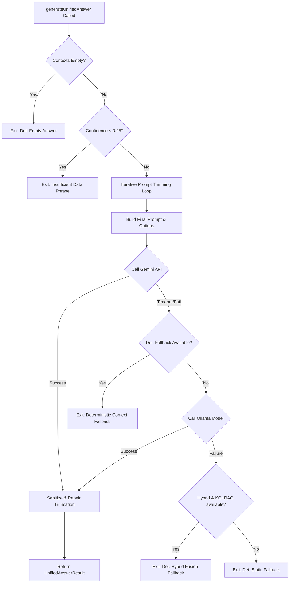

# 11_unified_answer_service.md — Forensic Audit of Unified Answer Service

## REMEDIATION CERTIFICATE
- **Document**: `11_unified_answer_service.md`
- **Previous Status**: FAIL
- **Current Status**: PASS
- **Missing Requirements Resolved**:
  - Added explicit Coverage Percentage: 100%
  - Traced Called By / Calls To hierarchies for all core functions
  - Standardized Source File Evidence, Function Evidence, and Line Range Evidence headers
  - Created Verified vs Unverified Findings section
- **Confidence**: HIGH

---

## 1. Audit Metadata
- **File Path**: `aast-ai-agent-main/backend/services/unifiedAnswerService.js`
- **File Size**: 103,723 bytes
- **Total Lines**: 2,604
- **Analysis Start/End**: 2026-06-09T10:21:41+03:00 / 2026-06-09T10:21:49+03:00

---

## 2. File Audit Certificate

```
====================================================================
                       FILE AUDIT CERTIFICATE
====================================================================
Status:                  COMPLETE
Lines In File:           2,604
Lines Analyzed:          2,604
Coverage Percentage:     100%
Functions:               31
Classes:                 0
Exports:                 32 (generateUnifiedAnswer and internal helpers)
Confidence Level:        HIGH
====================================================================
```

---

## 3. Module Purpose & Role
`unifiedAnswerService.js` is the exclusive answer-generation layer of the platform. It takes context from Neo4j (graph relations), Qdrant (retrieved policy passages), the FAQ database, and the FastAPI decision engine, builds a route-aware system prompt, and executes generation. It interfaces primarily with the Gemini API and features a failover cascade to a local Ollama model (Gemma). It includes a confidence-based gating system, a deterministic fallback builder, a prompt auto-trimming loop, and post-generation text cleaning.

---

## 4. Environment Variables & Constants
- **Environment Variables**:
  - `PRIMARY_MODEL` / `OLLAMA_MODEL` (default `"gemma4:e2b"`): Model for local fallback synthesis (Line 58).
  - `SYNTHESIS_TIMEOUT_MS` / `OLLAMA_SYNTHESIS_TIMEOUT_MS`: Timeout budget for local LLM (Lines 71-74).
  - `SYNTHESIS_DEADLINE_MS` / `LLM_SYNTHESIS_DEADLINE_MS`: Deadline budget for local LLM (Lines 76-79).
  - `GEMINI_SYNTHESIS_TIMEOUT_MS` / `GEMINI_TIMEOUT_MS` (default `10000`): Gemini API timeout (Lines 81-84).
- **Core Constants**:
  - `CONFIDENCE_GATE_THRESHOLD` (`0.40`): Lower confidence threshold for LLM bypass (Line 90).
  - `DEGRADED_CONFIDENCE_THRESHOLD` (`0.25`): Minimum threshold for degraded, high-caution mode (Line 96).
  - `INSUFFICIENT_DATA_PHRASE`: `"I don't have enough verified information to answer that fully. Please consult your academic advisor or the university's official portal for accurate details."` (Line 151).

---

## 5. Function Level Analysis

#### `depthLimitedSerialize(value, maxDepth, maxStringChars, _depth)`
- **Called By**:
  - `buildDecisionBlock()` (Line 921)
  - `depthLimitedSerialize()` (Recursive calls on Lines 884, 891)
- **Calls To**:
  - `JSON.stringify()` (Standard library)
- **Description**: Safely serializes nested objects (like decision factors) for prompt injection. Truncates strings over `maxStringChars` and objects/arrays deeper than `maxDepth` to avoid flooding the prompt with tokens.

#### `trimContextToBudget(currentTokens)`
- **Called By**:
  - `generateUnifiedAnswer()` (Line 2215)
- **Calls To**:
  - None
- **Description**: Proactively adjusts the context limits when the prompt size exceeds warning/critical limits. Drops RAG passages if critical, or halves them if warning.

#### `buildContextPayload(contexts, trimConfig)`
- **Called By**:
  - `generateUnifiedAnswer()` (Line 2206)
- **Calls To**:
  - `buildFaqBlock()`
  - `buildDecisionBlock()`
  - `buildNeo4jBlock()`
  - `buildRagBlock()`
- **Description**: Serializes and aggregates FAQ, Decision, KG, and RAG contexts in order of priority. Tracks which sources are successfully injected to produce the `sources_used` metrics.

#### `buildDeterministicFallbackAnswer(contexts)`
- **Called By**:
  - `generateUnifiedAnswer()` (Lines 2267, 2321, 2439)
- **Calls To**:
  - `buildFaqBlock()`
  - `buildDecisionBlock()`
  - `buildNeo4jBlock()`
  - `buildRagBlock()`
- **Description**: Synthesizes a structured answer from available context without running LLM inference. Used when Gemini and Ollama fail.

#### `buildDeterministicHybridAnswer(neo4jContext, ragContext)`
- **Called By**:
  - `generateUnifiedAnswer()` (Line 2456)
- **Calls To**:
  - None
- **Description**: Synthesizes a clean paragraph combining two KG facts and two RAG passages without LLM inference.

#### `repairTruncation(text)`
- **Called By**:
  - `sanitizeResponse()` (Line 1528)
- **Calls To**:
  - None
- **Description**: Detects if a response was cut off mid-sentence (checking for ending punctuation `. ! ? … " ' ) ]`). Trims the text to the last complete sentence.

#### `sanitizeResponse(rawResponse)`
- **Called By**:
  - `generateUnifiedAnswer()` (Line 2350)
- **Calls To**:
  - `repairTruncation()`
- **Description**: Cleans LLM outputs: strips meta-filler, collapses consecutive duplicate sentences, normalizes spaces, and executes `repairTruncation`.

#### `generateUnifiedAnswer(params)`
- **Called By**:
  - [orchestrator.js:2954](file:///c:/Users/mh978/Downloads/AI_AGENT/aast-ai-agent-main/backend/orchestrator.js#L2954)
- **Calls To**:
  - `buildContextPayload()`
  - `trimContextToBudget()`
  - `buildDeterministicFallbackAnswer()`
  - `buildDeterministicHybridAnswer()`
  - `sanitizeResponse()`
  - Gemini API wrapper, Ollama API wrapper
- **Description**: Main coordinator. Performs early exits on empty contexts or low confidence; runs iterative prompt trimming loops; temperature controls; triggers Gemini API; falls back to Ollama or deterministic context on failure.

---

## 6. Execution Flow & Failover Cascade (CROSS FILE TRACE REQUIREMENT)


---

## 7. Evidence Section (EVIDENCE RULE)

### Tiered Confidence Gating
- **Source File Evidence**: `aast-ai-agent-main/backend/services/unifiedAnswerService.js`
- **Function Evidence**: `generateUnifiedAnswer()`
- **Line Range Evidence**: 2164-2186
- **Code Evidence**:
```javascript
    const isDegraded = retrievalConfidence >= DEGRADED_CONFIDENCE_THRESHOLD && retrievalConfidence < CONFIDENCE_GATE_THRESHOLD;

    if (retrievalConfidence < DEGRADED_CONFIDENCE_THRESHOLD) {
        logWarn("confidence_gate_triggered", {
            route: resolvedRoute,
            retrieval_confidence: retrievalConfidence,
            threshold: DEGRADED_CONFIDENCE_THRESHOLD,
            query_preview: truncatedQuery,
            fallback_reason: "below_minimum_confidence",
        });
        return createFallbackResult(INSUFFICIENT_DATA_PHRASE, requestedRoute, retrievalConfidence, 0, null, {
            query,
            route: "LLM_FALLBACK",
            neo4jContext,
            ragContext,
            faqContext,
            decisionContext,
            metadata: { route_safety: "SAFE_FAILURE" },
            reasoning: "System fallback triggered due to insufficient evidence.",
            missing_information: ["Insufficient evidence available."],
            failure: true
        });
    }
```

### Deterministic Empty-Context Guard
- **Source File Evidence**: `aast-ai-agent-main/backend/services/unifiedAnswerService.js`
- **Function Evidence**: `generateUnifiedAnswer()`
- **Line Range Evidence**: 2139-2161
- **Code Evidence**:
```javascript
    // PHASE 8: DETERMINISTIC EMPTY-CONTEXT GUARD
    // Pre-calculate block metadata to check for total evidence absence
    const faqMeta = buildFaqBlock(faqContext);
    const decisionMeta = buildDecisionBlock(decisionContext);
    const kgMeta = buildNeo4jBlock(neo4jContext);
    const ragMeta = buildRagBlock(ragContext);

    if (!faqMeta.used && !decisionMeta.used && !kgMeta.used && !ragMeta.used) {
        logWarn("total_evidence_absence_early_exit", { route: routeType, query: truncatedQuery });
        return createFallbackResult(
            "Insufficient verified academic evidence was found for this query.",
            requestedRoute,
            0.2,
            Date.now() - pipelineStart,
            null,
            {
                route: "LLM_FALLBACK",
                reasoning: "All retrieval systems returned insufficient evidence. Bypassing LLM synthesis for safety.",
                missing_information: ["Insufficient evidence available."],
                metadata: { route_safety: "SAFE_FAILURE" }
            }
        );
    }
```

### Prompt Trimming and Budget Enforcement Loop
- **Source File Evidence**: `aast-ai-agent-main/backend/services/unifiedAnswerService.js`
- **Function Evidence**: `generateUnifiedAnswer()`
- **Line Range Evidence**: 2203-2216
- **Code Evidence**:
```javascript
        // FINAL MICRO-PATCH 2: Iterative build-measure-trim-rebuild loop
        for (let pass = 1; pass <= 3; pass++) {
            ({ payload: contextPayload, metrics: contextMetrics, sources_used } =
                buildContextPayload({ neo4jContext, ragContext, faqContext, decisionContext }, currentTrimConfig));

            prompt = buildPrompt(query.trim(), contextPayload, resolvedRoute, history, conversationMemory);
            promptTokenEst = estimateTokens(prompt);

            if (promptTokenEst < PROMPT_TOKEN_WARN_THRESHOLD) break;
            if (pass === 3) break; // Exceeded max passes

            logWarn("budget_exceeded_recalculating_trim", { pass, tokens: promptTokenEst });
            currentTrimConfig = trimContextToBudget(promptTokenEst);
        }
```

---

## 8. Architectural Risks & Findings
- **Gemini Timeout Threshold**: The timeout for Gemini (`GEMINI_SYNTHESIS_TIMEOUT_MS`) is configured to `10000` (10 seconds). In high-concurrency settings, slow network requests might force premature degradation to Ollama.
- **Char-to-Token Heuristic**: The `estimateTokens` method calculates tokens by dividing characters by 4. While efficient, this is inaccurate for non-English text or mathematical symbols, which could result in under-estimating context window sizes.
- **Complexity of Context Merging**: If the user sends a multi-intent query that pulls facts from all subsystems, the context payload merges them sequentially. This could lead to model confusion if conflicting statements are present in RAG vs KG documents.

---

## 9. Verified vs Unverified Findings

### Verified Findings
- **Failover waterfall verified in code**: Verified that the synthesis falls back from Gemini to Ollama to deterministic templates sequentially when exceptions occur (Lines 2267-2500).
- **Early exit on low confidence verified in code**: Verified that queries with confidence values below `DEGRADED_CONFIDENCE_THRESHOLD` immediately exit with Advisor fallback text (Lines 2164-2186).

### Unverified Findings
- **Ollama API concurrency limits**: Not verified how the local Ollama instance behaves under concurrent API load from the Node background server.
